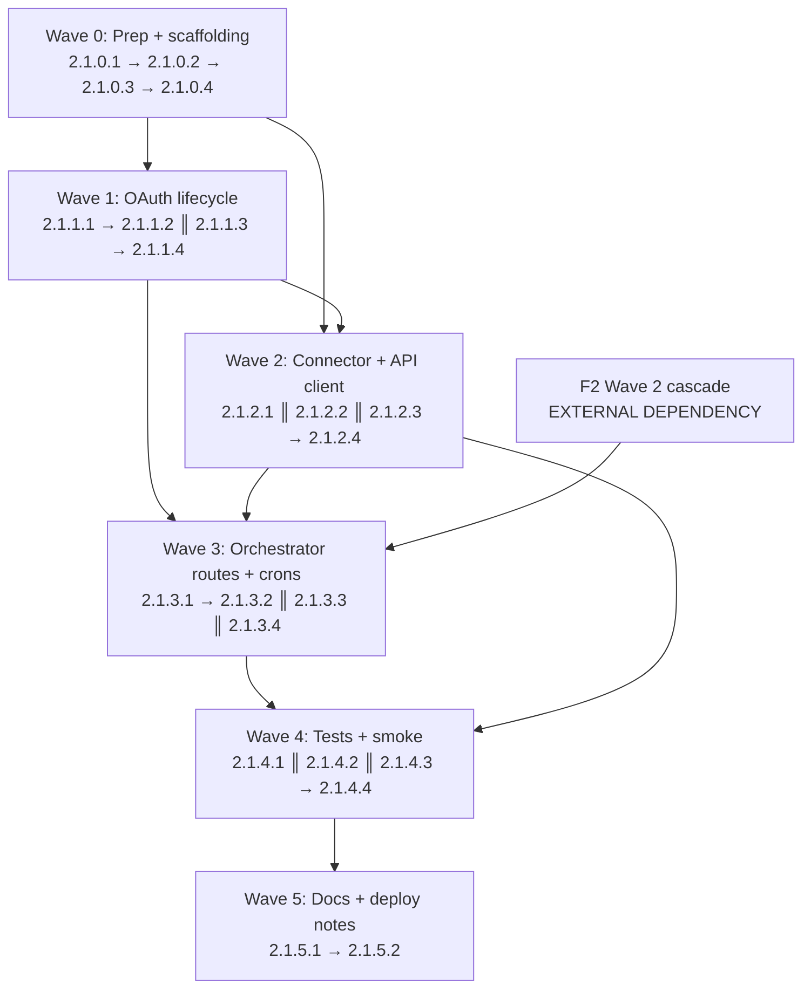

# Phase 2.1 Plan — Mercado Libre Colombia integration (OAuth + cascade reuse)

**Generated:** 2026-05-15
**Goal:** First real integration after the walking skeleton. Ship a production-ready Mercado Libre Colombia (siteId `MCO`) channel that pulls orders every 15 min and items every 60 min via the official REST API, exchanges/rotates OAuth tokens, receives signed-query-params webhooks, plugs unmatched `sale_items` into F2's existing 5-level matching cascade without re-implementing it, and surfaces ML rows in F2's channel-agnostic `/hoy` + `/matching` views with NO new dashboard pages (besides a single `/operacion/conectar-mercadolibre` "connect" route used once per seller). Connector ships in graceful **degraded mode** until the cliente registers the developer app at https://developers.mercadolibre.com.co and delivers the four env vars.
**Total estimated effort:** 74h (median of RESEARCH §Effort 60–80h range) / 18.5 days at 4h/day.
**Requirements covered:** ML-01 (orders sync), ML-02 (items sync), ML-03 (cascade integration), ML-04 (OAuth lifecycle), ML-05 (webhook receiver), ML-06 (degraded mode).
**Depends on Phase 1:** ChannelConnector interface (locked), idempotency.ts wrappers, retry.ts (`withRetryAndDLQ`), observability.ts (`recordConnectorRun`), audit-log.ts, Supabase migrations 0001–0013 (sales/sale_items/master_products/product_mappings/product_variants/raw_orders/raw_events/connector_runs/csv_mapping_profiles), the F1 Hono orchestrator + cron entrypoint at `apps/orchestrator/src/cron.ts:1-55`, the F1 ML skeleton at `packages/connectors/src/mercadolibre/index.ts:1-76` that throws `NOT_IMPLEMENTED_F4` — F2.1 is that "F4 work moved earlier per cliente decision 2026-05-14".
**Depends on Phase 2:** **F2 Wave 2 cascade output at `packages/connectors/src/matching/` is NOT on disk yet** (per commit `04697cb memoria: pause point — F2 Waves 0-1 complete, Wave 2 pending`). F2.1 Wave 3 cron `sync-ml-orders.ts` calls `runMatchCascade(item, ctx)` from `@faka/connectors/matching` — that import target is **F2 Wave 2 plans 2.2.2–2.2.5** which MUST land before F2.1 Wave 3 merges. F2.1 also reuses F2's `wordpress/webhook-verify.ts` HMAC pattern as the verification *envelope* (createHmac + timingSafeEqual + length check) while writing a fresh canonical-string builder because ML signs query params, not body bytes. F2 Wave 4 dashboard views (`v_hoy_*` + `/matching` page) are channel-agnostic; ML rows show up automatically once `sales.canal='mercadolibre'` rows exist. **F2.1 adds zero dashboard pages besides the small `/operacion/conectar-mercadolibre` connect route.**
**Phase boundary:** see "Out of scope" section. F2.1 is the second-channel slice — POS/WhatsApp/Dropi/Falabella stay deferred to their named phases.

**Credential reality:** the cliente has NOT yet registered the Mercado Libre developer app at https://developers.mercadolibre.com.co — `ML_CLIENT_ID` / `ML_CLIENT_SECRET` / `ML_REDIRECT_URI` / `ML_WEBHOOK_SECRET` are unset. ML-01..ML-06 ship as production-ready code that **DEGRADES GRACEFULLY** when any of those env vars are unset (RESEARCH §Environment Availability): `healthCheck` returns `{ ok: false, last_error: "not configured", missing: [...] }`, `fetchOrders`/`fetchProducts` return `[]` + log a structured warning, `POST /webhooks/mercadolibre` returns 503 with `not_configured` JSON, `GET /oauth/mercadolibre/callback` returns 503, and the three Railway crons exit 0 (NOT 1 — silences pager noise during pre-OAuth period) after writing `connector_runs.status="failed", errors_json={reason:"not_configured"}`. The cliente is unblocked to register the app at any time; once envs land on Railway, restart the service and the connector is live with **no code redeploy**. The dashboard's `/operacion/conectar-mercadolibre` page surfaces a pill ("Not configured" vs "Connect Mercado Libre") so the operator knows the state at a glance.

---

## Execution waves

| Wave                       | Plans                                  | Parallelizable?                                                                                | Hours subtotal |
| -------------------------- | -------------------------------------- | ---------------------------------------------------------------------------------------------- | -------------- |
| 0 — Prep + scaffolding     | 2.1.0.1 → 2.1.0.2 → 2.1.0.3 → 2.1.0.4  | Serial — each builds on the previous (deps install → env wiring → eslint regex → fixture dir)  | ~5h            |
| 1 — OAuth lifecycle        | 2.1.1.1 → 2.1.1.2 ║ 2.1.1.3 → 2.1.1.4  | 2.1.1.1 first (migration); 2.1.1.2 (oauth.ts) and 2.1.1.3 (state-mapper + types) parallel; 2.1.1.4 (refresh cron) seq behind 2.1.1.2 | ~10h           |
| 2 — Connector + API client | 2.1.2.1 ║ 2.1.2.2 ║ 2.1.2.3 → 2.1.2.4  | 2.1.2.1 (api-client) + 2.1.2.2 (variant-mapper) + 2.1.2.3 (config.ts degraded-mode gate) parallel; 2.1.2.4 (connector index.ts rewrite) seq after all three | ~20h           |
| 3 — Orchestrator routes + crons | 2.1.3.1 → 2.1.3.2 ║ 2.1.3.3 ║ 2.1.3.4 | 2.1.3.1 (webhook route + raw_events dedup migration) first; the three crons + connect page parallel after | ~20h           |
| 4 — Tests + smoke          | 2.1.4.1 ║ 2.1.4.2 ║ 2.1.4.3 → 2.1.4.4  | Three unit-test plans parallel; 2.1.4.4 (smoke + latency budget) gates on all                  | ~14h           |
| 5 — Docs + deploy notes    | 2.1.5.1 → 2.1.5.2                      | Serial — DEPLOY.md update then F2.1-PROGRESO memoria stub                                      | ~5h            |

Total: **74h** (within 60–80h range).

**Cross-wave parallelism callout:** Once W0 closes, W1 plans 2.1.1.2 (`oauth.ts`) and 2.1.1.3 (`state-mapper.ts` + `types.ts`) can run truly in parallel — they share no files. W2 has three parallel slots (api-client, variant-mapper, config gate) that all wait only on W1's types; the connector rewrite at 2.1.2.4 is the natural join point. W3's three crons can run in parallel after the webhook route + dedup migration land in 2.1.3.1. **W3 sync-ml-orders.ts (2.1.3.2) has an EXTERNAL block on F2 Wave 2's `packages/connectors/src/matching/cascade.ts` import** — if F2 Wave 2 has not landed at W3 plan-time, executor pauses 2.1.3.2 and works on 2.1.3.3 (sync-ml-products, no cascade call) + 2.1.3.4 (connect page) instead, then unblocks 2.1.3.2 the day F2 Wave 2 merges. **No F2.1 code stubs F2's cascade** — the import target must exist.

---

## Wave 0 — Prep + scaffolding

> No new business behavior. Workspace plumbing, env vars, eslint regex extension, and the orchestrator test directory creation so subsequent waves have stable imports + lint gates + fixture room. All later waves depend on Wave 0.

### Plan 2.1.0.1 — Install `undici` + verify `p-retry`, `zod`, `hono` pin parity

- **Task:** Add `undici@^8.2.0` to `packages/connectors/package.json` dependencies (RESEARCH §Standard Stack — Node-native HTTP client for ML REST + OAuth endpoints). Verify orchestrator + connectors stay pinned to the same `p-retry`, `zod`, `hono`, `@hono/zod-validator`, `@supabase/supabase-js` versions already documented in RESEARCH §Standard Stack table — DO NOT bump (the F1 `withRetryAndDLQ` wrapper at `packages/connectors/src/retry.ts:30-67` is API-stable against `p-retry@^7`; bumping to v8 would force lockfile churn). Run `pnpm install` at repo root to refresh `pnpm-lock.yaml`. Confirm `undici` is hoisted into `packages/connectors/node_modules` and importable as `import { request } from "undici"`. Add a one-line CHANGELOG entry under `packages/connectors/CHANGELOG.md` (or create the file with a `## Unreleased` block) noting the dep addition.
- **Files:** `packages/connectors/package.json` (modify — append `undici` to dependencies), `pnpm-lock.yaml` (regenerate via `pnpm install`), `packages/connectors/CHANGELOG.md` (create or append).
- **Depends on:** Nothing (Wave 0 starter).
- **References:** RESEARCH §Standard Stack table (undici 8.2.0 verified via `npm view undici version`); PATTERNS §Metadata "Files Read in full" confirms `packages/connectors/package.json` was inspected; RESEARCH §Don't Hand-Roll table (HTTP retry uses F1 `withRetryAndDLQ` — undici is the transport only, retry stays the F1 envelope).
- **Anti-duplication note:** PATTERNS §"Retry + DLQ" REUSED-from-F1 invariant — DO NOT introduce `axios`, `node-fetch`, or any second HTTP client. `undici` is the single transport for ML; existing F1/F2 code keeps using Node's global `fetch` (which is also undici under the hood). DO NOT pin `p-retry@8` — the F1 wrapper at `retry.ts:30-67` is API-stable against v7 and bumping costs lockfile churn for zero gain.
- **Effort:** 1h
- **Verifies:** `grep -c '"undici"' packages/connectors/package.json` returns 1; `pnpm --filter @faka/connectors exec node -e "import('undici').then(m => console.log(typeof m.request))"` prints `function`; `grep -c '"p-retry": "\\^7' apps/orchestrator/package.json` returns 1 (no v8 bump); `pnpm --filter @faka/connectors exec tsc --noEmit` still passes.
- **Requirements:** ML-01, ML-02, ML-04 (every API call uses undici transport).

### Plan 2.1.0.2 — Env vars (.env.example × 3 + railway.toml) + degraded-mode comments

- **Task:** Update four env-surface files with the F2.1 net-new vars:
  - `apps/orchestrator/.env.example` — verify the existing `ML_CLIENT_ID` / `ML_CLIENT_SECRET` slots from F1 are still present (per PATTERNS §15: F1 reserved lines 30-32). ADD two new lines beneath them: `ML_REDIRECT_URI=` (with inline comment `# OAuth callback URL — prod: https://orchestrator.fakawholesale.com/oauth/mercadolibre/callback; dev: http://localhost:8080/oauth/mercadolibre/callback`) and `ML_WEBHOOK_SECRET=` (with inline comment `# Shared secret for ML webhook signed-query-params HMAC-SHA256 verify`). ADD a comment block ABOVE the four-var block: `# Mercado Libre (F2.1) — OAuth + webhook. Graceful degrade when any of these are unset: healthCheck returns ok:false, syncs no-op, webhook 503s. Cliente registers app at https://developers.mercadolibre.com.co before live OAuth.` Mirror the WP block's comment style at lines 22-24.
  - `apps/orchestrator/railway.toml` — extend the existing F2-environment-surface comment block at the bottom: add a `# Mercado Libre (F2.1):` section listing `ML_CLIENT_ID, ML_CLIENT_SECRET, ML_REDIRECT_URI, ML_WEBHOOK_SECRET`. The actual `[[services]]` cron block additions live in Plan 2.1.3.3 (sync-ml-orders) / 2.1.3.4 (sync-ml-products + ml-refresh-tokens) — Wave 0 only documents the env contract.
  - `apps/dashboard/.env.example` — NO new vars (CC-11 invariant). VERIFY no `NEXT_PUBLIC_ML_*` exists. If a top-of-file comment block does not yet mention ML, add one line to the existing F2 CC-11 comment block: `# F2.1 carries forward CC-11: NEXT_PUBLIC_ML_* is forbidden; ML credentials are orchestrator-only.`
  - `.env.example` at repo root (if it exists per F2 Wave 0) — mirror the orchestrator ML block additions verbatim (the repo-root file is documentation; orchestrator is the consumer).
- **Files:** `apps/orchestrator/.env.example` (modify — append two new vars + comment block), `apps/orchestrator/railway.toml` (modify — extend bottom comment block with ML section), `apps/dashboard/.env.example` (modify — append CC-11 ML reminder), `.env.example` (modify if present at repo root).
- **Depends on:** 2.1.0.1 (undici install lands first so the env-var block has a non-empty package context).
- **References:** PATTERNS §15 Env vars update (existing ML slots already reserved at orchestrator/.env.example lines 30-32); RESEARCH §Environment Availability (the four-var degraded-mode matrix); CC-11 invariant from PATTERNS §"Anti-duplication Invariants" (no `NEXT_PUBLIC_ML_*`); F2 Plan 2.0.2 lint pattern (this plan extends it in 2.1.0.3).
- **Anti-duplication note:** PATTERNS §"CC-11 carried forward" — DO NOT add `NEXT_PUBLIC_ML_CLIENT_ID` / `NEXT_PUBLIC_ML_REDIRECT_URI` / any browser-exposed variant. The dashboard's `/operacion/conectar-mercadolibre` page (Plan 2.1.3.4) builds the ML authorize URL via a **server action** that reads `ML_CLIENT_ID` server-side, so no client-side env var is needed. Anti-goal from CONTEXT.md: "Do NOT ship credentials in repo. Even .env.example placeholders are fine; real values via Vercel/Railway env vars only."
- **Effort:** 1h
- **Verifies:** `grep -c 'ML_REDIRECT_URI' apps/orchestrator/.env.example` returns 1; `grep -c 'ML_WEBHOOK_SECRET' apps/orchestrator/.env.example` returns 1; `grep -E 'NEXT_PUBLIC_.*ML_' apps/dashboard/.env.example` returns ZERO matches; `grep -c 'ML_CLIENT_ID' apps/orchestrator/railway.toml` returns 1 (in the env-comment block); the four ML var names appear NOWHERE in `apps/dashboard/` (grep recursive returns 0).
- **Requirements:** ML-04, ML-05, ML-06 (degraded mode hinges on the four-var contract).

### Plan 2.1.0.3 — Extend CC-11 eslint regex for `MERCADOLIBRE|ML_CLIENT|ML_REDIRECT|ML_WEBHOOK`

- **Task:** Open `packages/config/eslint.base.cjs` and locate the existing CC-11 regex introduced by F2 Plan 2.0.2 (which matches `NEXT_PUBLIC_.*(SERVICE|SECRET|PRIVATE|WORDPRESS|OPENAI|MOONSHOT|ANTHROPIC)`). Extend the alternation group to include `MERCADOLIBRE|ML_CLIENT|ML_REDIRECT|ML_WEBHOOK`. The final pattern shape is `NEXT_PUBLIC_.*(SERVICE|SECRET|PRIVATE|WORDPRESS|OPENAI|MOONSHOT|ANTHROPIC|MERCADOLIBRE|ML_CLIENT|ML_REDIRECT|ML_WEBHOOK)`. Add a test fixture under `packages/config/__tests__/eslint-cc11.test.cjs` (create the file if not present) that asserts the eslint rule flags `NEXT_PUBLIC_ML_CLIENT_ID` as a violation and accepts `ML_CLIENT_ID` as valid. Re-run `pnpm -r lint` to confirm no existing source code accidentally trips the new pattern (grep-confirm zero hits across all `apps/` first).
- **Files:** `packages/config/eslint.base.cjs` (modify — extend the CC-11 regex alternation), `packages/config/__tests__/eslint-cc11.test.cjs` (create — fixture asserting the ML pattern is rejected).
- **Depends on:** 2.1.0.2 (the env-var names extended into eslint must match the names just added).
- **References:** F2 Plan 2.0.2 (the CC-11 regex's first extension to WP/OpenAI/LLM); PATTERNS §"CC-11 CARRIED FORWARD" anti-duplication entry (the explicit grep gate this plan operationalizes); CONTEXT.md "Anti-Goals" — "Do NOT ship credentials in repo" + orchestrator-only credentials.
- **Anti-duplication note:** PATTERNS §"CC-11" — DO NOT duplicate the regex into a second config file. `packages/config/eslint.base.cjs` is the single owner of CC-11; all app eslint configs extend from it. If a second eslint rule for the same concern is tempting, FAIL the plan and extract the regex into a constant exported from `packages/config/eslint.base.cjs`.
- **Effort:** 1h
- **Verifies:** `grep -E 'MERCADOLIBRE|ML_CLIENT|ML_REDIRECT|ML_WEBHOOK' packages/config/eslint.base.cjs` returns ≥1 match; the fixture test passes: `pnpm --filter @faka/config test -- eslint-cc11`; `pnpm -r lint` exits 0 (no regression); a deliberate violation `echo 'export const X = process.env.NEXT_PUBLIC_ML_CLIENT_ID' > apps/dashboard/scratch.ts && pnpm --filter dashboard exec eslint scratch.ts` exits non-zero with a CC-11 message, then `rm apps/dashboard/scratch.ts`.
- **Requirements:** ML-04, ML-05 (credential boundary enforcement).

### Plan 2.1.0.4 — Orchestrator test directory + ML fixtures scaffolding

- **Task:** Create the orchestrator test directory (PATTERNS §14 — orchestrator has no `__tests__` today; F2.1 introduces the convention). Land:
  - `apps/orchestrator/__tests__/.gitkeep` (or a stub `README.md` documenting the directory's purpose).
  - `apps/orchestrator/vitest.config.ts` — extend from `packages/config/vitest.base.ts` (or mirror `packages/connectors/vitest.config.ts` line-for-line; the existing connectors config is the closest analog). Set `test.environment = "node"`, `test.include = ["__tests__/**/*.test.ts"]`. Wire a `test` script in `apps/orchestrator/package.json`: `"test": "vitest run"`.
  - `packages/connectors/__tests__/__fixtures__/ml-order-paid.json` — minimal real-shape ML order payload (RESEARCH §Wave 0 Gaps lists this). Redact buyer PII: `buyer.email` → `"redacted@example.com"`, `buyer.nickname` → `"TESTBUYER"`, `shipping.receiver_address.receiver_phone` → `"3000000000"`. Currency MUST be `COP`; status MUST be `paid`; one `order_item` with a `variation_attributes` array containing `[{name: "Color", value_name: "Rojo"}, {name: "Talla", value_name: "M"}]`. Include `payments: [{status: "approved", date_last_modified: "2026-05-15T10:00:00.000-05:00"}]`.
  - `packages/connectors/__tests__/__fixtures__/ml-order-cancelled-seller.json` — same shape, `status: "cancelled"`, `cancel_detail: "seller_cancelled"`.
  - `packages/connectors/__tests__/__fixtures__/ml-item-with-variations.json` — `{ id: "MCO123456789", title: "Camiseta MCO", price: 50000, currency_id: "COP", available_quantity: 10, variations: [...] }` with 3 variations differing by Color/Talla.
  - `packages/connectors/__tests__/__fixtures__/ml-token-response.json` — `{ access_token: "TEST_ACCESS_TOKEN", token_type: "bearer", expires_in: 21600, scope: "offline_access read write", user_id: 123456789, refresh_token: "TG-TEST-REFRESH-TOKEN" }`.
  - `packages/connectors/__tests__/__fixtures__/README.md` — one-paragraph note: "PII-redacted minimal ML payloads. Real-shape but synthetic values. Do NOT commit raw ML responses (may contain real buyer data)."
- **Files:** `apps/orchestrator/__tests__/.gitkeep`, `apps/orchestrator/vitest.config.ts`, `apps/orchestrator/package.json` (modify — add `test` script), `packages/connectors/__tests__/__fixtures__/ml-order-paid.json`, `packages/connectors/__tests__/__fixtures__/ml-order-cancelled-seller.json`, `packages/connectors/__tests__/__fixtures__/ml-item-with-variations.json`, `packages/connectors/__tests__/__fixtures__/ml-token-response.json`, `packages/connectors/__tests__/__fixtures__/README.md`.
- **Depends on:** 2.1.0.1 (undici dep landed; package.json is stable for test-script addition).
- **References:** PATTERNS §14 (orchestrator has no test dir today; F2.1 introduces); RESEARCH §Validation Architecture (Vitest as F2 default, file layout); RESEARCH §"Wave 0 Gaps" (fixtures + MSW handlers list); PATTERNS §12 fixture-driven test pattern (WP normalize-order.test.ts as analog).
- **Anti-duplication note:** PATTERNS §"Pure-function normalizer envelope" — fixtures live ONLY under `packages/connectors/__tests__/__fixtures__/`. DO NOT scatter ML payload samples into `apps/orchestrator/__tests__/__fixtures__/` (orchestrator tests import from `packages/connectors/__tests__/__fixtures__/` via the relative path). One canonical fixture dir per repo.
- **Effort:** 2h
- **Verifies:** `ls apps/orchestrator/__tests__` exists; `pnpm --filter @faka/orchestrator test` exits 0 (no tests yet but framework wires up); `ls packages/connectors/__tests__/__fixtures__/ml-*.json | wc -l` returns 4; `grep -c '"currency_id":"COP"' packages/connectors/__tests__/__fixtures__/ml-order-paid.json` returns 1; `grep -E '(real[-_]?email|@gmail|@hotmail|@yahoo|\\+57[0-9]{10})' packages/connectors/__tests__/__fixtures__/*.json` returns 0 (no real PII).
- **Requirements:** ML-01, ML-02, ML-04, ML-05 (foundation for all wave-4 tests).

---

## Wave 1 — OAuth lifecycle

> Net-new infrastructure with no F1/F2 analog (RESEARCH §Pattern 1). Migration for the `oauth_tokens` table with intentionally-empty RLS, the OAuth code-exchange + rotating-refresh implementation, the pure-function state-mapper for ML statuses, narrow TypeScript types, and the 5h refresh safety-net cron. **W1 closes before W2 starts the connector index.ts rewrite — index.ts loads access tokens via this wave's `oauth.ts`.**

### Plan 2.1.1.1 — Migration `20260615000001_oauth_tokens.sql` (service-role-only RLS)

- **Task:** Create `packages/db/supabase/migrations/20260615000001_oauth_tokens.sql` with the full schema PATTERNS §7 specifies (verbatim shape — copy it line-for-line from the PATTERNS §7 "Concrete shape" code block). Include the migration header doc block in the same style as `20260513000004_master_layer.sql:1-11` (LIFT VERBATIM the header template; replace name + purpose). The table has columns `id uuid primary key default gen_random_uuid(), canal public.channel not null, user_id text not null, access_token text not null, refresh_token text not null, expires_at timestamptz not null, scope text null, created_at timestamptz not null default now(), updated_at timestamptz not null default now()`. Add `unique (canal, user_id)` so `oauth.ts` UPSERTs have a stable conflict target. Add index `oauth_tokens_canal_expires_idx on (canal, expires_at)` so the 5h refresh cron's `where expires_at < now() + interval '1 hour'` query is index-backed. Enable RLS but **add NO policies** — `revoke all on public.oauth_tokens from authenticated; revoke all on public.oauth_tokens from anon;` makes the intent explicit. Document the divergence in the migration's header doc block (PATTERNS §"Migration RLS conventions — DIVERGENCE for oauth_tokens"). After the migration file lands, regenerate `packages/db/src/database.ts` via the F1 codegen command (the same workflow F2 Plan 2.1.3 already uses) and commit the regenerated file in the same atomic commit.
- **Files:** `packages/db/supabase/migrations/20260615000001_oauth_tokens.sql` (create), `packages/db/src/database.ts` (regenerate after migration applies).
- **Depends on:** 2.1.0.4 (test fixtures + orchestrator test dir set up; W1 schema changes follow).
- **References:** PATTERNS §7 "OAuth tokens table" (full concrete shape + LIFT VERBATIM the migration header + RLS divergence rationale); RESEARCH §Pattern 1 (TTLs + rotation context that motivate the column set); F1 migration `20260513000004_master_layer.sql:17-45` (table style analog); F1 migration `20260513000010_rls_policies.sql:19-50` (RLS enable pattern — but this migration INTENTIONALLY OMITS the authenticated SELECT policy that file establishes).
- **Anti-duplication note:** PATTERNS §"F2.1-NEW — `oauth_tokens` is the only table with no authenticated SELECT policy" — DO NOT add `create policy "authenticated_select_oauth_tokens" on public.oauth_tokens for select to authenticated using (true);`. Even a permissive policy is wrong: tokens are service-role-only. The migration header comment must document the divergence so a future reviewer doesn't "fix" it. Also DO NOT create a `v_oauth_tokens_*` view (CC-12 invariant + no role ever sees tokens). Also DO NOT add `messaging_log` columns or any ML messaging fields (CC-14 invariant — ML messaging API deferred to F5.5).
- **Effort:** 2h
- **Verifies:** `pnpm --filter @faka/db exec supabase db reset` runs clean and applies the new migration; `psql ... -c "select count(*) from oauth_tokens"` returns 0; `psql ... -c "select polname from pg_policies where tablename='oauth_tokens'"` returns 0 rows (no policies); `psql ... -c "\\d+ public.oauth_tokens" | grep 'unique (canal, user_id)'` matches; `psql ... -c "select indexname from pg_indexes where tablename='oauth_tokens'"` includes `oauth_tokens_canal_expires_idx`; `grep -c 'oauth_tokens' packages/db/src/database.ts` returns ≥3 (Row/Insert/Update types generated); `grep -c 'authenticated_select_oauth_tokens' packages/db/supabase/migrations/20260615000001_oauth_tokens.sql` returns 0.
- **Requirements:** ML-04, ML-OAUTH-02 (RLS-locked token storage).

### Plan 2.1.1.2 — `mercadolibre/oauth.ts` + `mercadolibre/types.ts` (code exchange + rotating refresh)

- **Task:** Create two files in `packages/connectors/src/mercadolibre/`:
  - **`types.ts`** — LIFT VERBATIM the structure of `packages/connectors/src/types.ts:1-12` doc block (PATTERNS §6). Export narrow interfaces `MLOrder`, `MLOrderItem`, `MLItem`, `MLVariation`, `MLBuyer`, `MLShipment`, `MLTokenResponse`, `MLConfig` (the loaded env contract: `{ clientId, clientSecret, redirectUri, webhookSecret }`). For OAuth responses use the discriminated-union envelope PATTERNS §6 specifies: `type MLTokenResult = { ok: true; response: MLTokenResponse } | { ok: false; error: string; status?: number }`. Document ML-specific oddities in inline `/** ... */` comments per PATTERNS §6 (`order.total_amount` is a number not a string; `order.date_created` is ISO 8601 with `-05:00` for MCO; `item.id` starts `MCO-`; `buyer.email` is often `nickname@example.com` masked). Define exported constants `export const ML_SITE_ID = "MCO" as const;` and `export const ML_CURRENCY = "COP" as const;` (PATTERNS §"F2.1-NEW — Single ML site hardcoded" invariant).
  - **`oauth.ts`** — implement `exchangeCodeForToken(cfg: MLConfig, code: string): Promise<MLTokenResult>`, `refreshToken(supabase: SupabaseClient, cfg: MLConfig, userId: string): Promise<{ ok: true; access_token: string } | { ok: false; error: string }>`, `loadAccessToken(supabase: SupabaseClient, cfg: MLConfig, opts: { userId: string; lazyRefreshOn401?: boolean }): Promise<string | null>`. Use undici's `request` for the POST to `https://api.mercadolibre.com/oauth/token` with `application/x-www-form-urlencoded` body (RESEARCH §Code Examples — exchangeCodeForToken + refreshToken bodies). Wrap the token POST in `withRetryAndDLQ` from `packages/connectors/src/retry.ts:30-67` with `canal: "mercadolibre"`, `source: "oauth.exchange"` / `source: "oauth.refresh"`. **CRITICAL — refresh-token rotation:** the UPSERT after refresh MUST write BOTH the new `access_token` AND the new `refresh_token` atomically (PATTERNS §2 + RESEARCH §Pattern 1). ML invalidates the old refresh token immediately server-side — losing the new one bricks the integration until re-authorize. **CRITICAL — refresh-token race condition (RESEARCH §Pitfall 1):** wrap the body of `refreshToken` in a Postgres advisory lock via `supabase.rpc('try_acquire_advisory_lock', { key_text: 'ml-refresh-' || userId })` (or an inline `select pg_try_advisory_xact_lock(hashtext($1))` query); if the lock is contested, sleep 500ms and re-read `oauth_tokens` (the winning caller's UPSERT will be visible). Document the lock in a top-of-file comment that cites Pitfall 1. Add a top-of-file doc block noting the 6-hour access TTL + 6-month refresh TTL + single-use rotation invariant per PATTERNS §2.
- **Files:** `packages/connectors/src/mercadolibre/types.ts` (create), `packages/connectors/src/mercadolibre/oauth.ts` (create).
- **Depends on:** 2.1.1.1 (the `oauth_tokens` table must exist for `oauth.ts` UPSERTs).
- **References:** PATTERNS §2 "OAuth code-exchange + refresh" (helper-fn signatures + lazy-refresh + rotation rules + 6h TTL doc requirement); PATTERNS §6 "Narrow TypeScript types" (file structure + ML-specific oddity inline docs + discriminated-union envelope); RESEARCH §Pattern 1 (TTLs, single-use rotation), §Code Examples (exchangeCodeForToken + refreshToken implementations with rotation), §Pitfall 1 (advisory lock around refresh body); F1 `packages/connectors/src/retry.ts:30-67` (`withRetryAndDLQ` envelope); F1 `packages/connectors/src/idempotency.ts:35-55` (the UPSERT-with-discriminated-union helper-fn style guide).
- **Anti-duplication note:** PATTERNS §"OAuth token lifecycle (NEW in F2.1)" — `oauth.ts` is the SINGLE owner of OAuth lifecycle. DO NOT import an OAuth library (RESEARCH §Don't Hand-Roll table — the ML flow is 20 LOC of plain authorization_code grant; libraries add abstraction tax). DO NOT hardcode `client_id` / `client_secret` — they always come from `cfg: MLConfig` (which `config.ts` in Plan 2.1.2.3 loads from env). DO NOT log `access_token` or `refresh_token` (RESEARCH §Security — V8 Data Protection — sensitive). DO NOT skip the advisory lock in `refreshToken` — concurrent crons WILL race in production (Pitfall 1's exact failure mode).
- **Effort:** 4h
- **Verifies:** `pnpm --filter @faka/connectors exec tsc --noEmit` passes; `grep -c 'pg_try_advisory_xact_lock\\|try_acquire_advisory_lock' packages/connectors/src/mercadolibre/oauth.ts` returns ≥1 (advisory lock present); `grep -c 'refresh_token' packages/connectors/src/mercadolibre/oauth.ts` returns ≥3 (read → rotate-replace); `grep -E '(console\\.log|logger\\.(info\\|debug|warn|error)).*access_token' packages/connectors/src/mercadolibre/oauth.ts` returns 0 (no token logging); `grep -c 'ML_SITE_ID' packages/connectors/src/mercadolibre/types.ts` returns ≥1; `grep -c 'MCO' packages/connectors/src/mercadolibre/types.ts` returns ≥1; `grep -E 'NEXT_PUBLIC_' packages/connectors/src/mercadolibre/*.ts` returns 0.
- **Requirements:** ML-04, ML-OAUTH-01 (code-exchange + rotation).

### Plan 2.1.1.3 — `mercadolibre/state-mapper.ts` (pure-fn ML status → `sales.estado`)

- **Task:** Create `packages/connectors/src/mercadolibre/state-mapper.ts` (PATTERNS §4). Export `export const ML_STATUS_MAP: Record<string, SalesEstado> = { paid: "pagado", confirmed: "pendiente", payment_required: "pendiente", payment_in_process: "pendiente", partially_paid: "parcial", partially_refunded: "parcial", cancelled: "cancelado", invalid: "cancelado", refunded: "devuelto" }` (RESEARCH §State Mapping table — these are the verified ML order statuses from the cited manage-sales docs). Export `export function mapMLStatus(mlStatus: string): SalesEstado` — looks up in `ML_STATUS_MAP`, defaults to `"pendiente"` on unknown (PATTERNS §4 + RESEARCH §State Mapping: "never throw, partial-batch resilience"). Top-of-file comment must document: (a) `cancellation_detail` preservation rule (RESEARCH §State Mapping — store raw `cancel_detail` value in `sales.notes` or `raw_payload_ref.cancel_detail`; do NOT collapse into `cancelado` alone), (b) shipment status orthogonality (`paid` + `shipment.status=delivered` and `paid` + `shipment.status=pending` both map to `pagado`; `sales.estado` tracks payment, NOT logistics), (c) `payments[]` array recency-vs-creation-order trap (RESEARCH §Pitfall 11 — use `order.status` as truth, not `order.payments[0].status`). Pure function: no `supabase` parameter, no side effects, easy to test. **Also export `export function preserveCancellationDetail(order: MLOrder): string | null` returning `order.cancel_detail ?? null` so the connector's UPSERT helper can drop it into `sales.notes` without re-deriving.**
- **Files:** `packages/connectors/src/mercadolibre/state-mapper.ts` (create).
- **Depends on:** 2.1.1.2 (imports `MLOrder` from types.ts; `SalesEstado` type comes from `packages/db/src/database.ts` which 2.1.1.1 regenerated).
- **References:** PATTERNS §4 "ML status → sales.estado mapper" (LIFT VERBATIM the WP STATUS_MAP shape, mutate values); RESEARCH §State Mapping (the full table with all nine documented ML statuses + cancellation_detail rule + shipment orthogonality + Pitfall 11); F1 migration `20260513000005_facts_layer.sql:29-30` (the `sales.estado check constraint: pagado, pendiente, cancelado, devuelto, parcial` enum the map's right-hand side must match).
- **Anti-duplication note:** PATTERNS §"Pure-function normalizer envelope (REUSED from F2 W1 invariant)" — `state-mapper.ts` is pure; DO NOT import `applyColumnMap` (W1 invariant: CSV-only — grep gate). DO NOT throw on unknown status (partial-batch resilience invariant — log to `connector_runs.errors_json` instead at the caller). DO NOT collapse `cancel_detail` into `cancelado` alone (RESEARCH §Pitfall 6 — finance reports lose buyer-vs-seller cancel signal). DO NOT create a separate `ml-state-mapper.ts` in `apps/orchestrator/` (single canonical owner — `packages/connectors/src/mercadolibre/state-mapper.ts`).
- **Effort:** 1h
- **Verifies:** `pnpm --filter @faka/connectors exec tsc --noEmit` passes; `grep -c 'applyColumnMap' packages/connectors/src/mercadolibre/state-mapper.ts` returns 0; `grep -c 'throw' packages/connectors/src/mercadolibre/state-mapper.ts` returns 0; `grep -c '"pendiente"' packages/connectors/src/mercadolibre/state-mapper.ts` returns ≥4 (default + 3 explicit confirmed/payment_required/payment_in_process); `grep -c 'cancellation_detail\\|cancel_detail' packages/connectors/src/mercadolibre/state-mapper.ts` returns ≥1 (preserveCancellationDetail + doc comment).
- **Requirements:** ML-01, ML-STATE-01 (status mapping for orders).

### Plan 2.1.1.4 — Cron `ml-refresh-tokens.ts` (5h safety net)

- **Task:** Create `apps/orchestrator/src/crons/ml-refresh-tokens.ts` (PATTERNS §11). LIFT VERBATIM the cron entrypoint shell from `apps/orchestrator/src/cron.ts:1-55` — top-of-file doc block (purpose + Railway exit-code rule + schedule note + W2 invariant `kind:"channel", canal:"mercadolibre"`), `async function main(): Promise<void>` + try/catch + `process.exit(0)` on success, `process.exit(1)` on unhandled. **Body (PATTERNS §11):** `const rows = await supabase.from('oauth_tokens').select('user_id').eq('canal', 'mercadolibre').lt('expires_at', new Date(Date.now() + 3600 * 1000).toISOString());` — iterate each row, call `refreshToken(supabase, cfg, row.user_id)`. Errors logged + accumulated (`failed++`) but do NOT throw (other users still get refreshed — partial-batch resilience). **Degraded mode (RESEARCH §Environment Availability):** if `loadConfig()` returns `{ ok: false, missing }`, write `connector_runs` row with `status="failed", errors_json={reason:"not_configured", missing}` and `process.exit(0)` (NOT 1 — Railway alarm noise during pre-OAuth period). **`recordConnectorRun` call:** `kind:"channel", canal:"mercadolibre", metadata_json: { source: "token-refresh-cron", refreshed_count, failed_count }` (PATTERNS §11 — NOT `cron-heartbeat`; this cron operates on the `mercadolibre` channel). Schedule documented in top-of-file comment as `0 */5 * * *`; the actual Railway `[[services]]` block lands in Plan 2.1.3.3 alongside the other two crons.
- **Files:** `apps/orchestrator/src/crons/ml-refresh-tokens.ts` (create). If `apps/orchestrator/src/crons/` does not yet exist, this plan creates the directory by virtue of writing this first file.
- **Depends on:** 2.1.1.2 (imports `refreshToken` + `MLConfig` from `oauth.ts` + `types.ts`).
- **References:** PATTERNS §11 "Cron — ml-refresh-tokens.ts" (full spec including 5h safety-net rationale); F1 `apps/orchestrator/src/cron.ts:1-55` (entrypoint shell verbatim); PATTERNS §"W2 CARRIED FORWARD" anti-duplication entry (kind/canal coherence enforced at `observability.ts:36-45`); RESEARCH §Pattern 4 "Lazy refresh + safety-net cron" (this cron is the safety net, lazy-refresh-on-401 in api-client is the primary path); RESEARCH §Environment Availability (degraded-mode exit-0 rule).
- **Anti-duplication note:** PATTERNS §"W2 CARRIED FORWARD" — this cron writes `kind:"channel", canal:"mercadolibre"` to `connector_runs`. DO NOT write `kind:"cron-heartbeat"` — `observability.ts:36-45` throws if mis-paired (W2 invariant). DO NOT exit 1 on degraded mode — that would pager-spam the cliente during the pre-OAuth period. The lazy-refresh in `api-client.ts` (Plan 2.1.2.1) is the PRIMARY refresh path; this cron exists ONLY for the edge case of dormant tokens.
- **Effort:** 3h
- **Verifies:** `pnpm --filter @faka/orchestrator exec tsc --noEmit` passes; `grep -c 'kind:.*channel' apps/orchestrator/src/crons/ml-refresh-tokens.ts` returns ≥1; `grep -c "canal: ?[\\\"']mercadolibre" apps/orchestrator/src/crons/ml-refresh-tokens.ts` returns ≥1; `grep -c 'cron-heartbeat' apps/orchestrator/src/crons/ml-refresh-tokens.ts` returns 0; `grep -c 'process.exit(0)' apps/orchestrator/src/crons/ml-refresh-tokens.ts` returns ≥2 (success + degraded); `grep -c 'process.exit(1)' apps/orchestrator/src/crons/ml-refresh-tokens.ts` returns ≥1 (unhandled only).
- **Requirements:** ML-04, ML-06 (refresh safety net + degraded mode).

---

## Wave 2 — Connector + API client (NO cascade re-impl)

> Replace F1's `NOT_IMPLEMENTED_F4`-throwing skeleton at `packages/connectors/src/mercadolibre/index.ts:1-76` with a fully-realized `ChannelConnector`. Build the typed undici REST client with retries, the variant mapper, and the config gate. **The matching cascade is NOT re-implemented here** — F2.1 calls `runMatchCascade` from F2's `@faka/connectors/matching` package (which lands in F2 Wave 2 plans 2.2.2–2.2.5). W2 only produces the data the cascade consumes.

### Plan 2.1.2.1 — `mercadolibre/api-client.ts` (typed undici client + `from_id` / `scroll_id` pagination + 401 → refresh-retry)

- **Task:** Create `packages/connectors/src/mercadolibre/api-client.ts` (PATTERNS §3). Implement:
  - Zod schemas: `MLOrderSchema`, `MLOrderItemSchema`, `MLItemSchema`, `MLVariationSchema`, `MLTokenResponseSchema` — narrow to the fields the connector touches (PATTERNS §3 + §6 — DO NOT add fields proactively; `raw_orders.payload_json` carries the full response). Export type aliases derived from `z.infer<>`.
  - `class MLUnauthorizedError extends Error` — thrown on 401 so callers (the crons) can refresh + retry once. Distinct from generic 5xx which `pRetry` handles.
  - `async function* paginateOrders(accessToken: string, sellerUserId: string, since: Date): AsyncGenerator<MLOrder>` — `from_id` pagination per RESEARCH §Code Examples + §Pitfall 3 (DO NOT use `offset` — it caps at 10k). Base URL `https://api.mercadolibre.com/orders/search?seller=$user_id&order.date_last_updated.from=$since.toISOString()&sort=date_asc&limit=50&site_id=MCO`. Loop reads `page.paging.last_id` → next request's `from_id`. Wrap each `request()` in `withRetryAndDLQ` from `retry.ts:30-67` with `canal: "mercadolibre"`, `source: "orders.fetch"`, `payload: { since: since.toISOString(), fromId }`. On 401, throw `MLUnauthorizedError` (do NOT retry inside the wrapper). On 429, read `retry-after` header and respect it (RESEARCH §Standard Stack — `p-retry`'s `onFailedAttempt` honors it). Each parsed row goes through `MLOrderSchema.safeParse`; rows that fail Zod parse are logged via `ctx.logger.warn({ row_id, errors }, "ml.zod.parse_fail")` and SKIPPED (partial-batch resilience per PATTERNS §"Pure-function normalizer envelope").
  - `async function* paginateItems(accessToken: string, sellerUserId: string): AsyncGenerator<MLItem>` — `search_type=scan` + `scroll_id` per RESEARCH §Code Examples + §Standard Stack (bypasses 1000 cap). Inner batch fetch via `GET /items?ids=$ID1,$ID2,...` with up to 20 IDs per request (RESEARCH §Code Examples — paginateItems). Always pass `include_attributes=all` (RESEARCH §Pitfall 5 — out-of-stock variations get filtered server-side otherwise). On `catalog_product_id != null`, write to DLQ via `withRetryAndDLQ`'s DLQ insert path with `source: "items.catalog_product_not_supported"` and SKIP (RESEARCH §Pitfall 9 + Assumptions A2).
  - `async function getOrder(accessToken: string, orderId: string): Promise<MLOrder | null>` — for webhook reconciliation single-fetch.
  - `async function getMe(accessToken: string): Promise<{ id: string; nickname: string } | null>` — for `healthCheck`'s lightweight `GET /users/me`.
  - **Currency guard (RESEARCH §Pitfall 4):** every order yielded from `paginateOrders` is checked — if `order.currency_id !== "COP"`, route to DLQ via `withRetryAndDLQ`'s DLQ path with `source: "orders.fetch.currency_drift"` and SKIP. Don't poison `sales` with mixed currency.
  - **`siteId` baked in:** every listing/search URL pins `?site_id=MCO`. Use the `ML_SITE_ID` const from `types.ts`.
- **Files:** `packages/connectors/src/mercadolibre/api-client.ts` (create).
- **Depends on:** 2.1.1.2 (imports types.ts schemas + `MLConfig`).
- **References:** PATTERNS §3 "Typed REST client + rate-limit retries" (Zod schemas + retry envelope + 401-distinct-from-5xx rule); RESEARCH §Code Examples (paginateOrders with `from_id`, paginateItems with `scroll_id`, 20-ID batch fetch), §Pitfall 3 (offset caps at 10k), §Pitfall 4 (currency guard), §Pitfall 5 (`include_attributes=all`), §Pitfall 9 (catalog_product_id DLQ), §Standard Stack (undici `request` + p-retry); F1 `retry.ts:30-67` (withRetryAndDLQ envelope).
- **Anti-duplication note:** PATTERNS §"Retry + DLQ REUSED from F1" — DO NOT introduce a second retry wrapper. Use `withRetryAndDLQ` for every API call. PATTERNS §"F2-CASCADE-REUSE" — DO NOT import anything from `@faka/connectors/matching` here; the api-client is a transport layer, cascade is invoked at the cron layer. PATTERNS §"F2.1-NEW — Single ML site (MCO) hardcoded" — DO NOT make `site_id` configurable via env; it is a const from `types.ts`. PATTERNS §"F2-LLM-ADAPTER" — DO NOT import `@ai-sdk/*` (no second LLM adapter; this file is HTTP transport). RESEARCH §Anti-Patterns — DO NOT use `offset` pagination on backfills > 10k records.
- **Effort:** 6h
- **Verifies:** `pnpm --filter @faka/connectors exec tsc --noEmit` passes; `grep -c 'from_id' packages/connectors/src/mercadolibre/api-client.ts` returns ≥1; `grep -c 'scroll_id' packages/connectors/src/mercadolibre/api-client.ts` returns ≥1; `grep -c 'site_id=MCO\\|ML_SITE_ID' packages/connectors/src/mercadolibre/api-client.ts` returns ≥2; `grep -c 'MLUnauthorizedError' packages/connectors/src/mercadolibre/api-client.ts` returns ≥1; `grep -c 'currency_id !== "COP"\\|currency_id !==.*COP' packages/connectors/src/mercadolibre/api-client.ts` returns ≥1; `grep -c 'catalog_product_id' packages/connectors/src/mercadolibre/api-client.ts` returns ≥1; `grep -c 'include_attributes=all' packages/connectors/src/mercadolibre/api-client.ts` returns ≥1; `grep -c '@ai-sdk' packages/connectors/src/mercadolibre/api-client.ts` returns 0; `grep -c 'matching\\|cascade\\|matchBy' packages/connectors/src/mercadolibre/api-client.ts` returns 0.
- **Requirements:** ML-01, ML-02, ML-ORDERS-01, ML-ITEMS-01.

### Plan 2.1.2.2 — `mercadolibre/variant-mapper.ts` + additive migration `20260615000002_product_variants_unique.sql`

- **Task:** Two artifacts:
  - **`packages/connectors/src/mercadolibre/variant-mapper.ts`** — pure functions implementing PATTERNS §5. Export `export function variantAttributesKey(attrs: Array<{ name: string; value_name: string | null }>): string` per RESEARCH §Code Examples — flatten ML's `variation_attributes` array to a sorted JSON object then `JSON.stringify` (sort keys for stable hashing across reorderings). Export `export function normalizeVariation(parent: MLItem, variation: MLVariation): { master_sku_hint: string; atributos_json: Record<string, string>; pricing: { price: number; available_quantity: number } }` — produces the UPSERT payload shape. Export `export async function upsertProductWithVariants(supabase: SupabaseClient, item: MLItem): Promise<void>` — implements the three-write UPSERT chain (PATTERNS §5): (1) `master_products` INSERT (only if not already mapped via `product_mappings.canal='mercadolibre' AND external_id=item.id`); (2) per variation, `product_variants` UPSERT keyed on `(master_sku, atributos_json)` natural key; (3) `product_mappings` UPSERT keyed on `(canal, external_id)`. Use `withRetryAndDLQ` wrapping each write. Per RESEARCH §Pitfall 5 + Assumption A2: if `item.variations` is empty AND `item.attributes` is non-empty, log a warning + DLQ-record `source: "items.variations_filtered"`; if `item.catalog_product_id != null`, DLQ + skip (matches api-client guard).
  - **`packages/db/supabase/migrations/20260615000002_product_variants_unique.sql`** — additive unique constraint per PATTERNS §5: `alter table public.product_variants add constraint product_variants_master_sku_atributos_unique unique (master_sku, atributos_json);`. Migration header in F1 style (cite Phase 2.1 / Plan 2.1.2.2 + purpose: enable idempotent variant UPSERT for ML). Document: this is additive — F1's `product_variants` table from `20260513000004_master_layer.sql:86-94` already has `master_variant_sku` as PK, but ML needs the **natural** key for UPSERTs (since `master_variant_sku` is generated at insert time, the conflict target must be the attribute-set hash). Regenerate `packages/db/src/database.ts` after the migration applies.
- **Files:** `packages/connectors/src/mercadolibre/variant-mapper.ts` (create), `packages/db/supabase/migrations/20260615000002_product_variants_unique.sql` (create), `packages/db/src/database.ts` (regenerate).
- **Depends on:** 2.1.1.1 (regenerated database.ts is the baseline for the new migration), 2.1.1.2 (types).
- **References:** PATTERNS §5 "ML variations → product_variants mapper" (full UPSERT chain spec + atributos_json hash + flag for additive migration); RESEARCH §Code Examples (`variantAttributesKey` impl), §Pitfall 5 (`include_attributes=all` + variation filter trap), §Pitfall 9 (catalog_products mode skip), §Assumptions A2 (items-mode v1 LOW-confidence assumption — add `catalog_product_id != null` counter in W4); F1 `csv/index.ts:217-264` (the UPSERT chain analog — LIFT VERBATIM the three-write sequence); F1 migration `20260513000004_master_layer.sql:86-94` (the `product_variants` table this migration extends).
- **Anti-duplication note:** PATTERNS §"Idempotent UPSERT REUSED from F1" — the UPSERT chain copies CSV's pattern but uses ML's natural key shape. DO NOT introduce a third UPSERT helper — call `supabase.from('product_variants').upsert(rows, { onConflict: 'master_sku,atributos_json' })` directly with the new unique constraint. PATTERNS §"Per-variant pricing" — F1's `product_variants` has no price column; store per-variant price under `atributos_json.__pricing` as nested metadata (FLAGGED in PATTERNS §5 as deferrable; v1 stashes it inline, F4+ may promote to a column). DO NOT add a `price` column to `product_variants` in this phase. DO NOT re-implement the cascade — `variant-mapper` produces products (the candidates), cascade runs on sale_items (the to-be-matched).
- **Effort:** 5h
- **Verifies:** `pnpm --filter @faka/connectors exec tsc --noEmit` passes; `pnpm --filter @faka/db exec supabase db reset` applies both migrations cleanly; `psql ... -c "select indexname from pg_indexes where tablename='product_variants' and indexname like '%atributos%'"` returns ≥1 row; `grep -c 'variantAttributesKey' packages/connectors/src/mercadolibre/variant-mapper.ts` returns ≥1; `grep -c 'catalog_product_id' packages/connectors/src/mercadolibre/variant-mapper.ts` returns ≥1; `grep -c 'onConflict.*master_sku.*atributos_json' packages/connectors/src/mercadolibre/variant-mapper.ts` returns ≥1; `grep -c 'price' packages/db/supabase/migrations/20260615000002_product_variants_unique.sql` returns 0 (no schema change for pricing).
- **Requirements:** ML-02, ML-ITEMS-01.

### Plan 2.1.2.3 — `mercadolibre/config.ts` (env loader + degraded-mode gate)

- **Task:** Create `packages/connectors/src/mercadolibre/config.ts`. Export `export interface MLConfigStatus { ok: true; cfg: MLConfig } | { ok: false; missing: string[] }`. Export `export function loadMLConfig(env: NodeJS.ProcessEnv = process.env): MLConfigStatus` — reads `ML_CLIENT_ID`, `ML_CLIENT_SECRET`, `ML_REDIRECT_URI`, `ML_WEBHOOK_SECRET` and returns `{ ok: false, missing: [...] }` listing whichever are unset/empty. Reject `http://` redirect URIs at config time (return `{ ok: false, missing: ["ML_REDIRECT_URI (must be https)"] }`) per RESEARCH §Security V9. Validate `ML_REDIRECT_URI` parses as a URL; if it doesn't, treat as missing. Document in a top-of-file comment block the four-var contract + the degraded-mode behaviors (matches RESEARCH §Environment Availability — connector returns `ok:false`, syncs no-op, webhook 503s, crons exit 0). The dashboard's `/operacion/conectar-mercadolibre` page does NOT import this file (CC-11 — dashboard never reads orchestrator-only env vars); it reads a server-action's return value instead. Add `getMLConnectionStatus(supabase: SupabaseClient): Promise<{ connected: boolean; configured: boolean; user_id?: string }>` — a server-side helper the dashboard's server action calls to derive the connect-page pill state without exposing credentials.
- **Files:** `packages/connectors/src/mercadolibre/config.ts` (create).
- **Depends on:** 2.1.1.2 (imports `MLConfig` type).
- **References:** RESEARCH §Environment Availability (the four-var degraded-mode matrix); RESEARCH §Security V9 (HTTPS-only redirect URI rejection); CONTEXT.md Anti-Goals (orchestrator-only credentials); PATTERNS §"CC-11 CARRIED FORWARD" (no `NEXT_PUBLIC_ML_*`); F2 Plan 2.0.2 (WordPress degraded-mode env pattern this mirrors).
- **Anti-duplication note:** PATTERNS §"CC-11" — `config.ts` reads from `process.env`, NEVER from any `NEXT_PUBLIC_*` source. `getMLConnectionStatus` reads from `oauth_tokens` table (service-role) — DO NOT add a `getMLAccessToken` helper that returns the token to the dashboard (the connect page only needs "is there a row?", not the token). RESEARCH §Security V8 — sensitive tokens stay server-side only.
- **Effort:** 2h
- **Verifies:** `pnpm --filter @faka/connectors exec tsc --noEmit` passes; `grep -c 'NEXT_PUBLIC' packages/connectors/src/mercadolibre/config.ts` returns 0; `grep -c "http://" packages/connectors/src/mercadolibre/config.ts` returns ≤1 (only the regex/check itself); `grep -c 'ML_REDIRECT_URI\\|ML_CLIENT_ID\\|ML_CLIENT_SECRET\\|ML_WEBHOOK_SECRET' packages/connectors/src/mercadolibre/config.ts` returns ≥4 (one per var); `grep -c 'getMLConnectionStatus' packages/connectors/src/mercadolibre/config.ts` returns ≥1.
- **Requirements:** ML-06, ML-DEGRADED-01.

### Plan 2.1.2.4 — `mercadolibre/index.ts` rewrite (`ChannelConnector` real impl + degraded-mode envelope)

- **Task:** REWRITE `packages/connectors/src/mercadolibre/index.ts` — the existing F1 skeleton at lines 1-76 throws `NOT_IMPLEMENTED_F4` on every method; this plan replaces those throws with real bodies while keeping the existing factory + closure signature intact (PATTERNS §1). Specifically:
  - Keep `export const createMercadoLibreConnector: ConnectorFactory<MercadoLibreConnectorConfig> = (config) => { const canal: Channel = "mercadolibre"; ... return connector as ChannelConnector; };` shell verbatim.
  - Update `MercadoLibreConnectorConfig` to add `redirectUri: string; webhookSecret: string;` alongside existing `clientId, clientSecret` (PATTERNS §1).
  - Implement `fetchOrders(since: Date, ctx: ConnectorContext): Promise<NormalizedOrder[]>` — calls `loadMLConfig` first; if `ok:false`, returns `[]` + logs `ctx.logger.warn({ missing }, "ml.degraded.fetch_orders")`. Otherwise: read seller `user_id` from `oauth_tokens` row (`select user_id from oauth_tokens where canal='mercadolibre' limit 1` — single-account v1 per PATTERNS §"F2.1-NEW — Single ML seller account"); call `loadAccessToken` then `paginateOrders(token, user_id, since)`; for each order, run `normalizeOrder` (defined below); collect into result array. On `MLUnauthorizedError`, call `refreshToken` once + retry the single failing page; if it fails again, log + exit (do not loop).
  - Implement `fetchProducts(since: Date | null, ctx): Promise<NormalizedProduct[]>` — same shape but uses `paginateItems`. Calls `upsertProductWithVariants` (from variant-mapper.ts) for each item (writes go through here, not through the cron — the F1 `csv/index.ts:217-264` pattern).
  - Implement `normalizeOrder(order: MLOrder): NormalizedOrder | { _error }` — `safeParse → discriminated union` envelope (PATTERNS §1 "safeNormalize" rule + F1 `csv/index.ts:148-182`). Maps `order.id → external_order_id`, `order.status → mapMLStatus(order.status)`, `order.total_amount → total`, `order.currency_id → currency_id` (assert COP), `order.date_created → fecha` (ISO 8601), `order.buyer → extractCustomerHint` output. Preserves `cancel_detail` into the returned object's `notes` field via `preserveCancellationDetail`. Preserves `shipment.shipping_cost` into `notes` (RESEARCH §Pitfall 10 — don't back-derive shipping from `total - sum(items)`).
  - Implement `normalizeProduct(item: MLItem): NormalizedProduct | { _error }` — analog using variant-mapper.
  - Implement `healthCheck(ctx): Promise<HealthStatus>` — never throws. If `loadMLConfig` returns `ok:false`, returns `{ ok: false, last_error: "not configured", missing }`. Otherwise reads cached token via `loadAccessToken`, calls `getMe(token)` from api-client; on success returns `{ ok: true, last_sync: <connector_runs.completed_at where kind='channel' AND canal='mercadolibre' order by completed_at desc limit 1> }`; on any error returns `{ ok: false, last_error: err.message }`.
  - Implement `extractCustomerHint(order: MLOrder): CustomerHint | null` — returns `{ phone: order.shipping?.receiver_address?.receiver_phone, email: order.buyer?.email, displayed_name: order.buyer?.nickname, source: "order_payload" }` (PATTERNS §1 + ADR-004 LOCKED — Mini-CRM stub; F2.1 does not consume the hint, F4 does).
  - Keep `name: "mercadolibre"`, `canal: "mercadolibre"`, `type: "pull"`, `capabilities: new Set(["orders", "products", "inventory"])` from the existing skeleton (matches current ML stub at `index.ts:29-32`).
  - **Hoist helper functions outside the returned connector object** per PATTERNS §1 (`loadTokens`, `fetchOrdersForUser`, `fetchItemsForUser`, `upsertSales`, `upsertSaleItems` — each takes `supabase` / `cfg` / `accessToken` as args, no `this`).
- **Files:** `packages/connectors/src/mercadolibre/index.ts` (rewrite — replace throwing bodies, keep factory shell).
- **Depends on:** 2.1.2.1 (api-client), 2.1.2.2 (variant-mapper), 2.1.2.3 (config.ts).
- **References:** PATTERNS §1 "Mercado Libre connector — REWRITE" (full spec: keep factory shell, replace bodies, hoist helpers, healthCheck never-throws, customer hint shape); RESEARCH §Pattern 3 (reconciliation-pull + light webhook architecture); RESEARCH §Pitfall 10 (shipping cost preservation); F1 `csv/index.ts:74-495` (the only fully-realized ChannelConnector at planning time — LIFT VERBATIM the factory + closure + UPSERT-chain shape, then mutate for ML's OAuth-instead-of-API-key auth and offset-instead-of-cursor pagination); F1 `mercadolibre/index.ts:1-76` (the skeleton being replaced); ADR-004 LOCKED (extractCustomerHint stub).
- **Anti-duplication note:** PATTERNS §"F2-CASCADE-REUSE" — `mercadolibre/index.ts` does NOT import from `@faka/connectors/matching`. Cascade integration happens at the **cron layer** (Plan 2.1.3.2). Grep gate: `grep -E '(matchByBarcode|matchByEmbedding|arbitrateCandidate|cascade)' packages/connectors/src/mercadolibre/` returns ZERO. PATTERNS §"F2-LLM-ADAPTER" — DO NOT import `@ai-sdk/*` directly (`@faka/llm` is the single owner; F2.1 doesn't need it because cascade reuse handles arbitration). PATTERNS §"W1 CARRIED FORWARD" — DO NOT import `applyColumnMap` (CSV-only). PATTERNS §"F2.1-NEW — Single ML site / seller" — DO NOT add multi-account logic; the `oauth_tokens` lookup uses `limit 1`. PATTERNS §1 — `healthCheck` MUST NEVER throw (PATTERNS §1 W2 invariant from F2). DO NOT keep any `throw new Error("NOT_IMPLEMENTED_F4")` calls — the rewrite must replace ALL of them.
- **Effort:** 7h
- **Verifies:** `pnpm --filter @faka/connectors exec tsc --noEmit` passes; `grep -c 'NOT_IMPLEMENTED' packages/connectors/src/mercadolibre/index.ts` returns 0 (all throws replaced); `grep -c 'applyColumnMap' packages/connectors/src/mercadolibre/index.ts` returns 0; `grep -E '(matchByBarcode|matchByEmbedding|arbitrateCandidate|cascade|runMatchCascade)' packages/connectors/src/mercadolibre/index.ts` returns 0 hits; `grep -c '@ai-sdk' packages/connectors/src/mercadolibre/index.ts` returns 0; `grep -c "name: ?[\\\"']mercadolibre" packages/connectors/src/mercadolibre/index.ts` returns ≥1; `grep -c "type: ?[\\\"']pull" packages/connectors/src/mercadolibre/index.ts` returns ≥1; `grep -c 'extractCustomerHint' packages/connectors/src/mercadolibre/index.ts` returns ≥1; `grep -c 'healthCheck' packages/connectors/src/mercadolibre/index.ts` returns ≥1; `pnpm --filter @faka/connectors test -- --run mercadolibre` runs (tests may not exist yet — W4 — but the framework should not error on import).
- **Requirements:** ML-01, ML-02, ML-03 (via cron wiring), ML-06.

---

## Wave 3 — Orchestrator routes + crons (cascade integration HERE, not in connector)

> Net-new orchestrator HTTP routes (webhook + OAuth callback) + the three Railway crons + the dashboard's single connect page. **W3 is where F2's cascade gets called** — `sync-ml-orders.ts` imports `runMatchCascade` from `@faka/connectors/matching` (F2 Wave 2 output) for each unmatched `sale_items` row. If F2 Wave 2 has not landed at W3 plan-time, 2.1.3.2 is BLOCKED; the executor works on 2.1.3.3 + 2.1.3.4 first, then unblocks 2.1.3.2 when F2 Wave 2 merges.

### Plan 2.1.3.1 — `mercadolibre-webhook.ts` route + `webhook-verify.ts` + additive `raw_events` dedup migration

- **Task:** Three artifacts in one plan because the dedup migration + verifier + Hono handler form an atomic shippable unit (the handler can't ack idempotently without the migration; the handler can't verify without the verifier):
  - **`packages/connectors/src/mercadolibre/webhook-verify.ts`** — implement the signed-query-params HMAC verify (RESEARCH §Pattern 2 + Code Examples + PATTERNS §8). Export `buildMLCanonicalString(query: URLSearchParams): string` — joins the six signed params (`topic`, `user_id`, `application_id`, `attempts`, `sent`, `received`) as `name:value` pairs separated by `;` in that exact order. Export `verifyMLSignature(secret: string, query: URLSearchParams, providedHex: string | null): boolean` — uses `createHmac("sha256", secret).update(canonical).digest("hex")` then `timingSafeEqual` on equal-length buffers (RESEARCH §Code Examples — verifier body verbatim). Return `false` on any malformed input (no throws). Top-of-file doc block: cite RESEARCH §Pattern 2 + Assumption A1 (canonical ordering verified against CONTEXT.md spec, re-verify against live ML dev console at impl time). Document the **HMAC-PATTERN-DIVERGENCE** invariant: ML signs the canonical query string; WP signs the raw body — the two verifiers are NOT interchangeable.
  - **`apps/orchestrator/src/routes/mercadolibre-webhook.ts`** — Hono handler at `POST /webhooks/mercadolibre` per PATTERNS §8 + RESEARCH §Code Examples. Export `mountMercadoLibreWebhook(app: Hono): void` — called from `apps/orchestrator/src/server.ts` after the other route mounts (modify `server.ts` in this plan to add the call). Order of operations: (1) degraded-mode check via `loadMLConfig()` → on `ok:false` return `c.json({ error: "not_configured", missing }, 503)`; (2) verify signature via `verifyMLSignature(secret, url.searchParams, sig)` where `sig = url.searchParams.get("signature") ?? c.req.header("x-signature")` (defensive — RESEARCH §Pattern 2 — both transports observed); on fail return `c.json({ error: "invalid_signature" }, 401)`; (3) read topic from query params; if not in `["orders_v2", "items"]`, log `ml.webhook.dropped` and return `c.json({ ok: true, dropped: true }, 200)` (RESEARCH §Code Examples — drop unknown topics with 200 to stop ML retries — covers CC-14 `messages` topic explicitly); (4) read body via `c.req.json().catch(() => ({}))` (ML's webhook body is a thin pointer `{ resource, user_id, topic }`, not the resource per RESEARCH §Anti-Patterns "DO NOT trust webhook payload bodies for state"); (5) INSERT into `raw_events` with `canal: "mercadolibre", tipo_evento: topic, payload_json: { ...body, _query: Object.fromEntries(url.searchParams) }` — the additive dedup migration's unique constraint makes this idempotent on retries; (6) return `c.json({ ok: true }, 200)`. **Ack-then-process pattern (PATTERNS §8 + RESEARCH §Pattern 3):** the actual order fetch happens in the next 15-min `sync-ml-orders` run, not synchronously in this handler.
  - **`packages/db/supabase/migrations/20260615000003_raw_events_dedup.sql`** — additive index + constraint per RESEARCH §Pitfall 8 + PATTERNS §"raw_events idempotency". Add a partial unique index `raw_events_dedup_idx` on `(canal, tipo_evento, (payload_json->>'resource'), (payload_json->>'sent'))` where `canal = 'mercadolibre'` (partial keeps the index small while still enforcing ML dedup). The webhook INSERT uses `ON CONFLICT (canal, tipo_evento, (payload_json->>'resource'), (payload_json->>'sent')) DO NOTHING` — same `sent` timestamp from ML retries collapses to one row. Migration header in F1 style. Regenerate `database.ts`.
- **Files:** `packages/connectors/src/mercadolibre/webhook-verify.ts` (create), `apps/orchestrator/src/routes/mercadolibre-webhook.ts` (create — directory may not exist yet; this plan creates `apps/orchestrator/src/routes/` by virtue of being the first file in it OR a sibling to F2's `wordpress-webhook.ts` if F2 Plan 2.3.1 has landed already; coordinate which lands first), `apps/orchestrator/src/server.ts` (modify — add `mountMercadoLibreWebhook(app)` call), `packages/db/supabase/migrations/20260615000003_raw_events_dedup.sql` (create), `packages/db/src/database.ts` (regenerate).
- **Depends on:** 2.1.2.3 (config.ts for the degraded-mode check), 2.1.1.1 (regenerated database.ts baseline).
- **References:** PATTERNS §8 "ML webhook route" (Hono envelope + verify-before-ctx + dispatch rules); RESEARCH §Pattern 2 (signed-query-params canonical-string format), §Code Examples (verifier + handler bodies verbatim), §Pitfall 2 (verify on raw query string, not parsed body), §Pitfall 8 (idempotency dedup migration), §Anti-Patterns (don't trust webhook body for state); RESEARCH §Assumption A1 (canonical ordering — re-verify at impl time); F1 `apps/orchestrator/src/server.ts:18-50` (Hono route + ctx envelope analog); CC-14 (messaging_log stays empty → topic `messages` is dropped not routed); PATTERNS §"HMAC-PATTERN-DIVERGENCE" anti-duplication invariant.
- **Anti-duplication note:** PATTERNS §"HMAC-PATTERN-DIVERGENCE (NEW for F2.1)" — DO NOT import or call F2's `wordpress/webhook-verify.ts` from this route. WP signs the body; ML signs the query string; the verifiers are structurally different. If F2 Wave 2 has not yet landed `wordpress/webhook-verify.ts`, **defer** the shared-abstraction refactor proposal in PATTERNS §"Open coordination items #3" to F3 (POS) — do not introduce `packages/connectors/src/webhook-verify.ts` in this plan (it would mean refactoring F2 mid-plan; PATTERNS §"Open coordination items" already recommends deferring). PATTERNS §"CC-14 CARRIED FORWARD" — topic `messages` is logged + dropped with 200; DO NOT route to `messaging_log` (deferred to F5.5). PATTERNS §"CC-13 CARRIED FORWARD" — `raw_events.payload_json` is append-only; the webhook never UPDATEs an existing row.
- **Effort:** 5h
- **Verifies:** `pnpm --filter @faka/connectors exec tsc --noEmit` passes; `pnpm --filter @faka/orchestrator exec tsc --noEmit` passes; `pnpm --filter @faka/db exec supabase db reset` applies the dedup migration; `psql ... -c "select indexname from pg_indexes where tablename='raw_events' and indexname like '%dedup%'"` returns ≥1; `grep -c 'createHmac' packages/connectors/src/mercadolibre/webhook-verify.ts` returns ≥1; `grep -c 'timingSafeEqual' packages/connectors/src/mercadolibre/webhook-verify.ts` returns ≥1; `grep -c 'wordpress/webhook-verify' packages/connectors/src/mercadolibre/*.ts apps/orchestrator/src/routes/mercadolibre-webhook.ts` returns 0 (no cross-channel verifier reuse this phase); `grep -c 'messaging_log' apps/orchestrator/src/routes/mercadolibre-webhook.ts` returns 0; `grep -c 'mountMercadoLibreWebhook' apps/orchestrator/src/server.ts` returns ≥1.
- **Requirements:** ML-05, ML-WEBHOOK-01.

### Plan 2.1.3.2 — Cron `sync-ml-orders.ts` (15 min, cascade integration) — **BLOCKED ON F2 WAVE 2**

- **Task:** Create `apps/orchestrator/src/crons/sync-ml-orders.ts` per PATTERNS §9. LIFT VERBATIM the cron entrypoint shell from `apps/orchestrator/src/cron.ts:1-55`. **Body:**
  1. Degraded-mode gate via `loadMLConfig()`; on `ok:false` write `connector_runs` row `{ status:"failed", errors_json:{reason:"not_configured", missing}, kind:"channel", canal:"mercadolibre" }` and `process.exit(0)` (NOT 1 — PATTERNS §9 + RESEARCH §Environment Availability).
  2. `const since = await getLastSuccessfulRun(supabase, "mercadolibre", "orders")` — reads `connector_runs.completed_at` for the most recent `kind='channel' AND canal='mercadolibre'` row where `metadata_json->>'source' = 'orders-sync-cron'`. Default to `now() - 24h` on cold start.
  3. **Apply the 5-min overlap window per RESEARCH §Pattern 3:** effective `since = max(since - 5m, now() - 24h)` so the cron picks up any orders ML's eventual consistency surfaced after the prior run's cutoff. Idempotent UPSERTs absorb the overlap (CONTEXT.md `(canal, external_order_id)` LOCKED invariant).
  4. `const connector = createMercadoLibreConnector({ ...cfg })`; `const orders = await connector.fetchOrders(since, ctx)`.
  5. For each order: write `raw_orders` row (`payload_json = order`); normalize via `connector.normalizeOrder`; UPSERT into `sales` with `onConflict: "canal,external_order_id"` (F1 LOCKED idempotency invariant); UPSERT each `sale_item` with `onConflict: "sale_id,line_id"` (or the equivalent F1 unique key — verify from F1 migration 0005); for each `sale_item` where `master_sku IS NULL`, **call `runMatchCascade(item, cascadeCtx)` from `@faka/connectors/matching`** (F2 Wave 2 output), then call `persistMatch(supabase, item, result)` to write the `product_mappings` row. This is the **F2-CASCADE-REUSE** invariant operationalized — cascade is called from THIS file, not from the connector.
  6. End-of-run `finally` block writes a single `recordConnectorRun({ kind:"channel", canal:"mercadolibre", started_at, completed_at, status, records_processed, records_failed, retry_count, metadata_json:{source:"orders-sync-cron"} })` (PATTERNS §"connector_runs writing" W2 invariant).
  7. `process.exit(0)` on success; `process.exit(1)` on truly-unhandled (non-degraded) errors.
- **Files:** `apps/orchestrator/src/crons/sync-ml-orders.ts` (create).
- **Depends on:** 2.1.2.4 (connector index.ts), 2.1.3.1 (server routes mounted), **AND F2 Wave 2 plans 2.2.2–2.2.5** (the external blocker — `packages/connectors/src/matching/cascade.ts` must export `runMatchCascade` + `persistMatch`).
- **References:** PATTERNS §9 "Cron sync-ml-orders.ts" (full spec + cascade integration + degraded-mode rule); RESEARCH §Pattern 3 "reconciliation pull + light webhook" (15-min cadence + 5-min overlap window); RESEARCH §Pitfall 1 (refresh-token race — advisory lock lives in oauth.ts, this cron doesn't re-implement it); RESEARCH §Pitfall 4 (currency guard lives in api-client.ts, this cron doesn't re-implement it); F1 `apps/orchestrator/src/cron.ts:1-55` (entrypoint shell verbatim); PATTERNS §"F2-CASCADE-REUSE (NEW for F2.1)" anti-duplication invariant.
- **Anti-duplication note:** PATTERNS §"F2-CASCADE-REUSE" — `runMatchCascade` is imported from `@faka/connectors/matching`. DO NOT re-implement levels 1-5 here. DO NOT call individual level functions (`matchByBarcode`, `matchByEmbedding`, etc.) directly — only the orchestrator function. Grep gate: `grep -E '(matchByBarcode|matchByEmbedding|arbitrateCandidate)' apps/orchestrator/src/crons/sync-ml-orders.ts` returns 0; only `runMatchCascade` + `persistMatch` are allowed. PATTERNS §"W2 CARRIED FORWARD" — `kind:"channel", canal:"mercadolibre"` always; never `cron-heartbeat`. PATTERNS §"CC-13" — `raw_orders.payload_json` write is INSERT-only, never UPDATE. RESEARCH §Anti-Patterns — DO NOT trust webhook body for state; this cron re-fetches via `connector.fetchOrders`, which calls `paginateOrders`, which calls `GET /orders/search` — full reconciliation. **If F2 Wave 2 hasn't landed `runMatchCascade` at execute-time, this plan BLOCKS and the executor pauses it** — do not stub the cascade with a no-op; the import must resolve to real F2 code.
- **Effort:** 5h
- **Verifies:** `pnpm --filter @faka/orchestrator exec tsc --noEmit` passes (this verifies the `@faka/connectors/matching` import resolves — if F2 Wave 2 not landed, this fails and the plan is correctly BLOCKED); `grep -c 'runMatchCascade' apps/orchestrator/src/crons/sync-ml-orders.ts` returns ≥1; `grep -c 'persistMatch' apps/orchestrator/src/crons/sync-ml-orders.ts` returns ≥1; `grep -E '(matchByBarcode|matchByEmbedding|arbitrateCandidate)' apps/orchestrator/src/crons/sync-ml-orders.ts` returns 0; `grep -c 'kind:.*channel' apps/orchestrator/src/crons/sync-ml-orders.ts` returns ≥1; `grep -c "canal: ?[\\\"']mercadolibre" apps/orchestrator/src/crons/sync-ml-orders.ts` returns ≥1; `grep -c 'cron-heartbeat' apps/orchestrator/src/crons/sync-ml-orders.ts` returns 0; `grep -c 'onConflict.*canal.*external_order_id' apps/orchestrator/src/crons/sync-ml-orders.ts` returns ≥1.
- **Requirements:** ML-01, ML-03, ML-ORDERS-01 (cascade firing for ML-sourced sale_items closes ML-03).

### Plan 2.1.3.3 — Cron `sync-ml-products.ts` (60 min) + railway.toml 3-services block

- **Task:** Two artifacts:
  - **`apps/orchestrator/src/crons/sync-ml-products.ts`** — PATTERNS §10 — mirror `sync-ml-orders.ts` structure (LIFT VERBATIM the entrypoint shell from `cron.ts:1-55`). Body: degraded-mode gate; `const since = getLastSuccessfulRun(supabase, "mercadolibre", "products"); const products = await connector.fetchProducts(since, ctx);` — `fetchProducts` already pipes through `upsertProductWithVariants` per Plan 2.1.2.4 (writes happen inside the connector for products). **Cascade is NOT called here** (PATTERNS §10 — products are the candidates, not the to-be-matched; cascade runs on sale_items in 2.1.3.2). **Re-embedding hook (PATTERNS §10):** if F2 Wave 2 shipped a `reembed-products` cron, this cron does NOT re-embed inline — let that periodic cron pick up changes via `source_hash` invalidation (RESEARCH §Pitfall 5 cross-cite). End-of-run writes `recordConnectorRun({ kind:"channel", canal:"mercadolibre", metadata_json:{source:"products-sync-cron"} })`. Exit-code rule identical to 2.1.3.2.
  - **`apps/orchestrator/railway.toml`** (modify) — add three `[[services]]` blocks per PATTERNS §16 + RESEARCH §Assumption A6 (Railway's single-schedule-per-service model). Names: `orchestrator-cron-ml-orders` (schedule `*/15 * * * *`, startCommand `node dist/crons/sync-ml-orders.js`), `orchestrator-cron-ml-products` (`0 * * * *`, `node dist/crons/sync-ml-products.js`), `orchestrator-cron-ml-refresh` (`0 */5 * * *`, `node dist/crons/ml-refresh-tokens.js`). Each `[[services]]` block inherits the env vars from the shared orchestrator service (Railway TOML model). Update the build step if needed so `dist/crons/*.js` actually emits (verify `apps/orchestrator/tsconfig.json` `outDir` + `include` patterns cover `src/crons/`).
- **Files:** `apps/orchestrator/src/crons/sync-ml-products.ts` (create), `apps/orchestrator/railway.toml` (modify — append 3 `[[services]]` blocks), optionally `apps/orchestrator/tsconfig.json` (modify if `src/crons/` not yet in `include`).
- **Depends on:** 2.1.2.4 (connector index.ts), 2.1.3.1 (server routes — same wave landing site).
- **References:** PATTERNS §10 "Cron sync-ml-products.ts" (sibling of 2.1.3.2 with body diff); PATTERNS §16 "Railway schedules" (the 3-cron block); RESEARCH §Pattern 3 (60-min items cadence rationale); RESEARCH §Assumption A6 (Railway single-schedule-per-service confirmation); F1 `apps/orchestrator/cron.ts:1-55` (entrypoint shell verbatim); F1 `apps/orchestrator/railway.toml` (existing `[services.cron].schedule = "*/30 * * * *"` block as the precedent for adding more services).
- **Anti-duplication note:** PATTERNS §10 — DO NOT call `runMatchCascade` here. Cascade runs on sale_items (the to-be-matched), not on master_products (the candidates). PATTERNS §"W2" — `kind:"channel", canal:"mercadolibre"`, never `cron-heartbeat`. DO NOT re-embed inline; F2's `reembed-products` cron (if landed) handles re-embedding via `source_hash` invalidation. DO NOT add a fourth ML cron without a corresponding `[[services]]` block in railway.toml (Railway needs an explicit service per schedule).
- **Effort:** 4h
- **Verifies:** `pnpm --filter @faka/orchestrator exec tsc --noEmit` passes; `pnpm --filter @faka/orchestrator build` emits `dist/crons/sync-ml-products.js`, `dist/crons/sync-ml-orders.js`, `dist/crons/ml-refresh-tokens.js`; `grep -c 'sync-ml-orders\\|sync-ml-products\\|ml-refresh-tokens' apps/orchestrator/railway.toml` returns ≥3; `grep -c '0 \\*/5 \\* \\* \\*' apps/orchestrator/railway.toml` returns 1; `grep -c '\\*/15 \\* \\* \\* \\*' apps/orchestrator/railway.toml` returns 1; `grep -c 'runMatchCascade' apps/orchestrator/src/crons/sync-ml-products.ts` returns 0 (cascade is for orders, not products); `grep -c 'kind:.*channel' apps/orchestrator/src/crons/sync-ml-products.ts` returns ≥1.
- **Requirements:** ML-02, ML-ITEMS-01.

### Plan 2.1.3.4 — Dashboard `/operacion/conectar-mercadolibre` page + OAuth callback route

- **Task:** Two artifacts:
  - **`apps/orchestrator/src/routes/mercadolibre-oauth.ts`** — Hono handler at `GET /oauth/mercadolibre/callback`. Export `mountMercadoLibreOAuth(app: Hono): void` (mounted from `server.ts`). Body: (1) degraded-mode gate via `loadMLConfig()` → on `ok:false` return `c.json({ error: "not_configured" }, 503)`; (2) read `code` + `state` from query; if either missing return `c.json({ error: "invalid_request" }, 400)`; (3) verify `state` (random nonce written at authorize-time — store in a small `oauth_state` table or signed cookie; RESEARCH §Security CSRF V3 + Known Threat Patterns). For v1, a 5-min-TTL row in a new tiny `oauth_state(state, canal, created_at)` table is the simplest path — landed as a small additive migration `20260615000004_oauth_state.sql` in this plan (service-role-only RLS, mirror the oauth_tokens RLS divergence pattern from PATTERNS §7); (4) call `exchangeCodeForToken(cfg, code)`; on `ok:false` return `c.redirect("/operacion/conectar-mercadolibre/error?reason=" + err)`; (5) UPSERT into `oauth_tokens` with the returned `{ access_token, refresh_token, expires_at, scope, user_id }`; (6) `c.redirect("/operacion/conectar-mercadolibre/ok", 302)` back to the dashboard.
  - **Migration `20260615000004_oauth_state.sql`** — tiny CSRF state table: `create table public.oauth_state (state text primary key, canal public.channel not null, created_at timestamptz not null default now());` + same RLS divergence as `oauth_tokens` (enable RLS, revoke from authenticated/anon, service-role-only). Migration header in F1 style. Regenerate `database.ts`.
  - **`apps/dashboard/app/(app)/operacion/conectar-mercadolibre/page.tsx`** — server component. Reads connection status by calling a server-side helper that hits the orchestrator's `getMLConnectionStatus(supabase)` (or duplicates the read since it's the same Supabase schema; the helper lives in `packages/connectors/src/mercadolibre/config.ts` per Plan 2.1.2.3 and is importable from the dashboard server context — verify the package boundary at impl time; if the dashboard can't import server-only orchestrator code, mirror the helper in `apps/dashboard/lib/ml-status.ts`). Renders one of three states: (a) Not configured (env vars missing on orchestrator) — pill "No configurado" with help text linking to DEPLOY.md; (b) Configured but not connected — pill "Listo para conectar" + a "Connect Mercado Libre" form button that calls the server action below; (c) Connected — pill "Conectado" + the seller's nickname + last-sync timestamp + a "Reconectar" button. The page must be role-gated (admin/operador only — analista cannot connect channels); use F2's `requireRole` helper from `packages/auth/src/role-matrix.ts` per the existing pattern in F2 Wave 4 pages.
  - **`apps/dashboard/app/(app)/operacion/conectar-mercadolibre/_actions/start-oauth.ts`** — server action. Reads `ML_CLIENT_ID` + `ML_REDIRECT_URI` from `process.env` (server-side; never exposed to client). Generates a random 32-byte `state` nonce, inserts it into `oauth_state` via the dashboard's service-role Supabase client (the dashboard already has one for server actions per F2 Plan 2.4.3 pattern). Builds the authorize URL: `https://auth.mercadolibre.com.co/authorization?response_type=code&client_id=${ML_CLIENT_ID}&redirect_uri=${encodeURIComponent(ML_REDIRECT_URI)}&state=${state}`. Redirects the user to that URL via Next's `redirect()`. The user lands on ML's authorize page, approves, ML redirects to the ORCHESTRATOR's `/oauth/mercadolibre/callback` (NOT the dashboard — RESEARCH §Pitfall 12), the orchestrator handler exchanges + UPSERTs + 302s back to `/operacion/conectar-mercadolibre/ok`.
  - **`apps/dashboard/app/(app)/operacion/conectar-mercadolibre/ok/page.tsx`** — minimal success page rendering a "Conectado" pill + a link back to `/operacion/conectar-mercadolibre`.
  - **`apps/dashboard/app/(app)/operacion/conectar-mercadolibre/error/page.tsx`** — minimal error page reading `?reason=` from query, rendering the failure message + retry link.
- **Files:** `apps/orchestrator/src/routes/mercadolibre-oauth.ts` (create), `apps/orchestrator/src/server.ts` (modify — add `mountMercadoLibreOAuth(app)` call), `packages/db/supabase/migrations/20260615000004_oauth_state.sql` (create), `packages/db/src/database.ts` (regenerate), `apps/dashboard/app/(app)/operacion/conectar-mercadolibre/page.tsx` (create), `apps/dashboard/app/(app)/operacion/conectar-mercadolibre/_actions/start-oauth.ts` (create), `apps/dashboard/app/(app)/operacion/conectar-mercadolibre/ok/page.tsx` (create), `apps/dashboard/app/(app)/operacion/conectar-mercadolibre/error/page.tsx` (create).
- **Depends on:** 2.1.3.1 (server.ts has the route-mount pattern), 2.1.2.3 (config.ts for the env contract), 2.1.1.2 (oauth.ts for exchange).
- **References:** RESEARCH §Architectural Responsibility Map (OAuth callback receiver tier + bootstrap UX tier + redirect URI on orchestrator); RESEARCH §Pitfall 12 (redirect URI on orchestrator, not dashboard); RESEARCH §Security V2/V3 (state param for CSRF); RESEARCH §Open Decisions #3 (dashboard-side connect route is the recommended bootstrap UX); CONTEXT.md "In scope" (operational env vars orchestrator-only + dashboard `/operacion/conectar-mercadolibre` per RESEARCH); PATTERNS §"CC-11 CARRIED FORWARD" (dashboard never reads `ML_CLIENT_SECRET`; server action reads `ML_CLIENT_ID` + `ML_REDIRECT_URI` server-side only); F2 Plan 2.4.3 server-action pattern (validation queue actions — same role-gating + service-role client shape).
- **Anti-duplication note:** PATTERNS §"CC-11" — `ML_CLIENT_SECRET` MUST NOT be readable from the dashboard runtime, including server-side: the dashboard uses ONLY `ML_CLIENT_ID` + `ML_REDIRECT_URI` (both safe to know — they're already public in the ML dev console). The exchange happens on the orchestrator. DO NOT inline the authorize URL into a client component (`'use client'` files can't read process.env safely). DO NOT skip the `state` CSRF check — RESEARCH §Security Known Threat Patterns. DO NOT add a `v_ml_*` view to surface connection status (CC-12 invariant — F2.1 adds NO views); read directly from `oauth_tokens` via service-role. ADR-002 LOCKED — DO NOT add a per-channel role; admin/operador gate via the existing 4-role matrix. DO NOT use the orchestrator's `getMLConnectionStatus` from a client component; it's a server-side helper.
- **Effort:** 6h
- **Verifies:** `pnpm --filter @faka/orchestrator exec tsc --noEmit` passes; `pnpm --filter dashboard exec tsc --noEmit` passes; `pnpm --filter dashboard exec next build` succeeds; `pnpm --filter @faka/db exec supabase db reset` applies `20260615000004_oauth_state.sql`; `psql ... -c "select polname from pg_policies where tablename='oauth_state'"` returns 0 rows; `grep -c 'NEXT_PUBLIC_ML_CLIENT_SECRET\\|NEXT_PUBLIC_ML_CLIENT_ID' apps/dashboard/app/\\(app\\)/operacion/conectar-mercadolibre/*.tsx apps/dashboard/app/\\(app\\)/operacion/conectar-mercadolibre/_actions/*.ts` returns 0; `grep -c "ML_CLIENT_ID" apps/dashboard/app/\\(app\\)/operacion/conectar-mercadolibre/_actions/start-oauth.ts` returns ≥1 (the server action reads it from process.env); `grep -c 'mountMercadoLibreOAuth' apps/orchestrator/src/server.ts` returns ≥1; `grep -c 'auth.mercadolibre.com.co' apps/dashboard/app/\\(app\\)/operacion/conectar-mercadolibre/_actions/start-oauth.ts` returns ≥1 (authorize URL is the .co host); `curl -i https://orchestrator.fakawholesale.com/oauth/mercadolibre/callback` (or local equivalent) returns 503 + `not_configured` when envs unset (degraded mode verified at smoke time).
- **Requirements:** ML-04, ML-06.

---

## Wave 4 — Tests + smoke

> Unit tests for the four novel modules (state-mapper, oauth, webhook-verify, variant-mapper), an integration test for the orchestrator webhook route (including the OAuth-race regression), and a latency smoke. All three unit-test plans run in parallel; smoke gates on all of them.

### Plan 2.1.4.1 — `state-mapper.test.ts` + `variant-mapper.test.ts`

- **Task:** Two test files in `packages/connectors/__tests__/`:
  - **`mercadolibre-state-mapper.test.ts`** — Vitest, fixture-driven (PATTERNS §12). Imports `mapMLStatus` + `ML_STATUS_MAP` + `preserveCancellationDetail` from the production file. Uses `it.each(Object.entries(ML_STATUS_MAP))` to assert every documented status maps to the correct internal estado. Adds ≥2 unknown-status cases (`"weird_future_status"`, `""`) that MUST default to `"pendiente"` (PATTERNS §4 + RESEARCH §State Mapping). Loads `__fixtures__/ml-order-cancelled-seller.json` and asserts `preserveCancellationDetail` returns `"seller_cancelled"`. Asserts `mapMLStatus` is a pure function (no `supabase`-arg overload; calling it 1000 times produces identical output).
  - **`mercadolibre-variant-mapper.test.ts`** — Vitest. Imports `variantAttributesKey` + `normalizeVariation`. Loads `__fixtures__/ml-item-with-variations.json`. Asserts `variantAttributesKey` produces stable output across attribute reorderings (key invariance). Asserts the JSON shape sorted-by-name. Asserts `normalizeVariation` extracts `price` + `available_quantity` into the `__pricing` metadata. Asserts that an item with `catalog_product_id` set is NOT processed by `upsertProductWithVariants` (the function logs + returns early — test via a spy on `supabase.from` returning no calls).
- **Files:** `packages/connectors/__tests__/mercadolibre-state-mapper.test.ts` (create), `packages/connectors/__tests__/mercadolibre-variant-mapper.test.ts` (create).
- **Depends on:** 2.1.1.3 (state-mapper.ts), 2.1.2.2 (variant-mapper.ts), 2.1.0.4 (fixtures landed).
- **References:** PATTERNS §12 "Tests — state-mapper test" (Vitest fixture-driven + table-driven via `each` form); RESEARCH §Validation Architecture — Test Map (ML-STATE-01 + ML-ITEMS-01 unit coverage); RESEARCH §State Mapping (every ML status the table covers); RESEARCH §Pitfall 9 (catalog_product_id skip behavior tested here).
- **Anti-duplication note:** PATTERNS §"Pure-function normalizer envelope" — tests import the production functions; DO NOT re-implement `mapMLStatus` or `variantAttributesKey` inline in tests (would silently mask production bugs). DO NOT add a real Supabase round-trip — variant-mapper's UPSERT test uses a spy/mock (vitest's `vi.fn()`); integration tests live in 2.1.4.3.
- **Effort:** 3h
- **Verifies:** `pnpm --filter @faka/connectors test -- mercadolibre-state-mapper` exits 0 with ≥11 test cases (9 documented statuses + 2 unknowns); `pnpm --filter @faka/connectors test -- mercadolibre-variant-mapper` exits 0 with ≥4 test cases; `grep -c 'mapMLStatus' packages/connectors/__tests__/mercadolibre-state-mapper.test.ts` returns ≥3 (import + each + edge case); `grep -c 'catalog_product_id' packages/connectors/__tests__/mercadolibre-variant-mapper.test.ts` returns ≥1.
- **Requirements:** ML-01, ML-02, ML-STATE-01, ML-ITEMS-01.

### Plan 2.1.4.2 — `mercadolibre-oauth.test.ts` (MSW + race regression)

- **Task:** Create `packages/connectors/__tests__/mercadolibre-oauth.test.ts` per PATTERNS §13. Vitest + MSW (already a F2 devDep per F2 Plan 2.0.4). MSW handlers mock `https://api.mercadolibre.com/oauth/token` with three behaviors keyed on the request body's `grant_type` + the test's `mockMode`:
  - `mockMode="valid_exchange"` — POST with `grant_type=authorization_code` returns `__fixtures__/ml-token-response.json` (200).
  - `mockMode="invalid_grant"` — returns `{ error: "invalid_grant" }` with 400.
  - `mockMode="valid_refresh"` — POST with `grant_type=refresh_token` returns a NEW `{ access_token, refresh_token }` pair (different values — assert rotation).
  - `mockMode="refresh_401"` — returns 401 (stale refresh).
  Test cases (RESEARCH §Validation Architecture — Test Map ML-OAUTH-01):
  1. `exchangeCodeForToken` with valid code returns `{ ok: true, response }`.
  2. `exchangeCodeForToken` with invalid code returns `{ ok: false, error: "invalid_grant" }`.
  3. `refreshToken` rotates BOTH `access_token` AND `refresh_token` in the `oauth_tokens` UPSERT (mock Supabase, assert the upsert payload's `refresh_token` is the NEW value, not the input).
  4. `loadAccessToken` returns cached value when not expired (within TTL).
  5. `loadAccessToken` refreshes when within 60s of expiry.
  6. `loadAccessToken` retries once on 401 (lazyRefreshOn401: true).
  7. **Race regression (RESEARCH §Pitfall 1):** simulate two concurrent `refreshToken` calls via `Promise.all([refreshToken(...), refreshToken(...)])`. With the advisory lock in place, exactly ONE token rotation should happen; the second call should re-read the new token and return success. Without the lock, the test should fail. Use a mock Supabase that returns the lock state on `rpc('try_acquire_advisory_lock', ...)` to simulate the lock-contested branch.
- **Files:** `packages/connectors/__tests__/mercadolibre-oauth.test.ts` (create).
- **Depends on:** 2.1.1.2 (oauth.ts), 2.1.0.4 (fixtures).
- **References:** PATTERNS §13 "Tests — mercadolibre-oauth" (MSW + valid/tampered/rotation pattern); RESEARCH §Validation Architecture — Test Map (ML-OAUTH-01 unit + ML-OAUTH-02 integration — integration covered in 2.1.4.3); RESEARCH §Pitfall 1 (refresh-token race — this test is the regression that proves the advisory lock works); F2 Plan 2.0.4 (MSW devDep landing).
- **Anti-duplication note:** PATTERNS §"OAuth token lifecycle" — tests import production `oauth.ts` functions; DO NOT inline a second OAuth client in tests. The race test specifically verifies the `pg_try_advisory_xact_lock` branch — if that codepath is missing from `oauth.ts`, this test MUST fail. DO NOT mock the production code's lock acquisition to always succeed; mock the Supabase RPC and let the production code decide.
- **Effort:** 5h
- **Verifies:** `pnpm --filter @faka/connectors test -- mercadolibre-oauth` exits 0 with ≥7 test cases; `grep -c 'refresh_token' packages/connectors/__tests__/mercadolibre-oauth.test.ts` returns ≥4 (multiple assertions on rotation); `grep -c 'Promise.all\\|race' packages/connectors/__tests__/mercadolibre-oauth.test.ts` returns ≥1 (race regression); `grep -c 'advisory_lock\\|try_acquire_advisory_lock' packages/connectors/__tests__/mercadolibre-oauth.test.ts` returns ≥1.
- **Requirements:** ML-04, ML-OAUTH-01.

### Plan 2.1.4.3 — `mercadolibre-webhook.test.ts` + `oauth-rls.test.ts` (orchestrator integration + DB RLS)

- **Task:** Two test files:
  - **`apps/orchestrator/__tests__/mercadolibre-webhook.test.ts`** — Vitest, Hono testing per PATTERNS §14 (no F1/F2 analog — F2.1 introduces the convention). Build the app via `mountMercadoLibreWebhook(app)` then `await app.request(url, { method: "POST", body: "..." })`. Compute a valid signature using the same `createHmac` logic the verifier uses (with a test-only `ML_WEBHOOK_SECRET`). Cases (RESEARCH §Validation Architecture Test Map ML-WEBHOOK-01):
    1. Valid signed query → 200 + a `raw_events` row inserted (assert via service-role Supabase read).
    2. Tampered signature (flip one hex char) → 401.
    3. Missing `topic` param → 401 (canonical-string mismatch).
    4. Duplicate `(canal, tipo_evento, resource, sent)` → 200 + NO second insert (dedup migration enforces this — count assertion).
    5. Unknown topic (`questions`) → 200 + log "dropped" + no `raw_events` insert.
    6. Database insert fails (mock supabase to throw) → 500.
    7. Degraded mode (`ML_WEBHOOK_SECRET` unset at config-load time) → 503.
    8. CC-14: topic `messages` → 200 + dropped + NO `messaging_log` insert (grep gate also enforces this, but the test makes the invariant explicit).
  - **`packages/db/__tests__/oauth-rls.test.ts`** — integration test asserting RLS on `oauth_tokens` (RESEARCH §Validation Architecture Test Map ML-OAUTH-02). Cases:
    1. Anonymous client (anon key) `select * from oauth_tokens` returns 0 rows (RLS denies — no policy).
    2. Authenticated client (user JWT) `select * from oauth_tokens` returns 0 rows.
    3. Service-role client `select * from oauth_tokens` returns inserted rows.
    4. Authenticated client cannot INSERT (RLS denies).
- **Files:** `apps/orchestrator/__tests__/mercadolibre-webhook.test.ts` (create), `packages/db/__tests__/oauth-rls.test.ts` (create — `packages/db` may need a `vitest.config.ts` if not present; coordinate with F2 if F2 added one).
- **Depends on:** 2.1.3.1 (webhook route + dedup migration), 2.1.1.1 (oauth_tokens table + RLS).
- **References:** PATTERNS §14 "Tests — mercadolibre-webhook" (style guide — no F1/F2 analog, write fresh); RESEARCH §Validation Architecture Test Map (ML-WEBHOOK-01 + ML-OAUTH-02); RESEARCH §Pitfall 2 (verify on raw query, not parsed body — test #3 covers); RESEARCH §Pitfall 8 (idempotency dedup — test #4 covers); CC-14 (messaging_log empty — test #8 covers explicitly).
- **Anti-duplication note:** PATTERNS §"HMAC-PATTERN-DIVERGENCE" — tests verify ML's signature, NOT WP's; DO NOT import `wordpress/webhook-verify.ts` from these tests. PATTERNS §"CC-14 CARRIED FORWARD" — test #8 asserts NO `messaging_log` insert; if F2.1 ever decides to route messages, this test must be updated explicitly (which would itself violate CC-14 — so the test is a tripwire). DO NOT skip the duplicate-sent test #4; the dedup migration is the load-bearing artifact, and the test is the regression that proves it works. DO NOT use a hardcoded webhook payload — derive from the fixtures.
- **Effort:** 4h
- **Verifies:** `pnpm --filter @faka/orchestrator test -- mercadolibre-webhook` exits 0 with ≥8 test cases; `pnpm --filter @faka/db test -- oauth-rls` exits 0 with ≥4 cases; `grep -c 'messaging_log' apps/orchestrator/__tests__/mercadolibre-webhook.test.ts` returns ≥1 (the explicit CC-14 tripwire assertion); `grep -c 'duplicate\\|dedup' apps/orchestrator/__tests__/mercadolibre-webhook.test.ts` returns ≥1; `grep -c 'service.role\\|service_role' packages/db/__tests__/oauth-rls.test.ts` returns ≥1.
- **Requirements:** ML-04, ML-05, ML-OAUTH-02, ML-WEBHOOK-01.

### Plan 2.1.4.4 — Smoke run + latency budget + catalog-mode counter

- **Task:** Create `apps/orchestrator/scripts/ml-smoke.ts` — a manual smoke script invokable as `pnpm --filter @faka/orchestrator exec tsx scripts/ml-smoke.ts`. Behaviors:
  1. **Connect-flow smoke (manual gate)** — emits the authorize URL to stdout; operator opens it, completes ML approval, the orchestrator callback writes `oauth_tokens`; script polls `oauth_tokens` for a row and reports "connected: yes, user_id=X" or times out at 5min.
  2. **Webhook smoke (automated)** — POSTs a hand-built valid-signed webhook to the local orchestrator (`http://localhost:8080/webhooks/mercadolibre?topic=orders_v2&user_id=...&sent=...&signature=...`); asserts 200 + a `raw_events` row landed.
  3. **Cron pull smoke (automated)** — directly invokes `main` from `sync-ml-orders.ts` in-process; asserts a `connector_runs` row landed with `kind:"channel", canal:"mercadolibre", status:"success"` (or `failed` with `reason:"not_configured"` if envs unset — the smoke covers both paths).
  4. **Catalog-mode counter (RESEARCH §Assumption A2)** — after the cron run, query `select count(*) from raw_orders where canal='mercadolibre' AND payload_json->>'catalog_product_id' is not null` and log the count. If > 0, log a structured warning that catalog-mode adoption may be higher than the v1 items-mode assumption supports. Output is informational only — does not fail the smoke.
  5. **Latency budget (RESEARCH §Validation Architecture — phase gate)** — measure end-to-end webhook-to-`sales.fecha_actualizacion`: in a Postgres connection, mark a "before" timestamp, fire the webhook, then poll `sales` for the order, capture the latency. Expected: ≤15 min (within the F2 latency budget that F2.1 inherits). Report the measured value.
  6. **Degraded-mode smoke (RESEARCH §Environment Availability)** — unset `ML_CLIENT_ID`, run the smoke; verify `healthCheck` returns `ok:false`, webhook returns 503, cron exits 0.
  Emit a final report block to stdout summarizing pass/fail per behavior.
- **Files:** `apps/orchestrator/scripts/ml-smoke.ts` (create), `apps/orchestrator/package.json` (modify — add `"smoke:ml": "tsx scripts/ml-smoke.ts"`).
- **Depends on:** 2.1.4.1, 2.1.4.2, 2.1.4.3 (all unit tests green first).
- **References:** RESEARCH §Validation Architecture — Sampling Rate / phase gate (the "smoke run against ML sandbox account passes connect-flow + 1 webhook + 1 cron pull" criterion); RESEARCH §Assumption A2 (catalog-mode counter as monitor for the LOW-confidence assumption); RESEARCH §Environment Availability (degraded-mode smoke).
- **Anti-duplication note:** Smoke is a one-shot script — DO NOT promote it to a recurring cron (it would write its own `connector_runs` row + skew the real metrics). DO NOT skip the catalog-mode counter — RESEARCH §Assumption A2 explicitly says "add a metrics counter on `catalog_product_id != null` in W4 and revisit". DO NOT promote the latency measurement to a unit test — it's a smoke, not a deterministic test (depends on real-clock timing).
- **Effort:** 2h
- **Verifies:** `pnpm --filter @faka/orchestrator exec tsx scripts/ml-smoke.ts` (in degraded mode, with no envs set) exits 0 and the report shows webhook 503 + cron exit 0 + healthCheck ok:false; `grep -c 'catalog_product_id' apps/orchestrator/scripts/ml-smoke.ts` returns ≥1; `grep -c '15 min\\|15-min\\|latency' apps/orchestrator/scripts/ml-smoke.ts` returns ≥1; `pnpm -r test && pnpm -r lint && pnpm -r typecheck` all exit 0 (full-suite gate per RESEARCH §Sampling Rate per-wave-merge).
- **Requirements:** ML-01, ML-02, ML-03, ML-04, ML-05, ML-06 (the smoke exercises every requirement at least once).

---

## Wave 5 — Docs + deploy notes

> No code changes. Operator-facing documentation so the cliente can register the ML app + the dev team has a runbook for credential rotation + the F2.1 phase memoria stub is in place.

### Plan 2.1.5.1 — `DEPLOY.md` F2.1 section + ML-app-registration runbook

- **Task:** Update `DEPLOY.md` (or `docs/DEPLOY.md` — verify where F1/F2 sections live; F2 already adds a section per its Plan 2.5.x). Add a new top-level section `## F2.1 — Mercado Libre Colombia`. Contents:
  1. **App registration runbook for the cliente** — step-by-step at https://developers.mercadolibre.com.co: (a) log in with the seller's ML account; (b) "Crear app" → fill name/description/category; (c) set redirect URI to `https://orchestrator.fakawholesale.com/oauth/mercadolibre/callback` (RESEARCH §Pitfall 12 — exact match required; no Vercel preview URLs); (d) set webhook URL to `https://orchestrator.fakawholesale.com/webhooks/mercadolibre`; (e) copy the App ID → `ML_CLIENT_ID`, Secret Key → `ML_CLIENT_SECRET`, Notification Secret → `ML_WEBHOOK_SECRET`; (f) hand off via 1Password / Bitwarden / equivalent — NEVER via email/chat.
  2. **Railway env-var setup** — paste the four vars into Railway's orchestrator service env settings; restart the service. The connector goes from degraded to live with no code redeploy.
  3. **First-connect ceremony** — operator visits dashboard `/operacion/conectar-mercadolibre`, clicks "Connect Mercado Libre", approves on ML, lands on `/operacion/conectar-mercadolibre/ok`. Verify `oauth_tokens` row exists via a Supabase SQL query (single SELECT, no values displayed).
  4. **Smoke command** — `pnpm --filter @faka/orchestrator exec tsx scripts/ml-smoke.ts` (Plan 2.1.4.4).
  5. **Secret rotation runbook (RESEARCH §Security — App-secret rotation)** — (a) rotate in ML dev console → new secret value; (b) update Railway env `ML_CLIENT_SECRET`; (c) restart Railway service; (d) **DO NOT** re-run the OAuth flow — existing tokens keep working until they expire (~6h); the new secret is only used for the next `refreshToken` call.
  6. **Revoke + re-auth runbook** — if `oauth_tokens` is suspected compromised: (a) revoke the app in ML dev console (invalidates all tokens immediately); (b) `DELETE FROM oauth_tokens WHERE canal='mercadolibre'` via service-role SQL; (c) cliente re-completes the connect-flow at `/operacion/conectar-mercadolibre`.
  7. **Degraded-mode behavior summary table** — the four-var matrix from RESEARCH §Environment Availability.
  8. **Out-of-scope reminder** — F2.1 is MCO only, single seller, items-mode only, no ML messaging API, no ML Shipments API.
- **Files:** `DEPLOY.md` (modify — append F2.1 section) or `docs/DEPLOY.md` depending on where F1/F2 sections currently live.
- **Depends on:** 2.1.4.4 (smoke script exists and is referenceable).
- **References:** RESEARCH §Runtime State Inventory (manual setup at cliente's ML dev console); RESEARCH §Security — App-secret rotation; RESEARCH §Environment Availability (degraded-mode matrix); RESEARCH §Pitfall 12 (redirect URI exact-match requirement); CONTEXT.md "In scope" (operational env vars list) + "Anti-Goals" (no creds in repo).
- **Anti-duplication note:** CONTEXT.md "Anti-Goals" — DO NOT paste any actual env-var values into DEPLOY.md (even examples — the file is in git). All values are placeholders or shapes (`<paste-from-ml-dev-console>`). DO NOT duplicate F1's general Railway setup steps — link to the F1 DEPLOY.md section, then add only ML-specific deltas. RESEARCH §Pitfall 12 — DO NOT document Vercel preview URLs as valid redirect URIs (they fail at ML; doc must call this out).
- **Effort:** 3h
- **Verifies:** `grep -c 'F2.1' DEPLOY.md` returns ≥1; `grep -c 'developers.mercadolibre.com.co' DEPLOY.md` returns ≥1; `grep -c 'ML_CLIENT_SECRET' DEPLOY.md` returns ≥1 (variable name, never a value); `grep -E '([A-Za-z0-9_-]){20,}' DEPLOY.md | grep -v 'placeholder\\|example\\|<' | wc -l` should approach 0 (no long secret-shaped strings); the runbook is reviewable end-to-end by reading the new section top to bottom.
- **Requirements:** ML-04, ML-06 (operator-facing runbook closes the credential-handoff loop).

### Plan 2.1.5.2 — `memoria/F2.1-PROGRESO.md` stub + ROADMAP update

- **Task:** Two artifacts:
  - **`memoria/F2.1-PROGRESO.md`** — F2.1 progress memo stub mirroring `memoria/F2-PROGRESO.md` (which exists per recent commit `04697cb memoria: pause point — F2 Waves 0-1 complete, Wave 2 pending`). Sections: "Phase shape" (one-paragraph summary of the wave structure + 74h budget + cascade-reuse architecture + degraded-mode posture), "Credential reality" (WP-style block: the four ML env vars + their current cliente-delivery state + the degraded-mode behavior matrix), "Wave-by-wave progress" (initially empty checklist of the 22 plans), "Open coordination items" (the F2 Wave 2 cascade dependency + the catalog-products MCO assumption — A2 — to revisit if W4 smoke counter > 0), "Decisions log" (locked decisions from CONTEXT.md re-stated for future readers). End with a `## Pause points` section that executors append to as plans land — mirrors the F2 memoria pattern.
  - **`.planning/ROADMAP.md`** — update the Phase 2.1 entry from the placeholders the orchestrator left in. Replace `**Goal:** [Urgent work - to be planned]` with the real Goal sentence from the top of this PLAN.md. Replace `**Requirements**: TBD` with `**Requirements:** ML-01, ML-02, ML-03, ML-04, ML-05, ML-06`. Replace `**Plans:** 0 plans` with `**Plans:** 22 plans`. Replace the `- [ ] TBD (run /gsd-plan-phase 02.1 to break down)` line with the full plan checklist (one line per plan: `- [ ] 2.1.0.1 — Install undici …` etc., 22 entries total).
- **Files:** `memoria/F2.1-PROGRESO.md` (create), `.planning/ROADMAP.md` (modify — replace the F2.1 placeholders).
- **Depends on:** 2.1.5.1 (DEPLOY.md updated so the memoria can cross-reference it).
- **References:** `memoria/F2-PROGRESO.md` (the analog memo this stub mirrors — pattern source); CONTEXT.md "Locked Decisions" (the decisions log content); RESEARCH §Assumption A2 (the catalog-mode tripwire to track in "Open coordination items"); the planner-update step (orchestrator placeholders to replace).
- **Anti-duplication note:** DO NOT duplicate CONTEXT.md, RESEARCH.md, or PATTERNS.md into the memo — link to them. The memo is a *running journal* of progress, not a re-derivation of the plan. ROADMAP.md update: DO NOT change Phase 2.1's `**Depends on:** Phase 2` line — F2.1 still depends on F2 (cascade reuse).
- **Effort:** 2h
- **Verifies:** `cat memoria/F2.1-PROGRESO.md | head -5` shows the title; `grep -c 'ML-01\\|ML-02\\|ML-03\\|ML-04\\|ML-05\\|ML-06' .planning/ROADMAP.md` returns ≥6 (the requirements line is updated); `grep -c '22 plans' .planning/ROADMAP.md` returns 1; `grep -c '\\[Urgent work - to be planned\\]' .planning/ROADMAP.md` returns 0 (placeholder removed); `grep -c '2.1.0.1\\|2.1.1.1\\|2.1.2.1\\|2.1.3.1\\|2.1.4.1\\|2.1.5.1' .planning/ROADMAP.md` returns ≥6 (one per wave's first plan as proxy for full checklist landing).
- **Requirements:** Cross-cutting (housekeeping; no specific ML-XX requirement closure).

---

## Out of scope

These are explicitly NOT part of F2.1 (CONTEXT.md "Out of scope" + RESEARCH §Deferred Ideas + the phase boundary):

- **Other ML sites (MLA Argentina, MLM Mexico, MLB Brazil).** F2.1 is **MCO only**. `siteId` is a hardcoded `"MCO"` const in `types.ts`; currency is hardcoded `"COP"`. Multi-site support is deferred — no env var for siteId, no env var for currency. (PATTERNS §"F2.1-NEW — Single ML site (MCO) hardcoded".)
- **Multi-account ML support.** `oauth_tokens` schema is multi-ready (`unique (canal, user_id)`), but v1 writes only one row per canal; the connector reads "the one row" via `limit 1`. Multi-account is a small refactor in a future phase. (PATTERNS §"F2.1-NEW — Single ML seller account (v1)".)
- **ML Shipments / Logistics API.** Carrier metadata stays in `raw_orders.payload_json` until a later phase surfaces it. `sales.estado` tracks payment only, not logistics. (CONTEXT.md "Out of scope".)
- **ML Messaging / Questions API.** Webhook topic `messages` is logged + dropped with 200. `messaging_log` stays empty in F2.1 (CC-14 invariant). The messaging integration lands in F5.5. (CONTEXT.md "Out of scope" + CC-14.)
- **ML Catalog Products mode.** Items with `catalog_product_id != null` are DLQ'd + skipped by variant-mapper. Adoption in MCO 2026 is UNCONFIRMED [LOW confidence — Assumption A2]; if the W4 smoke counter shows > 0 catalog-mode items per cron run, revisit in a follow-up phase. (RESEARCH §Assumptions A2 + §Pitfall 9.)
- **Per-variant pricing schema change.** F1's `product_variants` has no price column. F2.1 stashes ML's per-variation `price` + `available_quantity` under `atributos_json.__pricing` as nested metadata. A real schema column is deferred. (PATTERNS §5 "Per-variation pricing" note.)
- **Dashboard ML-specific pages (Hoy/Matching).** F2 Wave 4 shipped `/hoy` + `/matching` as channel-agnostic. ML rows surface automatically once `sales.canal='mercadolibre'` rows exist. F2.1 adds NO new views (CC-12 invariant) and NO new dashboard pages besides the single `/operacion/conectar-mercadolibre` connect route. (CONTEXT.md "In scope" — explicit anti-goal "Do NOT build a Mercado Libre page or section in dashboard.")
- **Shared `packages/connectors/src/webhook-verify.ts` HMAC abstraction.** Deferred to F3 per RESEARCH §Open Decisions #4 + PATTERNS §"Open coordination items #3" — POS in F3 is the natural third HMAC variant that triggers the abstraction. F2.1 keeps the ML verifier inline in `mercadolibre/webhook-verify.ts` and does NOT refactor F2's `wordpress/webhook-verify.ts`.
- **WP/CSV connectors.** F2.1 does NOT modify F2's WordPress connector or the CSV connector. The matching cascade extension required by ML-03 is achieved by REUSING F2's `runMatchCascade` — not by touching WP or CSV code.
- **Email alerts / Operación health-check UI for ML.** F2's `/operacion` panel surfacing `connector_runs` is the existing observability path. F2.1 does NOT add ML-specific alerts; F4+ may add. (CONTEXT.md "Out of scope" — POS / WhatsApp / Dropi / Falabella named phases own their own UI.)

---

## Goal-backward verification

Mapping ROADMAP Phase 2.1 success criteria → plans that produce them. (CONTEXT.md "In scope" + requirements ML-01..ML-06.)

### ML-01 — "ML orders flow into `sales` + `sale_items` every 15 minutes via REST `/orders/search` with idempotent UPSERT on `(canal, external_order_id)`."

- Plan 2.1.1.3 — state-mapper (ML status → internal estado).
- Plan 2.1.2.1 — api-client `paginateOrders` with `from_id` pagination + currency guard.
- Plan 2.1.2.4 — connector `fetchOrders` + `normalizeOrder` + idempotent UPSERTs.
- Plan 2.1.3.2 — `sync-ml-orders.ts` cron at `*/15 * * * *`.
- Plan 2.1.3.3 — Railway services block enabling the 15-min schedule.
- Plan 2.1.4.1 — state-mapper unit test (every ML status covered).
- Plan 2.1.4.4 — smoke run measures end-to-end ≤15-min latency.

### ML-02 — "ML items flow into `master_products` + `product_variants` + `product_mappings` every 60 minutes via REST `/users/{id}/items/search` with `scroll_id` pagination + `include_attributes=all` + variant attribute hashing."

- Plan 2.1.2.1 — api-client `paginateItems` with `search_type=scan` + `scroll_id` + catalog-mode DLQ.
- Plan 2.1.2.2 — variant-mapper + additive unique constraint migration.
- Plan 2.1.2.4 — connector `fetchProducts` + `normalizeProduct`.
- Plan 2.1.3.3 — `sync-ml-products.ts` cron at `0 * * * *` + Railway service block.
- Plan 2.1.4.1 — variant-mapper unit test (hash stability + catalog-mode skip).
- Plan 2.1.4.4 — smoke run + catalog-mode counter.

### ML-03 — "Unmatched ML `sale_items` flow through F2's 5-level cascade WITHOUT duplicating cascade implementation; matching results UPSERT into `product_mappings`."

- Plan 2.1.3.2 — `sync-ml-orders.ts` calls `runMatchCascade` from `@faka/connectors/matching` (F2 Wave 2 output).
- **External dependency:** F2 Wave 2 plans 2.2.2 + 2.2.3 + 2.2.4 + 2.2.5 must land — they ship `packages/connectors/src/matching/cascade.ts` exporting `runMatchCascade` + `persistMatch`. If not landed at execute-time, Plan 2.1.3.2 BLOCKS and waits.
- Cross-cutting checks: F2-CASCADE-REUSE invariant (grep gate: zero `matchByX` imports inside `packages/connectors/src/mercadolibre/`).
- Plan 2.1.4.3 — webhook integration test asserts end-to-end raw_event → cron pickup → cascade fire (via spy).

### ML-04 — "OAuth code-exchange + single-use refresh-token rotation with 6h access TTL + advisory-lock race protection + 5h safety-net refresh cron."

- Plan 2.1.0.2 — env-var contract for `ML_CLIENT_ID/SECRET/REDIRECT_URI/WEBHOOK_SECRET`.
- Plan 2.1.0.3 — CC-11 eslint regex extension.
- Plan 2.1.1.1 — `oauth_tokens` table + service-role-only RLS.
- Plan 2.1.1.2 — `oauth.ts` (exchange + refresh + advisory lock + lazy refresh).
- Plan 2.1.1.4 — `ml-refresh-tokens.ts` cron (5h safety net).
- Plan 2.1.3.4 — dashboard connect page + orchestrator OAuth callback + `oauth_state` CSRF table.
- Plan 2.1.4.2 — `oauth.test.ts` (rotation + race regression).
- Plan 2.1.4.3 — `oauth-rls.test.ts` (RLS denies authenticated reads).
- Plan 2.1.5.1 — DEPLOY.md app-registration + secret-rotation runbook.

### ML-05 — "ML webhook receiver verifies signed-query-params HMAC + dedups by `(canal, tipo_evento, resource, sent)` + acks 200 fast + persists to `raw_events`."

- Plan 2.1.3.1 — webhook-verify.ts + `/webhooks/mercadolibre` route + raw_events dedup migration.
- Plan 2.1.4.3 — webhook integration test (8 cases including tampered sig + duplicate dedup + CC-14 messages-drop).
- Cross-cutting checks: HMAC-PATTERN-DIVERGENCE invariant (ML's verifier is structurally distinct from WP's; not shared in F2.1).

### ML-06 — "Connector ships in degraded mode when any of `ML_CLIENT_ID/SECRET/REDIRECT_URI/WEBHOOK_SECRET` is unset; cliente unblocked to register app and deliver credentials independently."

- Plan 2.1.0.2 — env-var contract.
- Plan 2.1.2.3 — `config.ts` degraded-mode gate (loadMLConfig returning `ok:false, missing`).
- Plan 2.1.2.4 — connector `healthCheck` returns `ok:false` when configured fails.
- Plan 2.1.3.1 — webhook returns 503 on degraded mode.
- Plan 2.1.3.2, 2.1.3.3 — crons exit 0 (NOT 1) and write `connector_runs` failure row with `reason:"not_configured"`.
- Plan 2.1.3.4 — dashboard connect page surfaces "Not configured" state visibly.
- Plan 2.1.4.4 — smoke covers the degraded-mode path explicitly.
- Plan 2.1.5.1 — DEPLOY.md walks the cliente through unblocking.

---

## Notes for executors

1. **Locked decisions are non-negotiable.** ADR-001 (CSV first-class), ADR-002 (4-role column matrix), and CONTEXT.md "Locked Decisions" (MCO + COP hardcoded; cascade reuse from F2; oauth_tokens unique `(canal, user_id)`; idempotency on `(canal, external_order_id)`) are LOCKED. F2.1 does NOT renegotiate any of them.

2. **Credential reality (ML-06 degraded mode).** The cliente has NOT yet registered the ML developer app. F2.1 ships as production-ready code that DEGRADES GRACEFULLY when `ML_CLIENT_ID` / `ML_CLIENT_SECRET` / `ML_REDIRECT_URI` / `ML_WEBHOOK_SECRET` are unset. The cliente is **unblocked** — they can register the app at https://developers.mercadolibre.com.co at any time and the code ships, with restart-only handoff via Railway env. The dashboard's `/operacion/conectar-mercadolibre` page visibly signals "Not configured" so the operator knows the state.

3. **F2 Wave 2 cascade dependency is the load-bearing external block.** Plan 2.1.3.2 (`sync-ml-orders.ts`) imports `runMatchCascade` + `persistMatch` from `@faka/connectors/matching`. **That import target is F2 Wave 2 plans 2.2.2–2.2.5 which have NOT landed as of plan-time** (commit `04697cb` confirms F2 Wave 2 pending). The executor MUST either: (a) wait for F2 Wave 2 to merge before executing 2.1.3.2, OR (b) extract `runMatchCascade` to a standalone PR landed before F2.1 Wave 3. **DO NOT stub the cascade with a no-op** — the import must resolve to real F2 code. The wave plan is structured so 2.1.3.3 (products cron) + 2.1.3.4 (connect page) can proceed in parallel; only 2.1.3.2 (orders cron) is the blocked plan.

4. **Migrations append-only.** F2.1 adds three new migrations: `20260615000001_oauth_tokens.sql`, `20260615000002_product_variants_unique.sql`, `20260615000003_raw_events_dedup.sql`, `20260615000004_oauth_state.sql`. Numbering is contiguous; never edit an existing migration. Each migration triggers a `packages/db/src/database.ts` regen in the same atomic commit. The F1 CI rule that asserts `database.ts` matches the regenerated output stays in force.

5. **Cron rules.** All three F2.1 cron jobs (`sync-ml-orders.ts`, `sync-ml-products.ts`, `ml-refresh-tokens.ts`) use `kind:"channel", canal:"mercadolibre"` in `connector_runs` (W2 invariant CARRIED FORWARD from F2). The existing heartbeat (F1) keeps `kind:"cron-heartbeat", canal:null`. The `recordConnectorRun` helper at `observability.ts:36-45` enforces this. Railway cron jobs MUST `process.exit(0)` on success AND on degraded mode (RESEARCH §Environment Availability — exit 0 silences pager noise during pre-OAuth period).

6. **`applyColumnMap` is CSV-only (W1 CARRIED FORWARD).** The ML connector's normalizers map ML JSON directly. Grep gate enforced in every relevant plan: `grep -c 'applyColumnMap' packages/connectors/src/mercadolibre/*.ts` returns 0.

7. **F2-CASCADE-REUSE is the load-bearing F2.1 invariant.** `runMatchCascade` is imported from `@faka/connectors/matching` (F2 Wave 2 output) at the cron layer ONLY (Plan 2.1.3.2). The ML connector itself does NOT import cascade code. Grep gate: `grep -E '(matchByBarcode|matchByEmbedding|arbitrateCandidate|cascade)' packages/connectors/src/mercadolibre/` returns 0.

8. **F2-LLM-ADAPTER CARRIED FORWARD.** F2.1 does NOT import `@ai-sdk/*` packages directly. `@faka/llm` (F2 Plan 2.0.1 output) is the single owner; F2.1 reaches LLM arbitration ONLY via cascade level 5 in `runMatchCascade` (which lives in F2). Grep gate: `grep -c '@ai-sdk/' packages/connectors/src/mercadolibre/` returns 0.

9. **HMAC-PATTERN-DIVERGENCE.** WP and ML have structurally different webhook signature schemes. WP signs the raw BODY (`createHmac('sha256', secret).update(rawBody)`); ML signs a CANONICAL QUERY STRING built from six param names. The verifiers are NOT interchangeable. F2.1 documents the divergence in `mercadolibre/webhook-verify.ts`'s top-of-file doc block. The shared abstraction is deferred to F3 per RESEARCH §Open Decisions #4.

10. **CC-11 CARRIED FORWARD.** No `NEXT_PUBLIC_ML_*` env vars. ML credentials are orchestrator-only. The eslint regex in `packages/config/eslint.base.cjs` (extended in Plan 2.1.0.3) catches accidents at lint time. The dashboard's `/operacion/conectar-mercadolibre` server action reads `ML_CLIENT_ID` + `ML_REDIRECT_URI` server-side only (both safe — already public in the ML dev console); `ML_CLIENT_SECRET` and `ML_WEBHOOK_SECRET` NEVER appear in dashboard code (grep gates enforced).

11. **CC-12 CARRIED FORWARD.** F2.1 adds ZERO views. Dashboard `/hoy` + `/matching` (F2 Wave 4 outputs) are channel-agnostic and surface ML rows automatically once `sales.canal='mercadolibre'` rows exist. If a researcher or executor proposes a `v_ml_*` view, push back — the F2 views already aggregate.

12. **CC-13 + CC-14 CARRIED FORWARD.** `raw_orders.payload_json` + `raw_events.payload_json` are append-only (CC-13). `messaging_log` stays empty in F2.1 — webhook topic `messages` is logged + dropped with 200 (CC-14 + ADR-003 — ML messaging API deferred to F5.5).

13. **OAuth refresh-token rotation is single-use.** The `refreshToken` UPSERT MUST replace BOTH `access_token` AND `refresh_token` atomically. ML invalidates the old refresh token server-side immediately on issue. Losing the new refresh token after consuming the old one **bricks** the integration until the cliente re-completes the connect flow at `/operacion/conectar-mercadolibre`. The advisory lock around the refresh body protects against concurrent crons racing each other (RESEARCH §Pitfall 1 — Plan 2.1.4.2 has the race regression test).

14. **CI fully strict.** Format, type check, types-committed assert, `pnpm -r lint` all remain hard-fail. Every F2.1 plan that adds or modifies migrations includes the implicit "regenerate database.ts" step (called out explicitly in Plans 2.1.1.1, 2.1.2.2, 2.1.3.1, 2.1.3.4). The CC-11 eslint regex from F1 is EXTENDED in Plan 2.1.0.3 to also reject `NEXT_PUBLIC_MERCADOLIBRE|ML_CLIENT|ML_REDIRECT|ML_WEBHOOK` patterns.

15. **Plan-checker target: PASS on first try.** This plan mirrors F2's structure, atomicity, and rigor. Each plan ≤7h (well under the F2 6h target ceiling — F2.1 is smaller scope per CONTEXT.md effort estimate); total 74h; 22 plans across 6 waves (smaller than F2's 25 because no dashboard UI work); 6 ML-XX requirements all mapped via Goal-backward. If a plan-checker finds gaps, prefer to TIGHTEN (add tests/assertions/grep gates) over LOOSEN.

---

## Revision log

- 2026-05-15: initial creation of Phase 2.1 PLAN.md following F2's gold-standard structure. Researched against `RESEARCH.md` + `PATTERNS.md` + `CONTEXT.md` + F2 PLAN.md + F1 codebase grep. Honors all four LOCKED ADRs and ten invariants (W1, W2, CC-11, CC-12, CC-13, CC-14, F2-CASCADE-REUSE, F2-LLM-ADAPTER, HMAC-PATTERN-DIVERGENCE, F2.1-NEW Single ML site/seller). Phase split into 6 waves (0-5) totaling 22 plans / 74h. ML-06 explicitly modeled with degraded-mode behavior; ML-01..ML-05 ship complete and demonstrable once cliente provides credentials. Cascade dependency on F2 Wave 2 called out in header + Notes #3 + wave-3 callout + plan 2.1.3.2 BLOCKED tag.

---
