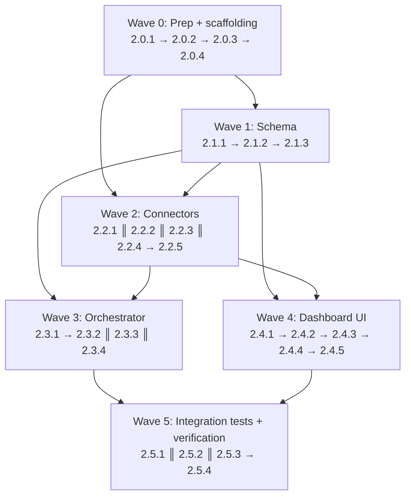

# Phase 2 Plan — Walking Skeleton (WordPress)

**Generated:** 2026-05-14
**Goal:** Prove the full pipeline with one real channel end-to-end — WordPress sync (live REST + WC webhooks + CSV historical backfill via ADR-001), a 5-level matching cascade with human validation queue, and a "Hoy" view that reflects today's sales within 15 minutes. This phase is where the F1 foundation meets reality.
**Total estimated effort:** 84h (median of RESEARCH+PATTERNS implied 76–92h range) / 21 days at 4h/day.
**Requirements covered:** WP-01, WP-02, WP-03, WP-04, WP-05, WP-06.
**Depends on Phase 1:** F1 ships everything F2 composes — `ChannelConnector` interface + `idempotentUpsert` + `recordConnectorRun` + `auditLog` + `requireRole` + the WordPress skeleton (throws `NOT_IMPLEMENTED_F2`) + Supabase migrations 0001–0013 with `pgvector` + `pg_trgm` enabled + `master_products` / `product_mappings` / `sales` / `sale_items` tables + the marts skeleton + the `connector_runs.kind` column + 4-role per-role `SECURITY INVOKER` views + the Operación upload wizard + a Hono orchestrator with a placeholder 501 webhook stub + the LLM adapter pattern in `scripts/discovery/llm-arbiter.ts`. F2 adds NO new tables besides `product_embeddings`; everything else extends or reuses F1 primitives.
**Phase boundary:** see "Out of scope" section. F2 is the first-channel slice — POS/WhatsApp/ML/Dropi/Falabella/AI all stay deferred to their named phases.

**Credential reality:** the client has NOT delivered `WORDPRESS_API_URL` / `WORDPRESS_API_KEY` / `WORDPRESS_API_SECRET` / `WORDPRESS_WEBHOOK_SECRET`. WP-01 (live REST + webhook receiver) ships as production-ready code that DEGRADES GRACEFULLY when env vars are unset: `healthCheck` returns `{ ok: false, last_error: 'not configured' }`, `fetchOrders/fetchProducts` no-op (return `[]` + log a structured warning), the webhook route 503s with a clear `not_configured` JSON payload, and the cron jobs short-circuit before any external call. **WP-02..WP-06 ship complete and demonstrable using CSV-uploaded data alone — this is the demo path.** The matching cascade, validation queue, and "Hoy" view all work end-to-end against CSV-ingested rows.

---

## Execution waves



| Wave                   | Plans                                            | Parallelizable?                                                                | Hours subtotal |
| ---------------------- | ------------------------------------------------ | ------------------------------------------------------------------------------ | -------------- |
| 0 — Prep + scaffolding | 2.0.1–2.0.4                                      | Serial (each builds on the previous; touches workspace + env wiring)           | ~10h           |
| 1 — Schema             | 2.1.1 → 2.1.2 → 2.1.3                            | Serial (migrations are ordered + types regen depends on both)                  | ~10h           |
| 2 — Connectors         | 2.2.1 ║ 2.2.2 ║ 2.2.3 ║ 2.2.4 → 2.2.5            | 4 plans parallel after Wave 1; 2.2.5 (cascade integration) seq after 2.2.2–2.2.4 | ~22h         |
| 3 — Orchestrator       | 2.3.1 → 2.3.2 ║ 2.3.3 ║ 2.3.4                    | 2.3.2/2.3.3/2.3.4 parallel after the webhook landing site exists (2.3.1)       | ~14h           |
| 4 — Dashboard UI       | 2.4.1 → 2.4.2 → 2.4.3 → 2.4.4 → 2.4.5            | Mostly serial (matching list → detail → actions; hoy page → live feed)         | ~20h           |
| 5 — Tests + verify     | 2.5.1 ║ 2.5.2 ║ 2.5.3 → 2.5.4                    | First three parallel; 2.5.4 (smoke + latency budget) gates on all              | ~8h            |

Total: **84h** (within 76–92h range).

Cross-wave parallelism: once W0 closes, W1 (schema migrations + types regen) and W2 (connectors layer) can NOT run truly in parallel because W2's matching cascade level-4 needs the `product_embeddings` table from W1. The safe overlap: W2.2.1 (`@faka/llm` package extraction) + W2.2.2 (WP connector) + W2.2.3 (matching cascade levels 1–3, pure SQL) can start as soon as W0 ships; W2.2.4 (embeddings + arbiter wiring) waits on W1.2.1. W3 (orchestrator routes + crons) needs W2's WP connector + matching cascade complete. W4 (dashboard UI) needs W1 (views) + W2 (validation queue reads `product_mappings`). W5 (tests) gates on everything.

---

## Wave 0 — Prep + scaffolding

> No new business behavior. Workspace plumbing, env vars, and the `@faka/llm` package extraction so subsequent waves have stable imports. All later waves depend on Wave 0.

### Plan 2.0.1 — Add `@faka/llm` workspace package (lift from `scripts/discovery/llm-arbiter.ts`)

- **Task:** Create new workspace `packages/llm/`:
  - `package.json` — `name: "@faka/llm"`, `type: "module"`, deps: `@faka/schema` (workspace), `ai@^4`, `@ai-sdk/anthropic`, `@ai-sdk/openai`, `@ai-sdk/google`, `@ai-sdk/openai-compatible` (for Moonshot/Kimi), `zod`. devDeps: `vitest`, `typescript`. Mirror `packages/connectors/package.json` layout exactly.
  - `tsconfig.json` — extends `@faka/config/tsconfig.base.json`, `outDir: dist`, `rootDir: src`.
  - `src/types.ts` — minimal subset the arbiter actually reads: `AnchorProduct { name: string; brand?: string; category?: string; barcode?: string; supplier_code?: string }`, `CandidateProduct { master_sku: string; name: string; brand?: string; category?: string }`, `MatchVerdict { isMatch: boolean; confidence: number; rationale: string }`. Do NOT import from `scripts/discovery/types.ts` (the package must be self-contained per PATTERNS §5).
  - `src/resolve-config.ts` — port verbatim from `scripts/discovery/llm-arbiter.ts:1-98` (env autodetect, CLI override, provider table). The autodetect order is documented at top of file (Kimi K2 if `MOONSHOT_API_KEY` set → Anthropic if `ANTHROPIC_API_KEY` → OpenAI → Gemini). Export `resolveLLMConfig(env?: NodeJS.ProcessEnv): LLMConfig | null` — returns `null` when no provider keys exist so callers can short-circuit (degraded mode per RESEARCH §Environment Availability).
  - `src/arbiter.ts` — port `arbitrateWithLLM` verbatim from `scripts/discovery/llm-arbiter.ts:128-167` (try/catch → return `{ isMatch: false, confidence: 0, rationale: err }`). Port `buildModel` verbatim from :169-208 (dynamic `await import("@ai-sdk/X")`). Port `extractJSON` verbatim from :210-225 (handles fenced ```json blocks). Port `promoteToMatch`, `summarizeConfig`, `estimateCallCost` from :227-267. **Spanish system prompt** stays unchanged (Colombia retail context per PATTERNS §5).
  - `src/prompts.ts` — extract the prompt template strings from `llm-arbiter.ts:100-110` into a versioned export: `export const ARBITER_PROMPT_V1 = { system: "...", user: (anchor, candidate) => "..." }`. Version bumps are append-only (V2, V3...) so prompts are testable per AI-05 in spirit (defer the full prompt-fixture rig to F5).
  - `src/index.ts` — barrel: re-export `resolveLLMConfig`, `arbitrateWithLLM`, `summarizeConfig`, `estimateCallCost`, `ARBITER_PROMPT_V1`, and the three types.
  - **Update `scripts/discovery/llm-arbiter.ts`** to RE-EXPORT from `@faka/llm` (keep the file as a thin shim so the existing discovery script keeps working) — `export { resolveLLMConfig, arbitrateWithLLM, ... } from "@faka/llm"`. Discovery's local types continue to live in `scripts/discovery/types.ts`; the shim adapts shapes where needed.
- **Files:** `packages/llm/package.json`, `packages/llm/tsconfig.json`, `packages/llm/src/types.ts`, `packages/llm/src/resolve-config.ts`, `packages/llm/src/arbiter.ts`, `packages/llm/src/prompts.ts`, `packages/llm/src/index.ts`, `scripts/discovery/llm-arbiter.ts` (modify — turn into shim).
- **Depends on:** Nothing (Wave 0 starter).
- **References:** RESEARCH §Don't Hand-Roll (the F1 LOCKED LLM adapter pattern is single-source-of-truth), PATTERNS §5 LLM arbiter package (lift verbatim guidance), `scripts/discovery/llm-arbiter.ts:1-267` (source).
- **Anti-duplication note:** PATTERNS §5 — DO NOT introduce a second LLM adapter implementation. The F1 env-driven multi-provider resolver is LOCKED. Discovery's existing file becomes a shim; no logic divergence. The cost estimate table (`llm-arbiter.ts:255-264`) gets a TODO comment to re-verify prices at F5 time but values are unchanged in F2.
- **Effort:** 3h
- **Verifies:** `pnpm --filter @faka/llm exec tsc --noEmit` passes; `pnpm vitest run packages/llm/__tests__/resolve-config.test.ts` (a stub test) confirms autodetect order; `pnpm --filter @faka/discovery exec tsc --noEmit` still passes after the shim change; `grep -c 'from "@faka/llm"' scripts/discovery/llm-arbiter.ts` ≥ 1 (shim re-exports); `grep -c 'export function resolveLLMConfig' packages/llm/src/resolve-config.ts` returns 1 (the canonical owner moved).
- **Requirements:** WP-03 (cascade level 5 reuses this adapter).

### Plan 2.0.2 — Env vars + secrets schema additions (WordPress credentials, OpenAI, matching thresholds)

- **Task:** Update three files with the new F2 env surface:
  - `.env.example` at repo root: add the WordPress block (`WORDPRESS_API_URL=`, `WORDPRESS_API_KEY=`, `WORDPRESS_API_SECRET=`, `WORDPRESS_WEBHOOK_SECRET=` — all four placeholders, with comments explaining "not yet delivered by client; connector falls back to degraded mode if any are unset"); the matching block (`MATCH_EMBED_HIGH=0.92`, `MATCH_EMBED_MID=0.78`, `MATCH_ARBITER=0.80`, `MATCH_QUEUE_CUTOFF=0.78`, `LLM_DAILY_TOKEN_CAP=200000`, `EMBEDDING_MODEL=text-embedding-3-small`, `EMBEDDING_DIM=1536`); the OpenAI block (`OPENAI_API_KEY=` — also documented in `scripts/discovery/.env.example` but lift to repo root for clarity that orchestrator needs it). Document the four LLM provider env vars `MOONSHOT_API_KEY` / `ANTHROPIC_API_KEY` / `GOOGLE_GENERATIVE_AI_API_KEY` / `OPENAI_API_KEY` (any one is sufficient).
  - `apps/orchestrator/.env.example`: same WP + matching + OpenAI + LLM provider blocks, plus add comment "These are read once at boot; on rotation, restart Railway service."
  - `apps/dashboard/.env.example`: NO new vars — dashboard never reads WP/OpenAI/LLM credentials (invariant CC-11). Add a comment block at the top documenting this constraint: "F2 keeps WordPress + OpenAI + LLM credentials orchestrator-only. Dashboard reads role-gated DB views; matching queue is server-action-only."
  - `apps/orchestrator/railway.toml`: add `[env]` block listing the new var NAMES (no values) so the operator runbook is explicit. Document them in a comment block referencing `DEPLOY.md`.
  - `apps/dashboard/vercel.json`: confirm NO new vars and tighten the CI lint to also reject `NEXT_PUBLIC_WORDPRESS_*` or `NEXT_PUBLIC_OPENAI_*` patterns (extend the existing CC-11 regex). Add a unit test in CI script or eslint config.
- **Files:** `.env.example` (modify), `apps/orchestrator/.env.example` (modify), `apps/dashboard/.env.example` (modify — comment only), `apps/orchestrator/railway.toml` (modify), `apps/dashboard/vercel.json` (modify if exists else create stub), `packages/config/eslint.base.cjs` (modify — extend the CC-11 regex to include WORDPRESS|OPENAI|MOONSHOT|ANTHROPIC patterns).
- **Depends on:** 2.0.1 (so the LLM provider list matches what `@faka/llm` reads).
- **References:** RESEARCH §Environment Availability (the explicit credential vs degraded-mode matrix), CC-11 invariant (no `NEXT_PUBLIC_*SECRET|SERVICE|PRIVATE`), F1 PLAN 1.4.4b lint pattern, RESEARCH §Architectural Map (orchestrator-only credentials).
- **Anti-duplication note:** CC-11 — DO NOT add `NEXT_PUBLIC_*` variants of any WP / OpenAI / LLM key. The dashboard reads role-gated views from Supabase via its existing anon key; the validation queue's "show side-by-side" data comes from server-actions, not from browser-side WC API calls.
- **Effort:** 2h
- **Verifies:** `grep -E 'NEXT_PUBLIC_.*(SERVICE|SECRET|PRIVATE|WORDPRESS|OPENAI|MOONSHOT|ANTHROPIC)' apps/dashboard/.env.example apps/dashboard/vercel.json` returns ZERO matches; `grep -c 'WORDPRESS_API_URL' apps/orchestrator/.env.example` returns 1; `grep -c 'WORDPRESS_API_URL' apps/orchestrator/railway.toml` returns 1; `grep -c 'WORDPRESS_API_URL' apps/dashboard/.env.example` returns 0 (orchestrator-only); `pnpm --filter dashboard exec eslint app/ --max-warnings=0` still passes; the eslint rule update is grep-confirmable: `grep -E 'WORDPRESS|OPENAI|MOONSHOT|ANTHROPIC' packages/config/eslint.base.cjs` returns ≥1.
- **Requirements:** WP-01 (degraded-mode credentials), WP-03 (matching thresholds env-driven).

### Plan 2.0.3 — New connector subdirectory scaffolding + WP CSV mapping profile (orders) extension

- **Task:** Extend the WordPress CSV mapping profiles in `packages/db/supabase/seed.sql`.
  - F1's seed already has a WordPress products profile (`seed.sql:15-42`) but no orders profile. **Do NOT create empty placeholder files for `wordpress/` or `matching/` directories** — the plans in Waves 2 land code directly in atomic commits; the per-plan "Files" list is the source of truth.
  - Add a WordPress orders profile per RESEARCH §Code Examples (`WordPress · Orders Export (WC Order Export Lite) · v1` with `external_order_id, fecha, estado, total, subtotal, descuento, costo_envio, moneda, customer_name, customer_email, customer_phone, customer_city, payment_method` mapping). Status map: `completed→pagado, processing→pendiente, cancelled→cancelado, refunded→devuelto`. Timezone: `America/Bogota`. Use the `on conflict do nothing` idempotent insert pattern from F1 (`seed.sql:42`).
  - Leave the existing F1 products profile untouched (versioned per ADR-001 LOCKED — if client's actual export shape diverges, add a v2 row in a later commit, never modify v1).
- **Files:** `packages/db/supabase/seed.sql` (modify — append WP orders profile insert).
- **Depends on:** Nothing (CSV profile insert is idempotent and standalone).
- **References:** RESEARCH §Code Examples (WP CSV mapping profile SQL), PATTERNS §9 (extend seed.sql; F1 has products profile already, add orders profile), ADR-001 (versioned CSV mapping profiles).
- **Anti-duplication note:** PATTERNS §9 — DO NOT modify the existing F1 WP products profile (`seed.sql:15-42`); the unique constraint `(canal, tipo, nombre, version)` (migration 0003:71) prevents accidental override anyway. RESEARCH §Assumption A1 — if the client's actual export columns differ from `WC Order Export Lite`, the planner-time fix is to insert a SECOND version row, not edit v1.
- **Effort:** 1h
- **Verifies:** `pnpm --filter @faka/db exec supabase db reset` runs seed clean (idempotent); `psql ... -c "select count(*) from csv_mapping_profiles where canal='wordpress'"` returns ≥ 2 (1 products v1 + 1 orders v1); `psql ... -c "select column_map_json->>'external_order_id' from csv_mapping_profiles where canal='wordpress' and tipo='orders'"` returns `'Order ID'`; `psql ... -c "select reglas_json->>'timezone' from csv_mapping_profiles where canal='wordpress' and tipo='orders'"` returns `'America/Bogota'`; rerunning `db reset` produces the same row count.
- **Requirements:** WP-02 (historical CSV backfill ingestion profile present).

### Plan 2.0.4 — Install Wave 2 dependencies + verify lockfile

- **Task:** Pin and install the new dependencies declared by upcoming Wave 2 plans. Single-shot install minimizes lockfile churn across waves.
  - `pnpm --filter @faka/connectors add @woocommerce/woocommerce-rest-api@<exact pinned> p-limit@<exact pinned>`.
  - `pnpm --filter @faka/connectors add @ai-sdk/openai@<exact pinned>` (if not already pinned via `@faka/llm` workspace).
  - `pnpm --filter @faka/connectors add -D msw@<exact pinned>` (HTTP mocking for WP REST tests in Wave 5).
  - `pnpm --filter @faka/llm add ai@<exact pinned> @ai-sdk/anthropic@<exact pinned> @ai-sdk/openai@<exact pinned> @ai-sdk/google@<exact pinned> @ai-sdk/openai-compatible@<exact pinned>` (Moonshot uses openai-compatible).
  - Resolve exact versions at install time via `npm view <pkg> version` (RESEARCH §Standard Stack flagged the `@woocommerce/woocommerce-rest-api` registry probe was throttled). Pin EXACT versions in package.json (no `^`). Document the resolved versions in a single line at the top of `apps/orchestrator/.env.example` (`# Resolved 2026-05-14: @woocommerce/woocommerce-rest-api@X.Y.Z, p-limit@A.B.C, msw@D.E.F`).
  - Commit the updated `pnpm-lock.yaml`. The `--frozen-lockfile` install in CI must succeed after this commit.
- **Files:** `packages/connectors/package.json` (modify), `packages/llm/package.json` (modify if needed after 2.0.1 versions resolve), `pnpm-lock.yaml` (modify — regenerated), `apps/orchestrator/.env.example` (modify — version comment).
- **Depends on:** 2.0.1 (LLM package exists), 2.0.2 (env example shape final).
- **References:** RESEARCH §Standard Stack (version verification note), RESEARCH §Installation snippet, ESTADO.md (existing pinning style: `@supabase/supabase-js@^2.105.1` exact resolution learned in F1).
- **Anti-duplication note:** RESEARCH §Standard Stack — re-use `@ai-sdk/openai` for OpenAI embeddings; do NOT add the bare `openai` SDK as a second client. Embedding calls go through the AI SDK in `level-4-embeddings.ts` (Wave 2). Pin EXACT (no caret) versions: F1's `pnpm 10.28.1` pin (ESTADO §"Decisiones operativas") is the precedent for exact pinning. F1 also learned that `@supabase/supabase-js@2.105.4` did not exist on npm — verify every version with `npm view` before pinning.
- **Effort:** 2h
- **Verifies:** `pnpm install --frozen-lockfile` exits 0; `pnpm --filter @faka/connectors exec tsc --noEmit` passes (imports for `@woocommerce/woocommerce-rest-api` resolve); `grep -E '"@woocommerce/woocommerce-rest-api": "\^' packages/connectors/package.json` returns ZERO (no caret pinning); `grep -E '"@ai-sdk/openai": "[0-9]' packages/llm/package.json` returns ≥1; the version comment in `apps/orchestrator/.env.example` matches the resolved versions in `pnpm-lock.yaml`.
- **Requirements:** WP-01 (WC SDK), WP-03 (embeddings + arbiter SDKs).

---

## Wave 1 — Schema

> Three artifacts: the `product_embeddings` table + HNSW index migration, the `v_hoy_*` views migration, and the regenerated `database.ts` types committed alongside. Migrations follow F1's contiguous numbering (next free: 20260601 timestamp).

### Plan 2.1.1 — Migration: `product_embeddings` table + HNSW index + ANN helper

- **Task:** Create `packages/db/supabase/migrations/20260601000001_product_embeddings.sql`:
  - Top-of-file doc block per F1 convention (`-- Migration 20260601000001 — Product embeddings. -- Phase 2 / Plan 2.1.1. -- Purpose: cascade level 4 (semantic match via pgvector). -- Invariant: vector dim is 1536 (text-embedding-3-small) — never edit; bump model = new column.`).
  - `create table public.product_embeddings (master_sku uuid primary key references public.master_products(master_sku) on delete cascade, embedding vector(1536) not null, source_text text not null, source_hash text not null, model text not null default 'text-embedding-3-small', updated_at timestamptz not null default now());`
  - `create index product_embeddings_hnsw on public.product_embeddings using hnsw (embedding vector_cosine_ops) with (m = 16, ef_construction = 64);` (RESEARCH §Code Examples verbatim).
  - `create or replace function public.find_similar_products(query_vec vector(1536), k int default 5) returns table (master_sku uuid, distance float) language sql stable as $$ select master_sku, embedding <=> query_vec as distance from public.product_embeddings order by embedding <=> query_vec limit k; $$;` (RESEARCH §Code Examples verbatim).
  - `alter table public.product_embeddings enable row level security;`
  - Baseline RLS: `create policy product_embeddings_select_all on public.product_embeddings for select to authenticated using (true);` (read-only — orchestrator writes via service-role).
  - `grant select on public.product_embeddings to authenticated;`
  - `grant execute on function public.find_similar_products(vector, int) to authenticated;`
- **Files:** `packages/db/supabase/migrations/20260601000001_product_embeddings.sql`.
- **Depends on:** Nothing (migration is additive). The `vector` extension is enabled in migration 0001 (F1); verify before merging.
- **References:** RESEARCH §Code Examples (embeddings table + HNSW + ANN helper SQL verbatim), PATTERNS §4 (analog: `20260513000004_master_layer.sql:17-45` table/index style), RESEARCH §Pitfall 5 (dimension is baked in; do NOT make `vector(N)` configurable), RESEARCH §Pitfall 6 (HNSW handles write churn at our scale).
- **Anti-duplication note:** RESEARCH §Pitfall 5 — DO NOT make the dimension a variable. `1536` is wired to `text-embedding-3-small`; future model swap adds a NEW column (`embedding_v2 vector(N)`) rather than editing this one. PATTERNS §4 — copy the `references ... on delete cascade` clause from `master_layer.sql:60-61` verbatim. RESEARCH §Standard Stack — DO NOT use IVFFlat; HNSW is the Supabase-recommended default for 2026.
- **Effort:** 2h
- **Verifies:** `pnpm --filter @faka/db exec supabase db reset` applies migration 0014 (the new file is #14 in the contiguous numbering) clean; `psql ... -c "\d product_embeddings"` shows the 6 columns + PK FK; `psql ... -c "select indexname, indexdef from pg_indexes where tablename='product_embeddings'"` shows `product_embeddings_hnsw using hnsw (embedding vector_cosine_ops)`; `psql ... -c "select pg_get_functiondef('public.find_similar_products(vector, int)'::regprocedure)"` returns the function body; `psql ... -c "select has_table_privilege('authenticated', 'public.product_embeddings', 'SELECT')"` returns `t`.
- **Requirements:** WP-03 (cascade level 4 storage).

### Plan 2.1.2 — Migration: `v_hoy_*` views (security_invoker, security-by-grants)

- **Task:** Create `packages/db/supabase/migrations/20260601000002_hoy_views.sql`:
  - Top-of-file doc block: `-- Migration 20260601000002 — Hoy views. -- Phase 2 / Plan 2.1.2. -- Purpose: 4 SECURITY INVOKER aggregate views for "Hoy" dashboard. -- Invariant CC-12: every view declares "with (security_invoker = true)". -- Invariant: timezone is America/Bogota; sales.fecha is already date-typed (migration 0005).`
  - **`v_hoy_totals`** (RESEARCH §Code Examples verbatim): `with (security_invoker = true)` + `select coalesce(sum(total), 0)::numeric(14,2) as ingresos_hoy, coalesce(sum(quantity), 0) as unidades_hoy, count(distinct sale_id) as ordenes_hoy from public.sales s left join public.sale_items si on si.sale_id = s.sale_id where s.fecha = (now() at time zone 'America/Bogota')::date and s.estado in ('pagado', 'pendiente', 'parcial');`
  - **`v_hoy_per_channel`** (RESEARCH §Code Examples verbatim): grouped per `canal`, returns `canal, ordenes, ingresos` ordered by `ingresos desc`.
  - **`v_hoy_top_products`** (RESEARCH §Code Examples verbatim): joins `sale_items` + `master_products`, top 10 by `ingresos` for today, filtered to `master_sku is not null` (unmatched items are surfaced in the validation queue, not the top-10).
  - **`v_hoy_last_hour`** (RESEARCH §Code Examples verbatim): rows with `s.created_at >= now() - interval '1 hour'`, top 50 by `created_at desc`. Includes a `coalesce(sum(quantity), 0) as item_count` aggregation per row.
  - All 4 views: `with (security_invoker = true)` BEFORE `as select`. Lint-friendly: 4 `create view` ⇒ 4 `security_invoker` in this file (count must match).
  - `grant select on public.v_hoy_totals, public.v_hoy_per_channel, public.v_hoy_top_products, public.v_hoy_last_hour to authenticated;` (last line of the file).
  - **Role variant for Analista (per RESEARCH Open Question §2 RESOLVED):** add `v_hoy_per_channel_analista` with $ columns nulled — `select canal, ordenes, null::numeric as ingresos from ...`. This view is granted to all 4 roles. The `v_hoy_per_channel` view (with `$`) is granted to `authenticated` BUT the dashboard's `<PerChannelChart>` server component reads `v_hoy_per_channel_analista` when `role==='analista'` and `v_hoy_per_channel` otherwise. **Defer to dashboard layer; this migration ships both views.**
- **Files:** `packages/db/supabase/migrations/20260601000002_hoy_views.sql`.
- **Depends on:** Nothing (additive). Existing `sales(canal, fecha)` btree index from migration 0005 is sufficient at v1 scale (RESEARCH §Assumption A8).
- **References:** RESEARCH §Code Examples (4 views SQL verbatim), RESEARCH Open Question §2 (analista variant resolution), PATTERNS §8 (analog: `20260513000011_role_views.sql:20-66` for 19 security_invoker views pattern), RESEARCH §Pitfall 10 (timezone — `America/Bogota`), invariant CC-12.
- **Anti-duplication note:** Invariant CC-12 — every `create view` MUST include `with (security_invoker = true)`. Lint: `grep -c 'create view' packages/db/supabase/migrations/20260601000002_hoy_views.sql` MUST equal `grep -c 'security_invoker = true' packages/db/supabase/migrations/20260601000002_hoy_views.sql`. PATTERNS §8 — these views are NOT per-role suffixed (`_view_admin/_view_manager/_view_analista`) because they aggregate; per-role projection happens at the column level (`v_hoy_per_channel_analista` with `null::numeric as ingresos`). RESEARCH §Pitfall 10 — `(now() at time zone 'America/Bogota')::date` is the canonical "today" filter; do NOT use `current_date` (UTC).
- **Effort:** 3h
- **Verifies:** Migration applies clean; `grep -c 'create view' packages/db/supabase/migrations/20260601000002_hoy_views.sql` (5 if analista variant; 4 if not) equals the matching `security_invoker = true` count; `psql ... -c "select viewname from pg_views where viewname like 'v_hoy_%'"` returns 4 (or 5) rows; `psql ... -c "select * from v_hoy_totals"` returns one row with NULL/zero values when DB is empty; `psql ... -c "select has_table_privilege('authenticated', 'public.v_hoy_totals', 'SELECT')"` returns `t`; SQL test (deferred to Wave 5) seeds 3 mixed-channel sales for today + 2 yesterday, asserts `v_hoy_totals.ingresos_hoy` excludes yesterday.
- **Requirements:** WP-05 (Hoy view data source).

### Plan 2.1.3 — Regenerate `database.ts` + commit + CI db-types gate

- **Task:** Regenerate the Supabase types file after migrations 14 + 15 land:
  - Run `pnpm --filter @faka/db run types` (which executes `supabase gen types typescript --local > types/database.ts`).
  - Commit the resulting `packages/db/types/database.ts` along with the two migration files in atomic commits or one batch — CI's `db-integration` job runs `git diff --exit-code packages/db/types/database.ts` after `db reset` and fails on drift.
  - Verify the new types include: `product_embeddings.Row/Insert/Update`, the 4 (or 5) `v_hoy_*` view row types under `Views`, and the `find_similar_products` function signature under `Functions`.
  - **Add a regenerate-after-migration reminder** to `DEPLOY.md` (append a short note: "After applying F2 migrations 14+15, run `pnpm --filter @faka/db run types` and commit the result; CI enforces no drift").
- **Files:** `packages/db/types/database.ts` (regenerated), `DEPLOY.md` (modify — append F2 migration note).
- **Depends on:** 2.1.1, 2.1.2 (both migrations exist on disk).
- **References:** F1 PLAN 1.1.7 (the `db:types:check` gate pattern), F1 CC-3 cross-cutting check.
- **Anti-duplication note:** F1 already excludes `database.ts` from Prettier via `.prettierignore` (ESTADO §"En el código"); do NOT format the generated file. CI is fully strict (`format`, `type check`, `types-committed assert` all hard-fail per the project rules); this plan is the F2 obeyance.
- **Effort:** 1h (mostly mechanical — generate, commit, verify)
- **Verifies:** `pnpm --filter @faka/db exec supabase db reset && pnpm --filter @faka/db run types && git diff --exit-code packages/db/types/database.ts` returns 0; `grep -c 'product_embeddings' packages/db/types/database.ts` ≥ 1; `grep -c 'v_hoy_totals' packages/db/types/database.ts` ≥ 1; CI's `db-integration` job goes green after the merge.
- **Requirements:** WP-03 + WP-05 (typed DB access for embeddings + views).

---

## Wave 2 — Connectors

> Builds the WordPress connector (production-ready, degraded-mode when env unset) + matching cascade (5 levels). Plans 2.2.1, 2.2.2, 2.2.3, 2.2.4 can run in parallel after Wave 1's migration 14 (product_embeddings exists for 2.2.4); 2.2.5 (cascade orchestration + product_mappings UPSERT) integrates 2.2.2 + 2.2.3 + 2.2.4 outputs and runs after them.

### Plan 2.2.1 — WordPress connector (real impl + degraded mode without credentials)

- **Task:** REWRITE `packages/connectors/src/wordpress/index.ts` (currently a F1 skeleton that throws `NOT_IMPLEMENTED_F2`). New layout in `packages/connectors/src/wordpress/`:
  - `config.ts` — `loadWordPressConfig(env: NodeJS.ProcessEnv = process.env): WordPressConfig | { ok: false, reason: "not_configured" }`. Reads `WORDPRESS_API_URL`, `WORDPRESS_API_KEY`, `WORDPRESS_API_SECRET`, `WORDPRESS_WEBHOOK_SECRET`. If any is missing or empty string → return `{ ok: false, reason: "not_configured" }` (the degraded-mode discriminant). Returns full config when all four present.
  - `client.ts` — Thin wrapper around `@woocommerce/woocommerce-rest-api`: `createWooClient(cfg): WooCommerceRestApi` with `queryStringAuth: true` (HTTPS canonical signing per RESEARCH §Pattern 2). Zod schemas for WC payloads: `WCOrder` (per WC v3 docs), `WCOrderLineItem`, `WCProduct`. Export type aliases.
  - `fetch-orders.ts` — `fetchOrders(since: Date, cfg: WordPressConfig): Promise<WCOrder[]>` per RESEARCH §Pattern 2 verbatim: paginates `per_page=100`, `modified_after=<since.toISOString().replace(/\\.\\d{3}Z$/, "")`, `dates_are_gmt=true`, `orderby=modified`, `order=asc`. Reads `x-wp-totalpages` header for pagination break condition. Wrap each page call in `p-retry({ retries: 3, factor: 2, minTimeout: 1000 })`. **Use `modified_after` NOT `after`** (RESEARCH §Pitfall 3 — WC GitHub #14539). Validate each row with Zod; rows that fail Zod parse are LOGGED + SKIPPED (do not throw — partial-batch resilience per PATTERNS §1 csv index.ts:148-182 envelope).
  - `fetch-products.ts` — Same pagination shape against `/products` endpoint, same Zod-validated discriminated union.
  - `normalize-order.ts` — Pure function `normalizeOrder(wc: WCOrder): NormalizedOrder` mapping WC JSON shape directly. `canal: "wordpress"`, `external_order_id: String(wc.id)`, `fecha: dayjs(wc.date_modified_gmt).tz('America/Bogota').format('YYYY-MM-DD')` (use `Intl` + `toLocaleDateString('en-CA', { timeZone: 'America/Bogota' })` per RESEARCH §Supporting libs — no `dayjs` dep needed), `total: Number(wc.total)`, `subtotal/descuento/costo_envio` computed from WC totals/discounts/shipping objects, `estado: STATUS_MAP[wc.status]` (`completed→pagado`, `processing→pendiente`, `cancelled→cancelado`, `refunded→devuelto`), `moneda: wc.currency`. **Items array:** map `wc.line_items[]` to `NormalizedOrderItem[]` with `external_product_id: String(item.product_id)`, `product_name: item.name`, `quantity: item.quantity`, `unit_price: Number(item.subtotal) / item.quantity`, `line_total: Number(item.total)`. **Does NOT call `applyColumnMap`** (invariant W1 — that helper is CSV-only).
  - `normalize-product.ts` — `normalizeProduct(wc: WCProduct): NormalizedProduct` — maps WC product shape: `external_id: String(wc.id)`, `nombre_canonico: wc.name`, `barcode: wc.meta_data?.find(m => m.key === '_ean')?.value`, `supplier_code: wc.sku`, `brand: wc.attributes?.find(a => a.name === 'Brand')?.options?.[0]`, `category: wc.categories?.map(c => c.name).join(' > ')`, `precio_sugerido: Number(wc.regular_price)`.
  - `webhook-verify.ts` — RESEARCH §Pattern 1 verbatim: `verifyWooSignature(rawBody: Buffer, signatureHeader: string | undefined, secret: string): boolean`. Uses `createHmac('sha256', secret).update(rawBody).digest('base64')` + `timingSafeEqual` on equal-length buffers. **CRITICAL**: must accept raw `Buffer`, not parsed JSON (RESEARCH §Pitfall 2).
  - `webhook-dedupe.ts` — `checkDeliverySeen(supabase, deliveryId: string): Promise<boolean>`. INSERT into `raw_events` with `ON CONFLICT (canal, tipo_evento, payload_json->>'delivery_id') DO NOTHING` and check `rowCount === 0` for already-seen. Returns `true` if seen, `false` if newly inserted. (Migration 0003's `raw_events` already supports this via the canal+tipo_evento unique constraint; if not, add a partial unique index on `(canal, (payload_json->>'_delivery_id'))` as part of this plan via a new migration `20260601000003_raw_events_dedup_index.sql`.)
  - `index.ts` — REWRITE the F1 skeleton: `export const createWordPressConnector: ConnectorFactory<WordPressConnectorConfig>`. Follow PATTERNS §1 verbatim (csv/index.ts:74-78 factory+closure shape; helper functions hoisted OUTSIDE the returned object; `safeNormalize*` envelope per csv:148-182; idempotent UPSERTs via `{ onConflict: "canal,external_order_id" }`). Connector shape:
    - `name: "wordpress"`, `canal: "wordpress"`, `type: "pull"`, `capabilities: new Set(["orders", "products"])`.
    - `healthCheck()`: if `loadConfig()` returns `{ ok: false }` → return `{ ok: false, last_error: "not configured" }`. Otherwise try a lightweight `GET /system_status` against the WC API; return `{ ok: true, last_sync: <connector_runs.completed_at> }` on success, `{ ok: false, last_error: <message> }` on failure. **NEVER throws.**
    - `fetchOrders(since: Date, ctx)`: if degraded → log warning + return `[]`. Otherwise delegate to `fetch-orders.ts`.
    - `fetchProducts(since: Date, ctx)`: same degraded check + delegate.
    - `normalizeOrder` / `normalizeProduct`: pure delegations to normalize-order.ts / normalize-product.ts (no env required — degraded mode does not affect normalization, just fetching).
    - `extractCustomerHint(raw): CustomerHint | null` — WC orders carry `billing.email`, `billing.phone`. Return `{ phone: raw.billing?.phone, email: raw.billing?.email, displayed_name: raw.billing?.first_name + ' ' + raw.billing?.last_name, source: "order_payload" }`. F4 will use this when Mini-CRM matching ships; F2 just exposes the hook.
- **Files:** `packages/connectors/src/wordpress/config.ts`, `packages/connectors/src/wordpress/client.ts`, `packages/connectors/src/wordpress/fetch-orders.ts`, `packages/connectors/src/wordpress/fetch-products.ts`, `packages/connectors/src/wordpress/normalize-order.ts`, `packages/connectors/src/wordpress/normalize-product.ts`, `packages/connectors/src/wordpress/webhook-verify.ts`, `packages/connectors/src/wordpress/webhook-dedupe.ts`, `packages/connectors/src/wordpress/index.ts` (REWRITE), and optionally `packages/db/supabase/migrations/20260601000003_raw_events_dedup_index.sql` if the dedup-by-delivery-id index doesn't already exist on `raw_events`.
- **Depends on:** 2.0.4 (SDK installed). Wave 1 NOT required (this plan does not touch product_embeddings; it produces the connector that 2.3.x will call). Can run in parallel with 2.2.3 + 2.2.4.
- **References:** RESEARCH §Pattern 1 (webhook verify code verbatim), RESEARCH §Pattern 2 (WC REST pull code verbatim), RESEARCH §Pitfall 2 (raw body), RESEARCH §Pitfall 3 (modified_after), RESEARCH §Pitfall 4 (cron + webhook write order), RESEARCH §Architectural Map (orchestrator-only credentials), RESEARCH §Environment Availability (degraded mode mandated for WP-01), PATTERNS §1 (csv/index.ts shape — factory + safe normalize envelope + idempotent UPSERT).
- **Anti-duplication note:** Invariant W1 — `normalize-order.ts` and `normalize-product.ts` MUST NOT import `applyColumnMap`. Grep gate: `grep -c 'applyColumnMap' packages/connectors/src/wordpress/*.ts` MUST return 0. The WC normalizers map JSON fields directly. Invariant CC-11 — `WORDPRESS_API_SECRET` and `WORDPRESS_WEBHOOK_SECRET` MUST stay orchestrator-only; the dashboard never imports `@faka/connectors/wordpress` (only `@faka/connectors`'s public surface, and the WP connector is invoked from `apps/orchestrator/src/*` exclusively). RESEARCH §Pitfall 2 — webhook verify takes `Buffer`, not parsed JSON; the verify function MUST refuse to compile if a `string` is passed (use TS overloads if needed). RESEARCH §Pitfall 1 — degraded mode: `healthCheck` returns `{ ok: false, last_error: "not configured" }` and `fetchOrders` returns `[]`; **NEVER throws** on missing env vars. The pattern: callers always get a connector; behavior degrades, surface doesn't.
- **Effort:** 6h
- **Verifies:** `pnpm --filter @faka/connectors exec tsc --noEmit` passes; `pnpm vitest run packages/connectors/__tests__/wordpress/webhook-verify.test.ts` passes (valid sig accepted, tampered byte rejected); `pnpm vitest run packages/connectors/__tests__/wordpress/normalize-order.test.ts` passes against a golden WC order fixture (`__fixtures__/wc-order-completed.json`); without env vars, `createWordPressConnector({}).healthCheck()` returns `{ ok: false, last_error: "not configured" }`; without env vars, `createWordPressConnector({}).fetchOrders(new Date(0), ctx)` returns `[]` (no throw, no crash); `grep -c 'applyColumnMap' packages/connectors/src/wordpress/` returns 0 (W1 invariant); `grep -c 'queryStringAuth: true' packages/connectors/src/wordpress/client.ts` returns 1; `grep -c 'modified_after' packages/connectors/src/wordpress/fetch-orders.ts` returns ≥ 1 (Pitfall 3 fix); `grep -c 'timingSafeEqual' packages/connectors/src/wordpress/webhook-verify.ts` returns 1 (no manual `===` compare).
- **Requirements:** WP-01 (real REST + webhook handlers, degraded gracefully without env).

### Plan 2.2.2 — Matching cascade: types + thresholds + levels 1-3 (pure SQL)

- **Task:** Create the matching cascade module (NO ANALOG in F1 per PATTERNS §3 — design from RESEARCH §Pattern 3 verbatim):
  - `packages/connectors/src/matching/types.ts` — `MatchResult { method: MatchMethod, score: number, master_sku: string | null, source?: "cache" | "live" }`, `SaleItemCandidate { canal: Canal, external_product_id: string, product_name: string, barcode?: string, supplier_code?: string }`, `CascadeContext { supabase: SupabaseClient, openai?: <AI SDK embedding model>, llmConfig?: LLMConfig | null, thresholds: Thresholds }`, `Thresholds { embeddingsHigh: number, embeddingsMid: number, arbiterAccept: number, queueCutoff: number, llmDailyTokenCap: number }`. Imports `MatchMethod` from `@faka/schema` (F1's enum).
  - `packages/connectors/src/matching/thresholds.ts` — RESEARCH §Pattern 3 thresholds verbatim: `export function loadThresholds(env = process.env): Thresholds { return { embeddingsHigh: Number(env.MATCH_EMBED_HIGH ?? 0.92), embeddingsMid: Number(env.MATCH_EMBED_MID ?? 0.78), arbiterAccept: Number(env.MATCH_ARBITER ?? 0.80), queueCutoff: Number(env.MATCH_QUEUE_CUTOFF ?? 0.78), llmDailyTokenCap: Number(env.LLM_DAILY_TOKEN_CAP ?? 200000) }; }`.
  - `packages/connectors/src/matching/level-1-barcode.ts` — `export async function matchByBarcode(supabase, barcode: string | undefined): Promise<{ master_sku: string } | null>`. Single SQL: `select master_sku from master_products where barcode = $1 limit 1`. Returns `null` if no match or no barcode. Wraps in `p-retry({ retries: 2 })` for transient DB blips.
  - `packages/connectors/src/matching/level-2-supplier-code.ts` — Same shape, queries `supplier_code` column on `master_products`.
  - `packages/connectors/src/matching/level-3-normalized-name.ts` — `normalize(name): string` using `String.prototype.normalize('NFD').replace(/\\p{Diacritic}/gu, '').toLowerCase().replace(/[^a-z0-9 ]/g, '').replace(/\\s+/g, ' ').trim()`. Then `matchByNormalizedName(supabase, normalizedName): Promise<{ master_sku } | null>` does a SQL exact match on a computed column or generated column. **Decision: add a generated column `master_products.nombre_normalizado text generated always as (normalize_name(nombre_canonico)) stored` + an index, via an additive migration in 2.2.2.** Or simpler: do the normalization in Postgres via a function `normalize_name(text)` and index on `lower(nombre_canonico)` + use `pg_trgm` similarity for fuzzy. **Recommendation:** add a small migration `20260601000004_master_products_nombre_normalizado.sql` that:
    - Adds the function `create or replace function public.normalize_name(t text) returns text language sql immutable as $$ select trim(regexp_replace(lower(unaccent(t)), '[^a-z0-9 ]+', ' ', 'g')) $$;` (note: enable `unaccent` extension in migration 0001 — verify it's present; if not, add `create extension if not exists unaccent;` here).
    - Adds the generated column: `alter table public.master_products add column nombre_normalizado text generated always as (public.normalize_name(nombre_canonico)) stored;`.
    - Adds the index: `create index master_products_nombre_normalizado_idx on public.master_products (nombre_normalizado);`.
  - Level 3 then becomes a clean SQL equality query.
- **Files:** `packages/connectors/src/matching/types.ts`, `packages/connectors/src/matching/thresholds.ts`, `packages/connectors/src/matching/level-1-barcode.ts`, `packages/connectors/src/matching/level-2-supplier-code.ts`, `packages/connectors/src/matching/level-3-normalized-name.ts`, `packages/db/supabase/migrations/20260601000004_master_products_nombre_normalizado.sql`.
- **Depends on:** 2.0.4 (deps installed). Wave 1 NOT required (this plan adds its own additive migration). Parallel with 2.2.1.
- **References:** RESEARCH §Pattern 3 (cascade + thresholds code verbatim), RESEARCH §Don't Hand-Roll (Spanish accent normalization via `String.normalize('NFD')`), PATTERNS §3 (NO ANALOG — design from spec), PATTERNS §10 (channel enum boundary), F1's `pg_trgm` extension enabled in migration 0001.
- **Anti-duplication note:** RESEARCH §Pattern 3 — DO NOT inline the threshold constants in level files; they ALL come from `loadThresholds(env)` so the env vars in 2.0.2 are the single source of truth. PATTERNS §3 — `types.ts` is the contract file; level files import from there. Do NOT inline `MatchResult` shapes in level files. RESEARCH §Anti-Patterns — DO NOT do levels 1-3 in TypeScript with loops; each level is ONE SQL query — single round-trip.
- **Effort:** 4h
- **Verifies:** `pnpm --filter @faka/connectors exec tsc --noEmit` passes; migration 16 applies clean (`pnpm --filter @faka/db exec supabase db reset`); `psql ... -c "select normalize_name('Acéíte Olíva 1L')"` returns `'aceite oliva 1l'`; `psql ... -c "select indexname from pg_indexes where indexname='master_products_nombre_normalizado_idx'"` returns 1 row; `pnpm vitest run packages/connectors/__tests__/matching/levels.test.ts` (a stub at this stage) covers: matchByBarcode returns null for non-existent, matchByBarcode returns master_sku for seeded fixture, normalize() strips accents+lowercase+single-space.
- **Requirements:** WP-03 (levels 1-3 of cascade).

### Plan 2.2.3 — Matching cascade: level 4 (embeddings) + service for re-embedding

- **Task:** Create the embeddings half of the cascade:
  - `packages/connectors/src/matching/level-4-embeddings.ts` — `matchByEmbedding(supabase, openai, productName, candidateLimit = 5): Promise<{ master_sku: string, score: number, candidate: { master_sku, nombre_canonico } } | null>`:
    1. Generate query embedding for `productName` (truncated to 512 chars per RESEARCH §Security — prompt injection / cost) via `await openai.embeddings.create({ model: process.env.EMBEDDING_MODEL ?? 'text-embedding-3-small', input: source })`. Wrap in `p-retry({ retries: 3, factor: 2 })`.
    2. Run `select master_sku, distance from find_similar_products($1::vector(1536), $2)` with the query vector and `k=5`.
    3. Convert cosine distance (0-2) to cosine SIMILARITY (1 − distance/2) for `score` in [0..1].
    4. Fetch `master_products.nombre_canonico` for the top result. Return `{ master_sku, score, candidate: { master_sku, nombre_canonico } }`. If `embedding_distance > 1.5` (low confidence) → return `null`.
    5. If `openai === undefined` OR API key absent → return `null` (degraded mode; cascade short-circuits to queue at this level). **Never throws.**
  - `packages/connectors/src/embeddings/service.ts` — `generateEmbeddingsForProducts(supabase, openai, productIds: string[], { concurrency = 5 }): Promise<{ generated: number, skipped: number, errors: Error[] }>`:
    1. For each `master_sku`, compute `source_text = ${nombre_canonico} ${brand ?? ''} ${category ?? ''}`.trim() (RESEARCH Open Question §4 RESOLVED — use this concatenation).
    2. Hash `source_text` with `sha256`. If `product_embeddings.source_hash` matches the existing row's hash → skip (RESEARCH §Pitfall 5).
    3. Otherwise: call `openai.embeddings.create({ model, input: source_text })`, UPSERT into `product_embeddings` with `{ master_sku, embedding, source_text, source_hash, model, updated_at: now() }`.
    4. Concurrency via `pLimit(concurrency)` (RESEARCH §Supporting libs — `p-limit`).
    5. Returns accumulated counts + errors (does NOT throw on individual failures — partial-batch resilience).
  - `packages/connectors/src/embeddings/index.ts` — barrel exporting `generateEmbeddingsForProducts` + `matchByEmbedding`.
  - **Add a `apps/orchestrator/src/jobs/reembed-products.ts` cron entry** to drive this service (full plan in 2.3.4; here we just expose the service the cron will call).
- **Files:** `packages/connectors/src/matching/level-4-embeddings.ts`, `packages/connectors/src/embeddings/service.ts`, `packages/connectors/src/embeddings/index.ts`.
- **Depends on:** Wave 1 (2.1.1 — `product_embeddings` table + `find_similar_products` function exist). 2.0.4 (deps). Parallel with 2.2.1, 2.2.2.
- **References:** RESEARCH §Pattern 3 (level 4 code verbatim), RESEARCH §Pitfall 5 (source_hash short-circuit), RESEARCH §Pitfall 6 (HNSW write churn — bulk re-embed wrapped in transaction), RESEARCH Open Question §4 RESOLVED (concat `nombre_canonico + brand + category`), RESEARCH §Security (truncate source_text to 512 chars), RESEARCH §Don't Hand-Roll (`@ai-sdk/openai` not bare `openai` SDK).
- **Anti-duplication note:** RESEARCH §Don't Hand-Roll — use `@ai-sdk/openai` (already in F1 via `@faka/llm`). Do NOT add the bare `openai` npm package. RESEARCH §Pitfall 5 — `source_hash` check is mandatory; without it, full re-embed on every product update burns through OpenAI quota. RESEARCH §Pitfall 7 — `LLM_DAILY_TOKEN_CAP` is enforced at the arbiter (level 5), not the embeddings layer; embeddings are CHEAPER but still rate-limit. **Cost-runaway mitigation comes via the source_hash short-circuit and the once-per-name re-embed pattern, not via a token cap on embeddings.**
- **Effort:** 4h
- **Verifies:** `pnpm --filter @faka/connectors exec tsc --noEmit` passes; unit test `packages/connectors/__tests__/matching/level-4-embeddings.test.ts` with an MSW-mocked OpenAI: feeding a known product name returns the seeded fixture's `master_sku` with score > 0.92; with `openai === undefined`, returns `null` (no throw); `pnpm vitest run packages/connectors/__tests__/embeddings/service.test.ts` confirms idempotency (same source_text twice → 1 embed call); with API key absent (env unset), `generateEmbeddingsForProducts(...)` returns `{ generated: 0, skipped: 0, errors: [<missing-key>] }` — degraded.
- **Requirements:** WP-03 (cascade level 4).

### Plan 2.2.4 — Matching cascade: level 5 (LLM arbiter) + token budget guard

- **Task:** Create the LLM-arbiter half of the cascade:
  - `packages/connectors/src/matching/level-5-llm-arbiter.ts` — `arbitrateCandidate(llmConfig: LLMConfig | null, anchor: AnchorProduct, candidate: CandidateProduct, { tokenBudget }: { tokenBudget: TokenBudgetTracker }): Promise<MatchVerdict>`:
    1. If `llmConfig === null` (no provider key) → return `{ isMatch: false, confidence: 0, rationale: "no_provider_configured" }`. Degraded mode.
    2. If `tokenBudget.exhausted()` → return `{ isMatch: false, confidence: 0, rationale: "daily_token_cap_reached" }`. Cost guard (RESEARCH §Pitfall 7).
    3. Strip control characters from `anchor.name` and `candidate.name` before sending (RESEARCH §Security — prompt injection mitigation; use `name.replace(/[\\u0000-\\u001F]/g, ' ')`).
    4. Delegate to `arbitrateWithLLM(llmConfig, anchor, candidate)` from `@faka/llm`.
    5. Record tokens used into `tokenBudget` (estimate via `estimateCallCost` from `@faka/llm` if SDK doesn't return usage).
    6. Return the verdict unchanged.
  - `packages/connectors/src/matching/token-budget.ts` — `class TokenBudgetTracker { constructor(supabase, dailyCap: number, canal: Canal) }`. Method `current(): Promise<number>` aggregates `connector_runs.metadata_json->>'llm_tokens'` for today's runs of this canal. Method `exhausted(): Promise<boolean>` returns `current() >= dailyCap`. Method `record(tokens: number): void` stores in-memory accumulator that the run flushes to `connector_runs.metadata_json.llm_tokens` at run-end. **NB**: this means `connector_runs.metadata_json` is the daily-cost ledger; the schema already has `metadata_json jsonb?` per migration 0008 — verify (if not, add `alter table connector_runs add column metadata_json jsonb;` in this plan's migration).
- **Files:** `packages/connectors/src/matching/level-5-llm-arbiter.ts`, `packages/connectors/src/matching/token-budget.ts`, optionally `packages/db/supabase/migrations/20260601000005_connector_runs_metadata.sql` if `metadata_json` doesn't exist yet on `connector_runs`.
- **Depends on:** 2.0.1 (`@faka/llm` extracted). Parallel with 2.2.1-2.2.3.
- **References:** RESEARCH §Pattern 3 level 5 code, RESEARCH §Pitfall 7 (LLM cost runaway mitigations 1-5), RESEARCH §Security (prompt injection strip control chars, daily token cap), `@faka/llm` from 2.0.1.
- **Anti-duplication note:** Invariant: this plan MUST NOT re-implement provider routing. `@faka/llm`'s `arbitrateWithLLM` is the single owner. The arbiter level file is a THIN wrapper that adds degraded-mode + token budget guard + control-char strip. Grep gate: `grep -c '@ai-sdk/' packages/connectors/src/matching/level-5-llm-arbiter.ts` returns 0 (no direct provider SDK imports in cascade code).
- **Effort:** 3h
- **Verifies:** `pnpm --filter @faka/connectors exec tsc --noEmit` passes; unit test `packages/connectors/__tests__/matching/level-5-llm-arbiter.test.ts` with stubbed `arbitrateWithLLM`: with `llmConfig=null` → returns `{ isMatch: false, ... rationale: "no_provider_configured" }`; with `tokenBudget.exhausted()=true` → returns `{ ..., rationale: "daily_token_cap_reached" }`; control char in name is stripped before sending; `pnpm vitest run packages/connectors/__tests__/matching/token-budget.test.ts` covers `.record() + .current() + .exhausted()` math; `grep -c "from '@faka/llm'" packages/connectors/src/matching/level-5-llm-arbiter.ts` returns 1.
- **Requirements:** WP-03 (cascade level 5 + cost guard).

### Plan 2.2.5 — Cascade orchestrator (`runMatchCascade`) + idempotent `product_mappings` UPSERT

- **Task:** Wire levels 1-5 into the single entry point + the UPSERT path:
  - `packages/connectors/src/matching/cascade.ts` — `runMatchCascade(item: SaleItemCandidate, ctx: CascadeContext): Promise<MatchResult>` per RESEARCH §Pattern 3 verbatim:
    1. **Cache check first:** `findValidatedMapping(ctx.supabase, item.canal, item.external_product_id)` — query `product_mappings` for `validado_humano=true` row → return immediately if found (RESEARCH §Pitfall 7 mitigation 1, F1 invariant "learn once").
    2. **Level 1 — barcode** (if `item.barcode`): call `matchByBarcode`, return on hit with `method: "barcode_exact", score: 1.0`.
    3. **Level 2 — supplier_code** (if `item.supplier_code`): same shape.
    4. **Level 3 — normalized name**: call `matchByNormalizedName(normalize(item.product_name))` → return with `method: "normalized_name_exact", score: 0.9`.
    5. **Level 4 — embeddings**: call `matchByEmbedding`. If `score >= thresholds.embeddingsHigh` → return high-confidence match. If `score >= thresholds.embeddingsMid` → proceed to level 5 with the top candidate.
    6. **Level 5 — arbiter**: call `arbitrateCandidate(llmConfig, anchor, candidate, { tokenBudget })`. If `isMatch && confidence >= thresholds.arbiterAccept` → return `method: "llm_arbiter_match"`. Otherwise → return `method: "llm_arbiter_reject"` with the score.
    7. **Below `embeddingsMid` OR all rejections** → return `method: "unresolved", score: r4?.score ?? 0, master_sku: null`.
    - **Error envelope:** wrap the body in `try/catch`; on any uncaught exception, return `{ method: "unresolved", score: 0, master_sku: null }` rather than throwing (PATTERNS §3 — match F1's "audit failures must not block" stance).
  - `packages/connectors/src/matching/persist.ts` — `persistMatch(supabase, item, result): Promise<void>`:
    1. UPSERT into `product_mappings` via `idempotentUpsert(supabase, "product_mappings", { canal, external_id, external_sku?, match_method, score, master_sku }, { onConflict: "canal,external_id" })`.
    2. If `result.master_sku !== null` AND `result.method !== "unresolved"`, UPDATE `sale_items SET master_sku = result.master_sku WHERE canal = $1 AND external_product_id = $2 AND master_sku IS NULL` (does NOT overwrite a human-validated mapping).
    3. If `result.score < thresholds.queueCutoff` → mark `product_mappings.validado_humano = false` explicitly (default) so the validation queue picks it up.
  - `packages/connectors/src/matching/index.ts` — barrel exporting `runMatchCascade`, `persistMatch`, `loadThresholds`, types.
  - **Add a new column on `product_mappings` if not present:** `last_arbitrated_at timestamptz?` — useful for the validation queue UI to show "last reviewed by AI" (additive migration `20260601000006_product_mappings_metadata.sql` if needed).
- **Files:** `packages/connectors/src/matching/cascade.ts`, `packages/connectors/src/matching/persist.ts`, `packages/connectors/src/matching/index.ts`, optionally `packages/db/supabase/migrations/20260601000006_product_mappings_metadata.sql`.
- **Depends on:** 2.2.2, 2.2.3, 2.2.4 (all level files exist).
- **References:** RESEARCH §Pattern 3 (cascade short-circuit verbatim), RESEARCH §Pitfall 7 (cache-check first + arbiter cost guard), PATTERNS §3 (no analog; design from spec), PATTERNS §"Shared Patterns / Idempotent UPSERT" (composite key `canal,external_id` for `product_mappings`).
- **Anti-duplication note:** PATTERNS §3 — DO NOT scatter SQL across level files; each level is one query, returning to the orchestrator. The orchestrator (`cascade.ts`) owns the control flow. **Audit-log NOT written here** — cascade is a system operation, not a user mutation; F1 `auditLog` is for app-layer user actions (audit.ts:50-54). RESEARCH §Pitfall 11 — items below threshold land with `master_sku IS NULL`; the `re-cascade-unmatched.ts` cron (2.3.4) retries them up to 7 days.
- **Effort:** 4h
- **Verifies:** `pnpm --filter @faka/connectors exec tsc --noEmit` passes; `pnpm vitest run packages/connectors/__tests__/matching/cascade.test.ts` table-driven test covers: cache short-circuit, level-1 hit, level-2 hit, level-3 hit, level-4 high-confidence, level-4-then-5 hit, level-5 reject (sub-threshold), all-fail-unresolved. Integration test (Wave 5) seeds 3 products + 5 sale_items, runs cascade end-to-end, asserts `product_mappings` has 5 rows, `sale_items.master_sku` is non-null for 3 of them, 2 land in queue (`validado_humano=false`, score < queueCutoff); `grep -c 'idempotentUpsert' packages/connectors/src/matching/persist.ts` returns ≥ 1 (F1 helper reused).
- **Requirements:** WP-03 (full cascade with short-circuit + queue routing).

---

## Wave 3 — Orchestrator

> Hono server + cron jobs. Adds the real `/webhooks/wordpress` route (replacing F1's 501 stub), an hourly cron for WP REST pull, an embeddings backfill cron, and a re-cascade-unmatched cron for stuck items. All routes/jobs degrade gracefully when WP env vars unset.

### Plan 2.3.1 — WP webhook route: HMAC verify + dedupe + raw_orders insert + ACK fast

- **Task:** Create `apps/orchestrator/src/routes/webhooks-wordpress.ts`:
  - `export function mountWordPressWebhook(app: Hono): void` — registers `app.post("/webhooks/wordpress", handler)`. Replace the existing F1 stub at `apps/orchestrator/src/server.ts:52-54` with a call to this mounter (the dispatcher `/webhooks/:canal` is kept disabled for now; F3 POS will reactivate the dispatcher).
  - Handler implementation per RESEARCH §Pattern 1 verbatim:
    1. `const cfg = loadWordPressConfig(env);` — if `{ ok: false }` → return `c.json({ error: "not_configured", message: "WordPress credentials not configured; webhook endpoint disabled" }, 503)`. This is the credential degraded path.
    2. `const rawBody = Buffer.from(await c.req.arrayBuffer());` — RAW BYTES; do not parse JSON yet (RESEARCH §Pitfall 2 invariant).
    3. `const sig = c.req.header("x-wc-webhook-signature");`
    4. `const deliveryId = c.req.header("x-wc-webhook-delivery-id");`
    5. `const topic = c.req.header("x-wc-webhook-topic");`
    6. `if (!verifyWooSignature(rawBody, sig, cfg.webhookSecret))` → return `c.json({ error: "invalid_signature" }, 401)`.
    7. `if (!deliveryId)` → return `c.json({ error: "missing_delivery_id" }, 400)`.
    8. **Timestamp window check (24h replay protection):** if `c.req.header("x-wc-webhook-timestamp")` parses to a date >24h old → return `c.json({ error: "stale_delivery" }, 401)` (RESEARCH §Security — signature replay).
    9. Dedupe via `checkDeliverySeen(supabase, deliveryId, "wordpress")`. If seen → `c.json({ ok: true, dedup: true })` (200 ACK — at-least-once delivery handled per RESEARCH §Pitfall 1).
    10. Parse payload: `const payload = JSON.parse(rawBody.toString("utf8"))`.
    11. Insert into `raw_orders`: `await supabase.from("raw_orders").insert({ canal: "wordpress", payload_json: { ...payload, _topic: topic, _delivery_id: deliveryId }, processed: false });`. **Append `processed: false` flag** so the async processor (2.3.2) picks it up. Note: this requires adding `raw_orders.processed boolean default false` — verify if F1's schema already has it; if not, add via additive migration `20260601000007_raw_orders_processed_flag.sql`.
    12. Return `c.json({ ok: true })` ACK within <2s.
    13. **No `executionCtx?.waitUntil` here** (RESEARCH Open Question §1 RESOLVED — use the durable Postgres queue pattern instead of in-process async). The actual cascade + normalization happens in 2.3.3's `process-wp-events.ts` cron polling `raw_orders WHERE processed=false AND canal='wordpress'`.
- **Files:** `apps/orchestrator/src/routes/webhooks-wordpress.ts`, `apps/orchestrator/src/server.ts` (MODIFY — wire the mounter, remove the 501 stub for `wordpress` only; other canals stay 501), optionally `packages/db/supabase/migrations/20260601000007_raw_orders_processed_flag.sql` if needed.
- **Depends on:** 2.2.1 (webhook-verify + webhook-dedupe modules exist), 2.0.2 (env vars + secrets schema).
- **References:** RESEARCH §Pattern 1 (webhook handler verbatim), RESEARCH §Pitfall 1 (dedupe + ACK fast), RESEARCH §Pitfall 2 (raw body invariant), RESEARCH §Pitfall 4 (cron vs webhook write ordering), RESEARCH Open Question §1 RESOLVED (Postgres queue, not waitUntil), RESEARCH §Security (timestamp window for replay protection), PATTERNS §2 (Hono error envelope + `getSupabase` + `log.*` shape from F1 server.ts).
- **Anti-duplication note:** RESEARCH §Pitfall 2 (invariant) — the FIRST thing the handler does is `arrayBuffer()` → `Buffer`. The signature is computed over those bytes. If anything in the route reads/parses JSON before verify, the signature check will silently 401 on every legitimate webhook. Add a grep gate: `grep -B2 -A5 'verifyWooSignature' apps/orchestrator/src/routes/webhooks-wordpress.ts | grep -c 'JSON.parse'` must show JSON.parse appearing only AFTER verify (a manual code-review item; encode it in a unit test that uses MSW or a fixture). Invariant W2 — `recordConnectorRun` is NOT called here because this is the webhook ACK path, not a sync run. The async processor in 2.3.3 writes the connector_runs row. Invariant CC-14 — webhook handler must NOT route any payload to `messaging_log` regardless of `topic`; if topic is unknown, log + drop.
- **Effort:** 4h
- **Verifies:** Unit test `apps/orchestrator/__tests__/webhooks-wordpress.test.ts` using Hono's `app.request(...)`: (a) valid HMAC + new delivery_id → 200 + `raw_orders` row inserted with `_delivery_id` in payload; (b) tampered byte → 401 invalid_signature; (c) duplicate delivery_id → 200 dedup:true, NO new `raw_orders` row; (d) missing delivery_id → 400; (e) stale timestamp > 24h → 401 stale_delivery; (f) env unset → 503 not_configured; (g) topic `messaging.event` → handler logs+drops, does NOT write `messaging_log` (CC-14); `grep -c '/webhooks/wordpress' apps/orchestrator/src/server.ts` returns ≥ 1; `curl -X POST http://localhost:8080/webhooks/wordpress -H "x-wc-webhook-signature: invalid" --data '{}'` returns 401 (manual smoke).
- **Requirements:** WP-01 (real webhook receiver, degraded gracefully).

### Plan 2.3.2 — Async event processor cron: poll `raw_orders WHERE processed=false`, normalize, UPSERT, run cascade

- **Task:** Create `apps/orchestrator/src/jobs/process-wp-events.ts`:
  - Entry point: `node dist/jobs/process-wp-events.js` (Railway cron). Schedule: `* * * * *` (every minute — drains the queue).
  - Body per RESEARCH §Architectural Map (orchestrator owns idempotent UPSERTs + cascade post-ingest):
    1. `const supabase = getSupabase();` (service-role).
    2. `const cfg = loadWordPressConfig(env);` — if degraded, log "skipping (not configured)" + `process.exit(0)` (no work for cron when env unset, but the cron itself must exit 0 — Railway clean-exit rule per F1 Pitfall 7).
    3. Fetch up to 100 unprocessed events: `select * from raw_orders where canal='wordpress' and processed=false order by created_at asc limit 100`.
    4. For each event:
       - Parse the WC payload from `payload_json` (extract `_topic`, `_delivery_id`).
       - If `_topic` starts with `order.` → call `normalizeOrder(wcOrder)` from WP connector → idempotent UPSERT into `sales` with `{ onConflict: "canal,external_order_id" }` (RESEARCH §Pitfall 4 — make UPSERT win on latest write). UPSERT `sale_items` with `{ onConflict: "sale_id,external_product_id" }` (add the unique constraint via migration if not present — check existing schema).
       - If `_topic` starts with `product.` → `normalizeProduct(wcProduct)` → UPSERT into `master_products` with `{ onConflict: "canal,external_id" }` via `product_mappings` (creates a tentative `master_products` row + a `product_mappings` row with `match_method='external_creation'`).
       - **Run matching cascade for each `sale_item` with `master_sku IS NULL`:** instantiate `CascadeContext` with thresholds + LLM config + tokenBudget + supabase + openai client. For each item: `const result = await runMatchCascade(item, ctx); await persistMatch(supabase, item, result);`.
       - Mark `raw_orders.processed = true, processed_at = now()`.
    5. Wrap the loop in `recordConnectorRun({ kind: "channel", canal: "wordpress", started_at, completed_at, status: "succeeded"|"partial"|"failed", records_processed, records_failed, retry_count, errors_json, duration_ms })`. Write ONCE at end (F1 invariant per `observability.ts:31-75`). **Invariant W2:** `kind: "channel"`, never `cron-heartbeat`.
    6. `process.exit(0)` (Railway clean exit).
  - Update `apps/orchestrator/src/cron.ts` (F1 had a heartbeat-only cron; now `cron.ts` branches on `argv[2]`):
    - `node dist/cron.js heartbeat` → existing heartbeat behavior (W2 `kind: "cron-heartbeat"`, `canal: null`).
    - `node dist/cron.js process-wp-events` → calls `process-wp-events` job.
    - `node dist/cron.js sync-wp-orders` → calls `sync-wp-orders` (plan 2.3.3).
    - `node dist/cron.js sync-wp-products` → calls `sync-wp-products` (plan 2.3.3).
    - `node dist/cron.js reembed-products` → calls `reembed-products` (plan 2.3.4).
    - `node dist/cron.js re-cascade-unmatched` → calls `re-cascade-unmatched` (plan 2.3.4).
  - Update `apps/orchestrator/railway.toml` to register 6 cron services accordingly (or document in `DEPLOY.md` the schedule of each).
- **Files:** `apps/orchestrator/src/jobs/process-wp-events.ts`, `apps/orchestrator/src/cron.ts` (MODIFY — argv branching), `apps/orchestrator/railway.toml` (MODIFY — register new cron services + schedules), `apps/orchestrator/package.json` (MODIFY — build script now produces dist/jobs/*.js too), optionally `packages/db/supabase/migrations/20260601000008_sale_items_unique.sql` if a `(sale_id, external_product_id)` unique constraint isn't already present.
- **Depends on:** 2.2.1 (WP connector), 2.2.5 (cascade orchestrator + persistMatch), 2.3.1 (webhook writes `raw_orders WHERE processed=false`).
- **References:** RESEARCH §Pattern 1 (post-ACK async work via Postgres queue), RESEARCH §Pitfall 4 (UPSERT ordering), RESEARCH Open Question §1 RESOLVED, F1 PLAN 1.4.2 (cron clean exit pattern), invariant W2.
- **Anti-duplication note:** Invariant W2 — `kind: "channel"`, `canal: "wordpress"` for this cron. `cron-heartbeat` stays for the existing heartbeat job only. Grep gate: `grep -c "kind: 'cron-heartbeat'" apps/orchestrator/src/jobs/process-wp-events.ts` returns 0; `grep -c "kind: 'channel'" apps/orchestrator/src/jobs/process-wp-events.ts` returns ≥ 1. `recordConnectorRun` must be called from a `try { ... } finally` so even failed runs write the row (F1 helper enforces the kind/canal coherence). The async processor cron MUST be idempotent on `raw_orders.processed` — if it crashes mid-loop, the next minute it picks up where it left off; the unique-constraint UPSERT on `sales` is the safety net (RESEARCH §Pitfall 4).
- **Effort:** 4h
- **Verifies:** `pnpm --filter @faka/orchestrator run build` produces `dist/jobs/process-wp-events.js`; integration test (Wave 5) seeds 3 fixture WC payloads into `raw_orders` (processed=false), runs `node dist/cron.js process-wp-events`, asserts: (a) 3 `sales` rows + their `sale_items` exist, (b) all 3 events marked processed=true, (c) one `connector_runs` row with kind=channel/canal=wordpress; `psql ... -c "select kind, canal, status, records_processed from connector_runs where canal='wordpress' order by started_at desc limit 1"` returns the expected row; rerunning the cron is a no-op (no new rows).
- **Requirements:** WP-01 (async processing of webhook events), WP-03 (cascade triggered post-ingest).

### Plan 2.3.3 — Hourly REST pull crons: `sync-wp-orders` + `sync-wp-products`

- **Task:** Two cron jobs running hourly as insurance against missed webhooks (RESEARCH §Pattern 2):
  - `apps/orchestrator/src/jobs/sync-wp-orders.ts`:
    1. Load config; degrade if env unset (log + exit 0).
    2. Determine `since = max(connector_runs.completed_at where kind='channel' and canal='wordpress' and status in ('succeeded','partial'))` OR fallback to `new Date(Date.now() - 25 * 3600 * 1000)` (25h ago for first run, slight overlap with hourly cadence).
    3. Call `fetchOrders(since, cfg)` from WP connector (paginated, retry-wrapped).
    4. For each WC order: `normalizeOrder` → idempotent UPSERT into `raw_orders` AND `sales` (the UPSERT-on-conflict makes this safe even if webhook landed first per Pitfall 4). Add `_source: "rest_pull"` to `raw_orders.payload_json` for observability.
    5. Mark items for cascade: for each `sale_items` with `master_sku IS NULL`, enqueue (process-wp-events cron picks them up next minute).
    6. `recordConnectorRun({ kind: "channel", canal: "wordpress", ... records_processed: orders.length, errors_json: aggregated, duration_ms })`.
    7. `process.exit(0)`.
  - `apps/orchestrator/src/jobs/sync-wp-products.ts`:
    1. Same skeleton, but pulls `/products?modified_after=...`.
    2. For each WC product: `normalizeProduct` → UPSERT into `master_products` (if no existing mapping by external_id) + UPSERT into `product_mappings(canal='wordpress', external_id=String(wc.id))` (so the cascade level 1-2 has data to match against).
    3. After UPSERT, enqueue an embedding regeneration via writing to a small queue (or just relying on `reembed-products` cron in 2.3.4 to pick up changes via `source_hash`).
  - Cron schedules in `railway.toml`: `0 * * * *` (every hour at :00) for both. Stagger by 30 min: `30 * * * *` for products to avoid simultaneous WC API load.
- **Files:** `apps/orchestrator/src/jobs/sync-wp-orders.ts`, `apps/orchestrator/src/jobs/sync-wp-products.ts`, `apps/orchestrator/railway.toml` (MODIFY — register both).
- **Depends on:** 2.2.1 (WP fetchOrders/Products + normalize), 2.3.2 (process-wp-events cron exists so the queue is drained).
- **References:** RESEARCH §Pattern 2 (REST pull with modified_after verbatim), RESEARCH §Pitfall 3 (modified_after not after), RESEARCH §Pitfall 4 (UPSERT idempotency safety net), F1 PLAN 1.4.2 (cron entry pattern + clean exit).
- **Anti-duplication note:** Both crons MUST use `modified_after` not `after` (W3-derived invariant from RESEARCH §Pitfall 3). Grep gate: `grep -c 'modified_after' apps/orchestrator/src/jobs/sync-wp-orders.ts` returns ≥ 1. RESEARCH §Pitfall 4 — cron writes to `sales` use the SAME `{ onConflict: "canal,external_order_id" }` UPSERT; do NOT skip the conflict clause "because cron is the source of truth"; the webhook and cron must remain commutative.
- **Effort:** 3h
- **Verifies:** Both jobs build into `dist/jobs/`; integration test (Wave 5) mocks WC REST with MSW, runs `sync-wp-orders`, asserts orders since `since` land in `raw_orders` + `sales`, `connector_runs` has 1 row with `records_processed > 0`. Degraded smoke: with env unset, `node dist/cron.js sync-wp-orders` exits 0 with log "skipping (not configured)" and writes a `connector_runs` row with `status='succeeded', records_processed=0, errors_json: { reason: 'not_configured' }`.
- **Requirements:** WP-01 (1h scheduled pull as webhook insurance).

### Plan 2.3.4 — Embeddings backfill cron + re-cascade-unmatched cron

- **Task:** Two cron jobs for keeping the cascade healthy:
  - `apps/orchestrator/src/jobs/reembed-products.ts`:
    1. Daily cron (`0 4 * * *` — 4am UTC = 11pm Bogota; off-peak).
    2. Query: `select master_sku, nombre_canonico, brand, category from master_products where master_sku not in (select master_sku from product_embeddings where source_hash = sha256(<source_text>))`. Approximation: select all products and let the service decide (its `source_hash` check is the actual guard).
    3. Cap to 500 products per run (configurable via `REEMBED_BATCH_SIZE` env var, default 500). Avoid full-catalog re-embed in one go.
    4. Call `generateEmbeddingsForProducts(supabase, openai, productIds, { concurrency: 5 })` from 2.2.3.
    5. `recordConnectorRun({ kind: "channel", canal: "wordpress", metadata_json: { embed_count: ..., skipped: ... } })`. **Note:** `canal: "wordpress"` because the embeddings cron's primary purpose is supporting WP matching; revisit when other channels need it (F3+).
    6. Exit 0.
    7. **Degraded:** if `OPENAI_API_KEY` unset, log + exit 0 with `status='succeeded', records_processed=0, errors_json: { reason: 'no_embedding_provider' }`.
  - `apps/orchestrator/src/jobs/re-cascade-unmatched.ts`:
    1. Cron every 6h (`0 */6 * * *`).
    2. Query: `select * from sale_items where master_sku is null and created_at > now() - interval '7 days' limit 200` (RESEARCH §Pitfall 11 — sale_items stuck without master_sku, cap at 200/run to control cost).
    3. For each: re-derive the `SaleItemCandidate` (need `canal`, `external_product_id`, `product_name`, `barcode`, `supplier_code` from `raw_orders.payload_json`). Call `runMatchCascade` + `persistMatch`. If the cascade succeeds now (e.g., new embeddings landed or new master_products) → `sale_items.master_sku` gets populated.
    4. `recordConnectorRun({ kind: "channel", canal: "wordpress", ... })`.
    5. Exit 0.
  - Register both in `railway.toml` with the schedules above. Document the schedule rationale in `DEPLOY.md`.
- **Files:** `apps/orchestrator/src/jobs/reembed-products.ts`, `apps/orchestrator/src/jobs/re-cascade-unmatched.ts`, `apps/orchestrator/railway.toml` (MODIFY), `DEPLOY.md` (MODIFY — schedule rationale).
- **Depends on:** 2.2.3 (embeddings service), 2.2.5 (cascade orchestrator).
- **References:** RESEARCH §Pitfall 5 (re-embed only when source_text changes), RESEARCH §Pitfall 6 (HNSW handles writes at our scale), RESEARCH §Pitfall 11 (re-attempt stuck items), F1 PLAN 1.4.2 (cron pattern).
- **Anti-duplication note:** RESEARCH §Pitfall 5 — re-embed cron MUST use the `source_hash` short-circuit (handled by `generateEmbeddingsForProducts`); do NOT add a top-of-loop hash check that duplicates the service's check. RESEARCH §Pitfall 11 — `re-cascade-unmatched` cap at 200/run is to control LLM arbiter cost (RESEARCH §Pitfall 7 — cost runaway). Both crons follow W2: `kind: "channel"`.
- **Effort:** 3h
- **Verifies:** Both jobs build; smoke: `node dist/cron.js reembed-products` with seeded `master_products` (3 new + 2 unchanged) → API called 3 times via MSW mock → `product_embeddings` has 5 rows; `node dist/cron.js re-cascade-unmatched` against seeded data where 2 `sale_items.master_sku IS NULL` + a fixture `product_embeddings` row that would now match → both rows get `master_sku` populated and `product_mappings` written; `connector_runs` shows kind=channel/canal=wordpress runs.
- **Requirements:** WP-03 (embeddings backfill + re-cascade for stuck items).

---

## Wave 4 — Dashboard UI

> The user-facing slice. Validation queue (matching) + "Hoy" view + the role-aware reads. Wave 4 starts after Wave 1 (views exist) and Wave 2 (validation queue reads `product_mappings`). Mostly serial because plans build on each other (list → detail → server actions).

### Plan 2.4.1 — `/matching` validation queue: list page + Server Action listMappings

- **Task:** Create `apps/dashboard/app/(app)/matching/page.tsx`:
  - Server Component. `const role = headers().get("x-user-role") as UserRole | null` (invariant W5 — read from header, never `getUser()`).
  - Calls `listMappings({ limit: 50, status: 'queue' })` Server Action.
  - Renders `<DataTable<MappingRow> rows={rows} keyFn={r => r.mapping_id} columns={...}>` from `@faka/ui`. Columns: Canal (badge), Product name (anchor), Score (badge — color by tier: ≥0.9 green, ≥0.78 yellow, <0.78 red), Method (badge), Last reviewed, Actions ("Side-by-side" link → `/matching/[mappingId]`).
  - Header: `<header>` with `<h1>Cola de validación</h1>` + descriptor + bulk-action panel (placeholder for 2.4.3's bulk-validate).
  - `export const dynamic = 'force-dynamic';` (queue is real-time — no caching).
  - Update `apps/dashboard/app/layout.tsx` to add `/matching` to the sidebar nav (label "Cola de validación", icon, active state highlight). Role-gate via UI: only render the nav link when `role ∈ ['super_admin','admin','manager']` (Analista cannot validate; middleware enforces the actual route gate per ADR-002).
- Create `apps/dashboard/app/(app)/matching/_actions/list.ts`:
  - `"use server";` `export async function listMappings({ limit = 50, status = 'queue' }: { limit?, status?: 'queue' | 'all' | 'validated' }): Promise<MappingRow[]>`.
  - `requireRole(supabase, ['super_admin','admin','manager','analista'])` (Analista CAN read — but they can't validate; the queue is read-only for them).
  - Query joins: `product_mappings pm join master_products mp on pm.master_sku = mp.master_sku left join product_mappings_sample_items_view ...` (or just: select `pm.*`, `mp.nombre_canonico`, `mp.brand`, `pm.canal`, etc.). Filter: `status='queue'` → `where pm.validado_humano = false and pm.score < $1` (queueCutoff from env); `status='validated'` → `where pm.validado_humano = true`; `status='all'` → no filter. Order by `pm.created_at desc`.
  - **PII safety (RESEARCH §Pitfall 9):** the queue ONLY queries `product_mappings` + `master_products`. It does NOT query `raw_orders.payload_json` (which contains customer email/phone). The side-by-side detail page (2.4.2) also stays away from `raw_orders` for analista by using the role-gated view if any context is needed.
- **Files:** `apps/dashboard/app/(app)/matching/page.tsx`, `apps/dashboard/app/(app)/matching/_actions/list.ts`, `apps/dashboard/app/layout.tsx` (MODIFY — add `/matching` nav link with role gate).
- **Depends on:** F1 (`@faka/auth`, `@faka/ui`, `requireRole`), 2.2.5 (`product_mappings` has the rows to list).
- **References:** RESEARCH §Pitfall 9 (Analista PII safety), PATTERNS §6 (list page analog: `operacion/historial/page.tsx:1-183`), PATTERNS §"Shared Patterns / Authentication" (requireRole), invariant W5 (read role from header).
- **Anti-duplication note:** RESEARCH §Pitfall 9 invariant — `grep -c 'raw_orders' apps/dashboard/app/\\(app\\)/matching/` MUST return 0 (queue UI never reads raw payload). Invariant W5 — `grep -c 'getUser()' apps/dashboard/app/\\(app\\)/matching/page.tsx` returns 0. The role comes from the header. Invariant CC-11 — no `NEXT_PUBLIC_*` reads here.
- **Effort:** 4h
- **Verifies:** `pnpm --filter dashboard run build` clean; manual test: login as `admin` → visit `/matching` → renders the table with seeded mappings (validado_humano=false, score < queueCutoff); login as `analista` → visit `/matching` → renders the table read-only (the action buttons are hidden via UI role gate, the route itself is allowed — analista is read-only for the queue). `grep -c "raw_orders" apps/dashboard/app/\\(app\\)/matching/` returns 0 (PII safety).
- **Requirements:** WP-04 (validation queue UI).

### Plan 2.4.2 — `/matching/[mappingId]` detail page: side-by-side comparison

- **Task:** Create `apps/dashboard/app/(app)/matching/[mappingId]/page.tsx`:
  - Server Component. Reads `params.mappingId`.
  - Server-side fetch via a new Server Action `getMappingDetail(mappingId)` (or inline `createClient()` + supabase queries — match F1's `historial/page.tsx:49-63` pattern, then refactor if duplicated).
  - Renders: a 2-column grid (per RESEARCH §Don't Hand-Roll — Tailwind grid + `@faka/ui/Card`):
    - LEFT column: "Producto del canal" — name, brand, category, barcode (if any), supplier_code (if any), the most recent `sale_items` line that triggered this mapping (quantity + unit_price + sale date — derived from `sale_items` join). NO customer data ever — even for Admin, the side-by-side stays product-only by design.
    - RIGHT column: "Candidato master" — `master_products.nombre_canonico`, brand, category, master_sku (read-only badge), the cascade method + score (`<Badge>` colored by tier), the LLM rationale (if `method='llm_arbiter_*'`, fetched from `product_mappings.metadata_json->>rationale` — add this column if not present via additive migration).
  - **Action bar at top:** "Aceptar" (green button), "Rechazar" (red button), "Volver a la cola" (back link). Keyboard shortcuts (per CONTEXT.md "Specific Ideas" — keyboard-driven workflow):
    - `a` → Aceptar
    - `r` → Rechazar
    - `←` → previous mapping in queue (URL-routed)
    - `→` → next mapping in queue (URL-routed)
    - `Esc` → back to list
    - Implemented in a Client Component `_components/keyboard-handler.tsx` that hooks into `window.addEventListener('keydown', ...)` and calls the Server Actions or `router.push(...)`.
- Create `apps/dashboard/app/(app)/matching/[mappingId]/_components/keyboard-handler.tsx` ("use client").
- Add a "next/previous" cursor: the page receives `?cursor=mapping_id` from list → server-side query loads the mapping + the previous + next mapping_id ordered by `created_at` so the keyboard nav has somewhere to go. (Simple: `select mapping_id from product_mappings where validado_humano=false and score<$1 and created_at > <current.created_at> order by created_at asc limit 1` for next, similar for previous.)
- **Files:** `apps/dashboard/app/(app)/matching/[mappingId]/page.tsx`, `apps/dashboard/app/(app)/matching/[mappingId]/_components/keyboard-handler.tsx`, `apps/dashboard/app/(app)/matching/_actions/get-detail.ts`, optionally `packages/db/supabase/migrations/20260601000009_product_mappings_rationale.sql` if a `metadata_json` column doesn't exist on `product_mappings` yet.
- **Depends on:** 2.4.1 (list exists), 2.2.5 (`product_mappings` schema).
- **References:** RESEARCH §Don't Hand-Roll (Tailwind grid + `@faka/ui` Card primitives), PATTERNS §6 (detail page analog: dynamic route from `operacion/upload/page.tsx:25-82` style — `params.X` instead of `searchParams`), RESEARCH §Pitfall 9 (no customer data in side-by-side), CONTEXT.md "Specific Ideas" (keyboard shortcuts).
- **Anti-duplication note:** Invariant W5 — role from header. RESEARCH §Pitfall 9 — DO NOT include `raw_orders.payload_json` in either column even though Admin "could" see it. The side-by-side is product-only by design; if customer context is ever requested, route through `sale_items_view_<role>` (which already nulls fields per ADR-002), never `raw_orders`. CONTEXT.md keyboard shortcuts: a/r/←/→/Esc are specific keys (do not invent new ones like 'j/k').
- **Effort:** 4h
- **Verifies:** Visit `/matching/<id>` while logged in as admin → renders 2-column side-by-side with correct product + candidate data; press `a` → Aceptar action fires (will be wired in 2.4.3); press `→` → URL updates to next mapping_id; verify `grep -c "raw_orders" apps/dashboard/app/\\(app\\)/matching/\\[mappingId\\]/` returns 0; verify Analista visiting the detail page can read it but does NOT see Aceptar/Rechazar buttons (UI role gate).
- **Requirements:** WP-04 (side-by-side comparison + keyboard shortcuts).

### Plan 2.4.3 — Validation Server Actions: validate-mapping, reject-mapping, bulk-validate

- **Task:** Create the three Server Actions per PATTERNS §6 (analog: `commit-upload.ts:41-228` — the canonical 7-step Server Action shape):
  - `apps/dashboard/app/(app)/matching/_actions/validate-mapping.ts`:
    1. `"use server";` `export async function validateMapping(mappingId: string): Promise<{ ok: true } | { ok: false, error: string }>`.
    2. `requireRole(supabase, ['super_admin','admin','manager'])` — Analista CANNOT validate.
    3. UPDATE `product_mappings SET validado_humano = true, validated_by = ctx.user.id, validated_at = now() WHERE mapping_id = $1`.
    4. **Backfill `sale_items.master_sku` for all rows tied to this mapping:** `UPDATE sale_items SET master_sku = pm.master_sku FROM product_mappings pm WHERE sale_items.canal = pm.canal AND sale_items.external_product_id = pm.external_id AND sale_items.master_sku IS NULL AND pm.mapping_id = $1` — picks up any items that landed after the cascade gave up.
    5. `auditLog(supabase, { user_id: ctx.user.id, role_at_time: ctx.role, action: 'mapping_validated', target_table: 'product_mappings', target_id: mappingId, payload_json: { master_sku } })`.
    6. `revalidatePath('/matching');` + `revalidatePath('/matching/[mappingId]', 'page');`.
    7. Return `{ ok: true }`.
  - `apps/dashboard/app/(app)/matching/_actions/reject-mapping.ts`:
    1. Same shape. UPDATE `product_mappings SET master_sku = NULL, match_method = 'rejected', validado_humano = true, validated_by = ctx.user.id, validated_at = now()`. (Sticky rejection: even if cascade later thinks this is a match, `validado_humano=true` makes the cache short-circuit return rejected.)
    2. `auditLog(...action: 'mapping_rejected')`.
  - `apps/dashboard/app/(app)/matching/_actions/bulk-validate.ts`:
    1. Takes `mappingIds: string[]` (max 100).
    2. Same auth gate.
    3. Loop: call internal logic of validate-mapping for each. **Write ONE audit_log row per mapping** (RESEARCH §Security — "bulk operation = N audit rows, not one"); F1 `auditLog` failures must not throw per audit.ts:50-54.
    4. Return `{ ok: true, processed: N, errors: [...] }`.
- Create the row-actions client component (PATTERNS §6 analog: `history-row-actions.tsx:1-48`): `apps/dashboard/app/(app)/matching/_components/row-actions.tsx` — `"use client"` Button group for Aceptar/Rechazar + bulk selection checkbox. Calls the Server Actions on click; `router.refresh()` after.
- Wire the keyboard-handler from 2.4.2 to call `validateMapping(mappingId)` on `a` keypress and `rejectMapping(mappingId)` on `r`.
- **Files:** `apps/dashboard/app/(app)/matching/_actions/validate-mapping.ts`, `apps/dashboard/app/(app)/matching/_actions/reject-mapping.ts`, `apps/dashboard/app/(app)/matching/_actions/bulk-validate.ts`, `apps/dashboard/app/(app)/matching/_components/row-actions.tsx`, `apps/dashboard/app/(app)/matching/[mappingId]/_components/keyboard-handler.tsx` (MODIFY — wire to actions).
- **Depends on:** 2.4.2 (detail page exists), 2.2.5 (`product_mappings` schema).
- **References:** PATTERNS §6 (Server Action 7-step shape from `commit-upload.ts:41-228`), PATTERNS §"Shared Patterns / Audit Logging" (auditLog from `audit.ts:37-55`), RESEARCH §Security (bulk = N audit rows), ADR-002 (Analista cannot validate).
- **Anti-duplication note:** PATTERNS §6 invariants: (a) `requireRole` wrapped in `try/catch ForbiddenError` returning `{ ok: false, error: "forbidden" }`; (b) `auditLog` on every action; (c) `revalidatePath` for list + detail. Bulk action: ONE audit row per mapping, not aggregated (RESEARCH §Security). RESEARCH §Pitfall — validation is NOT a "connector run", so DO NOT call `recordConnectorRun` here (F1 invariant: connector_runs is for syncs only). Grep gate: `grep -c 'recordConnectorRun' apps/dashboard/app/\\(app\\)/matching/_actions/` returns 0.
- **Effort:** 4h
- **Verifies:** Manual: login as admin → click Aceptar on a queue row → row disappears from queue, audit_log has `mapping_validated` row, `product_mappings.validado_humano=true`; click Rechazar → same flow with `master_sku=NULL` and `match_method='rejected'`. Bulk: select 5 rows + click "Aceptar seleccionados" → 5 audit_log rows written. Login as analista → visit `/matching/[id]` → Aceptar/Rechazar buttons NOT rendered. Wave 5 integration test confirms 403 if analista calls the action directly (bypassing UI).
- **Requirements:** WP-04 (human validation flips `validado_humano=true`).

### Plan 2.4.4 — `/hoy` page: 4 sections (totals, per-channel, top 10, last-hour)

- **Task:** Create `apps/dashboard/app/(app)/hoy/page.tsx`:
  - Server Component. `const role = headers().get("x-user-role") as UserRole | null` (W5).
  - `export const dynamic = 'force-dynamic';` (RESEARCH §Pitfall 12 — opt out of Next fetch cache for Hoy; we want fresh reads on every visit).
  - Header: `<h1>Hoy</h1>` + date label "{Mié 14 de mayo, 2026 · Hora local Bogotá}".
  - Grid layout (Tailwind `grid grid-cols-1 md:grid-cols-2 gap-4`):
    - **Totals card** (top-left): `<TotalsCard data={totalsRow}>` — large numbers: `ingresos_hoy` (formatted as COP currency, with `null` shown as "—" for analista), `unidades_hoy`, `ordenes_hoy`. Reads `v_hoy_totals` (per-role display: analista sees null for ingresos; the view itself is non-role-gated but server-side we conditionally null-out via simple `if (role === 'analista') totalsRow.ingresos_hoy = null;` since `v_hoy_totals` doesn't have a role-variant — alternative: add `v_hoy_totals_analista` with `null::numeric as ingresos_hoy`. **Decision: do null-out in server code; the view stays single**).
    - **Per-channel chart** (top-right): `<PerChannelChart data={channelRows}>` — horizontal bar chart from `v_hoy_per_channel` (or `v_hoy_per_channel_analista` for analista). Uses a lightweight inline SVG bar chart (no chart library — avoid 100KB+ JS bundles for what's effectively 5 bars).
    - **Top 10 products** (bottom-left): `<TopProductsTable data={topRows}>` — `<DataTable>` columns: nombre_canonico / unidades / ingresos. Reads `v_hoy_top_products`. Analista: ingresos shown as "—".
    - **Last-hour live feed** (bottom-right): `<LiveFeed initialRows={lastHourRows}>` — initially server-rendered from `v_hoy_last_hour`, then a Client Component subscribes to Realtime (see 2.4.5).
- Create the server components: `apps/dashboard/app/(app)/hoy/_components/totals-card.tsx`, `apps/dashboard/app/(app)/hoy/_components/per-channel-chart.tsx`, `apps/dashboard/app/(app)/hoy/_components/top-products-table.tsx`. All take rows as props from the parent page (do NOT re-fetch in children per PATTERNS §7).
- Update `apps/dashboard/app/layout.tsx` to add `/hoy` to the sidebar nav (label "Hoy", icon, route order: Hoy comes first; Operación stays as-is). All 4 roles can access (middleware doesn't gate `/hoy`; data is column-redacted per ADR-002).
- Update middleware (`packages/auth/src/middleware.ts`) `ROUTE_ROLE_REQUIREMENTS` to include `/hoy: ['super_admin','admin','manager','analista']` (all 4) and `/matching: ['super_admin','admin','manager','analista']` (analista read-only — validate action-level).
- **Files:** `apps/dashboard/app/(app)/hoy/page.tsx`, `apps/dashboard/app/(app)/hoy/_components/totals-card.tsx`, `apps/dashboard/app/(app)/hoy/_components/per-channel-chart.tsx`, `apps/dashboard/app/(app)/hoy/_components/top-products-table.tsx`, `apps/dashboard/app/layout.tsx` (MODIFY — add /hoy nav link), `packages/auth/src/middleware.ts` (MODIFY — add /hoy and /matching to ROUTE_ROLE_REQUIREMENTS).
- **Depends on:** 2.1.2 (views exist), 2.1.3 (types regenerated so `from('v_hoy_totals')` is typed).
- **References:** RESEARCH §Code Examples (Hoy SQL views), RESEARCH §Pitfall 10 (timezone — already handled by view SQL), RESEARCH §Pitfall 12 (dynamic = 'force-dynamic'), PATTERNS §7 (page analog: `operacion/page.tsx:15-90`).
- **Anti-duplication note:** Invariant W5 — role from header. RESEARCH §Pitfall 12 — `dynamic = 'force-dynamic'` MUST be at the top of the file. PATTERNS §7 — each panel is a Server Component receiving its row(s) as props; do NOT have children re-fetch from Supabase (causes N+1 round-trips on every render). No chart library: a lightweight inline SVG keeps the dashboard bundle under the F1 budget. Currency formatting: use `Intl.NumberFormat('es-CO', { style: 'currency', currency: 'COP' })` (built-in; no `numeral.js` or `dinero.js`).
- **Effort:** 5h
- **Verifies:** `pnpm --filter dashboard run build` clean (no SSR errors); manual: login as admin → visit `/hoy` → all 4 panels render with seeded data; the totals card shows `$XYZ COP`; the per-channel chart shows bars for `wordpress`, `csv-upload` etc.; top 10 list has 10 rows or fewer; last-hour shows initial sales feed (Realtime wiring is 2.4.5). Login as analista → ingresos cells show "—", per-channel chart bars labeled by canal but NOT by $; check `grep -c "dynamic = 'force-dynamic'" apps/dashboard/app/\\(app\\)/hoy/page.tsx` returns 1; integration test (Wave 5) asserts an analista's SSR response body does NOT contain a numeric ingresos value.
- **Requirements:** WP-05 (Hoy view MVP slice — totals + per-channel + top 10 + last-hour feed).

### Plan 2.4.5 — Realtime live-feed Client Component + WP CSV upload wizard step

- **Task:** Two artifacts.
  - **Live-feed Client Component** at `apps/dashboard/app/(app)/hoy/_components/live-feed.tsx` per RESEARCH §Code Examples verbatim:
    ```typescript
    "use client";
    import { useEffect, useState } from "react";
    import { createBrowserClient } from "@supabase/ssr";
    ```
    - Props: `initialRows: SaleRow[]` (server-rendered from `v_hoy_last_hour`).
    - `useEffect` mounts a Supabase Realtime subscription: `.channel("sales-today").on("postgres_changes", { event: "INSERT", schema: "public", table: "sales", filter: \`fecha=eq.${today}\` }, (payload) => setRows((r) => [payload.new, ...r].slice(0, 50))).subscribe();`
    - Today derivation: `new Date().toLocaleDateString("en-CA", { timeZone: "America/Bogota" })` (RESEARCH §Pitfall 10).
    - Cleanup: `return () => supabase.removeChannel(ch);` on unmount.
    - Reads `NEXT_PUBLIC_SUPABASE_URL` + `NEXT_PUBLIC_SUPABASE_ANON_KEY` only (CC-11 — NO service role in browser).
    - Renders: a table with columns: hora, canal (badge), sale_id (truncated link to detail), item_count, total. Analista: `total` cell shows "—".
    - **Graceful degrade:** if Realtime fails to connect (e.g., WebSocket blocked by firewall), the component remains functional with the SSR initial rows; show a non-blocking "Sin actualización en tiempo real" indicator in the corner.
  - **WP CSV upload wizard step bump** — extend the F1 wizard at `apps/dashboard/app/(app)/operacion/upload/_components/step-source.tsx` to highlight WordPress as the F2 primary channel (e.g., a small "Backfill histórico Phase 2" callout under the WordPress card). Add the WordPress orders profile to the `<Select>` of available profiles (Wave 0 already seeded it). **No new files needed for the wizard itself** — F1's CSV path already handles WordPress; just verify the orders profile is selectable and a sample CSV (`apps/dashboard/__fixtures__/wp-orders-sample.csv` — 10-row sample matching the WC Order Export Lite shape) lands rows in `sales` + `sale_items` end-to-end via `commitUpload`. Add this fixture as part of the plan.
- **Files:** `apps/dashboard/app/(app)/hoy/_components/live-feed.tsx`, `apps/dashboard/__fixtures__/wp-orders-sample.csv` (10-row WP orders CSV matching `WordPress · Orders Export (WC Order Export Lite) · v1` profile), `apps/dashboard/app/(app)/operacion/upload/_components/step-source.tsx` (MODIFY — light callout, no logic change).
- **Depends on:** 2.4.4 (Hoy page exists), 2.0.3 (WP orders profile seeded).
- **References:** RESEARCH §Code Examples (live-feed code verbatim), RESEARCH §Pitfall 8 (Realtime can't span multiple tables; subscribe to sales only), RESEARCH §Pitfall 10 (Bogota timezone for fecha filter), invariant CC-11.
- **Anti-duplication note:** Invariant CC-11 — `grep -c 'SERVICE_ROLE\\|SECRET\\|PRIVATE' apps/dashboard/app/\\(app\\)/hoy/_components/live-feed.tsx` returns 0. The client uses `createBrowserClient` with anon key only. RESEARCH §Pitfall 8 — DO NOT try to subscribe to `sales JOIN sale_items` Realtime; subscribe to `sales` only and either show sale-level info OR fire a one-time fetch on each event to enrich (recommend sale-level only for MVP). The wizard step is NOT rebuilt; F1's CSV path already works for WP — this plan just adds the fixture + callout.
- **Effort:** 3h
- **Verifies:** Manual: visit `/hoy`, open DevTools → see WebSocket connection to Supabase Realtime; insert a new `sales` row via psql → row appears at top of live feed within ~2s; refresh page → SSR rows include the new sale. CSV smoke: upload `wp-orders-sample.csv` via wizard → 10 rows land in `sales` (canal=wordpress), 30+ rows in `sale_items` (assuming 3 items/order avg); the cascade subsequently fires (visible in `connector_runs` + `product_mappings`). `grep -c 'NEXT_PUBLIC_SUPABASE_SERVICE' apps/dashboard/app/\\(app\\)/hoy/_components/live-feed.tsx` returns 0.
- **Requirements:** WP-02 (WP CSV historical backfill demonstrated end-to-end), WP-05 (last-hour realtime feed live), WP-06 (latency budget — the Realtime path is the <15-min path).

---

## Wave 5 — Integration tests + verification

> Real integration tests against local Supabase (F1 plans 1.2.5 + 1.4.3 were deferred — F2 writes the real configs). Plus a smoke script verifying the 15-min latency claim. All Wave 5 plans gate on Waves 1-4 being green.

### Plan 2.5.1 — Vitest integration configs: real `vitest.integration.config.ts` for dashboard + orchestrator

- **Task:** Replace the noop `test:integration` scripts (ESTADO.md flags 1.2.5 + 1.4.3 deferred) with real configs:
  - `apps/dashboard/vitest.integration.config.ts` — Vitest config: `globals: true`, `environment: "node"`, `setupFiles: ['./__tests__/setup-supabase-local.ts']`, `include: ['**/*.integration.test.ts']`, `testTimeout: 30000` (Supabase reset can take 20s).
  - `apps/dashboard/__tests__/setup-supabase-local.ts` — beforeAll: `supabase db reset --no-seed` (each integration test seeds its own fixtures); `supabase storage create-bucket csv-uploads --public=false` if needed; create a service-role client + 4 test users (one per role) via `auth.admin.createUser`. afterAll: nothing (let next `db reset` clean up).
  - `apps/orchestrator/vitest.integration.config.ts` — same pattern, `environment: "node"`, `setupFiles: ['./__tests__/setup-supabase-local.ts']`.
  - Add `test:integration` script in each `package.json` to run `vitest run -c vitest.integration.config.ts`.
  - Update `.github/workflows/ci.yml` `db-integration` job to call `pnpm -r run test:integration` instead of the F1-era noop. Add the 4 LLM env vars as workflow secrets (`MOONSHOT_API_KEY` etc — optional; tests should gracefully skip LLM-dependent assertions when keys absent).
- **Files:** `apps/dashboard/vitest.integration.config.ts`, `apps/dashboard/__tests__/setup-supabase-local.ts`, `apps/orchestrator/vitest.integration.config.ts`, `apps/orchestrator/__tests__/setup-supabase-local.ts`, `apps/dashboard/package.json` (MODIFY — script), `apps/orchestrator/package.json` (MODIFY — script), `.github/workflows/ci.yml` (MODIFY — wire test:integration in db-integration job).
- **Depends on:** Wave 1-4 (the configs need the schema + connectors + UI to exercise).
- **References:** F1 PLAN 1.2.5 + 1.4.3 (deferred integration tests; F2 writes the real configs), RESEARCH §Validation Architecture (Vitest as F1 standard), ESTADO.md §"Pendientes menores" item 1.
- **Anti-duplication note:** Reuse F1's Vitest version pinning (RESEARCH §Validation Architecture: `Vitest ^2.1.8`); do not bump to a newer major. CI: F1's lint job stays unchanged; only `db-integration` gains `test:integration` invocations.
- **Effort:** 2h
- **Verifies:** `pnpm --filter dashboard run test:integration` and `pnpm --filter @faka/orchestrator run test:integration` both exit 0 against a local Supabase (or skip cleanly if `supabase status` reports not running, with a clear message). CI `db-integration` job goes green after the merge.
- **Requirements:** Foundation for WP-02..WP-06 verification.

### Plan 2.5.2 — Cascade integration test (5-level coverage)

- **Task:** Create `packages/connectors/__tests__/matching/cascade.integration.test.ts`:
  - beforeEach: seed 6 fixture `master_products` (with barcodes, supplier_codes, normalized names that exercise each level); seed `product_embeddings` for 3 of them; seed 5 `sale_items` candidates each engineered to hit a specific level.
  - Tests:
    1. **Cache short-circuit**: pre-seed a `product_mappings` row with `validado_humano=true`. Run cascade for matching item. Assert: returned `source='cache'`, no embeddings call (MSW asserts zero requests to OpenAI).
    2. **Level 1 (barcode)**: cascade returns `method='barcode_exact', score=1.0`. SQL only — 0 external calls.
    3. **Level 2 (supplier_code)**: same shape but for supplier_code path.
    4. **Level 3 (normalized name)**: input is "Aceite Olíva 1L"; master has "aceite oliva 1l" normalized; cascade returns `method='normalized_name_exact', score=0.9`.
    5. **Level 4 (embeddings high)**: input fuzzy-matches a seeded embedding with cosine similarity > 0.92. Cascade returns `method='embeddings_high'`, no arbiter call.
    6. **Level 4+5 (arbiter accept)**: similarity 0.78-0.91; arbiter (MSW-stubbed) returns `{ isMatch: true, confidence: 0.88 }`. Cascade returns `method='llm_arbiter_match'`.
    7. **Level 5 reject**: arbiter returns `{ isMatch: false, confidence: 0.4 }`. Cascade returns `method='llm_arbiter_reject', master_sku=null`. Item routes to queue.
    8. **All-fail unresolved**: input has no barcode/supplier/exact-name AND embeddings score is below `embeddingsMid`. Returns `method='unresolved', master_sku=null`. Item routes to queue.
    9. **Persist match**: `persistMatch(supabase, item, result)` UPSERTs `product_mappings` correctly; `sale_items.master_sku` updated when result has master_sku.
    10. **No throw on OpenAI failure**: MSW returns 503 from OpenAI. Cascade returns `method='unresolved'` (degraded), `connector_runs` NOT written (cascade is not a run itself).
    11. **No throw on LLM failure**: arbiter throws 500. Cascade returns `method='llm_arbiter_reject', confidence=0`.
    12. **Token cap respected**: pre-set tokenBudget.exhausted() = true. Level 5 returns `rationale='daily_token_cap_reached'` without calling the LLM.
- **Files:** `packages/connectors/__tests__/matching/cascade.integration.test.ts`, `packages/connectors/__tests__/matching/fixtures/products.json`, `packages/connectors/__tests__/matching/fixtures/sale-items.json`, `packages/connectors/__tests__/matching/fixtures/embeddings.json`, `packages/connectors/__tests__/setup-msw.ts` (MSW server with OpenAI + LLM provider mocks).
- **Depends on:** 2.5.1, 2.2.5 (cascade complete), 2.0.4 (MSW installed).
- **References:** RESEARCH §Validation Architecture (Phase Requirements → Test Map), RESEARCH §Wave 0 Gaps (table-driven cascade test).
- **Anti-duplication note:** Tests live in `packages/connectors/__tests__`, not in `apps/`. RESEARCH §Validation Architecture — MSW is the HTTP mocking library; do NOT install `nock` or `fetch-mock`. Coverage threshold for `packages/connectors/src/matching/` ≥ 80%.
- **Effort:** 3h
- **Verifies:** `pnpm vitest run packages/connectors/__tests__/matching/cascade.integration.test.ts` passes all 12 tests; coverage report shows `packages/connectors/src/matching/` ≥ 80%.
- **Requirements:** WP-03 (cascade end-to-end with seeded data).

### Plan 2.5.3 — Webhook + RLS + Hoy integration tests

- **Task:** Three integration test files:
  - `apps/orchestrator/__tests__/webhooks/wordpress.integration.test.ts`:
    1. Boot Hono app via `app.request(...)`.
    2. Test valid HMAC delivery: compute signature against test secret, POST to `/webhooks/wordpress` with WC order fixture payload, assert 200 + `raw_orders` row inserted with `_delivery_id`.
    3. Test tampered byte → 401.
    4. Test duplicate delivery_id → 200 dedup, no new `raw_orders` row.
    5. Test missing delivery_id → 400.
    6. Test stale timestamp → 401.
    7. Test env unset → 503 not_configured.
    8. Test CC-14: send a payload with `_topic: 'whatsapp.event'` → handler logs+drops, `messaging_log` count unchanged from before/after (CC-14 — stays empty in F2).
  - `apps/dashboard/__tests__/matching/validate-mapping.integration.test.ts`:
    1. Seed a `product_mappings` row with `validado_humano=false`.
    2. Sign in as analista → call `validateMapping(mapping_id)` directly → assert `{ ok: false, error: 'forbidden' }`.
    3. Sign in as manager → call `validateMapping(mapping_id)` → assert `{ ok: true }`, `product_mappings.validado_humano=true`, `audit_log` has `mapping_validated` row with `role_at_time='manager'`.
    4. Assert `sale_items.master_sku` got backfilled.
    5. Test bulk-validate: 5 mapping_ids → 5 audit rows.
    6. Test PII: ensure Analista's queue read does NOT include customer columns in the response (use a server-action stub that reads from `*_view_analista` and assert customer fields are null).
  - `apps/dashboard/__tests__/hoy/views.integration.test.ts`:
    1. Seed 5 `sales` rows: 3 today (mixed canales: wordpress, csv-upload, dropi), 2 yesterday. Each with 2 sale_items.
    2. Query `v_hoy_totals` as authenticated user. Assert: ingresos sum matches today's only.
    3. Query `v_hoy_per_channel`. Assert 3 rows (one per today's canal), ordered by ingresos.
    4. Query `v_hoy_top_products`. Assert at most 10 rows, all with non-null master_sku.
    5. Query `v_hoy_last_hour`. Assert rows with `created_at >= now() - 1h`.
    6. **CC-12 lint:** `grep -c 'create view' packages/db/supabase/migrations/20260601000002_hoy_views.sql` equals `grep -c 'security_invoker = true' packages/db/supabase/migrations/20260601000002_hoy_views.sql`.
    7. **Timezone:** with fixture sales at 23:30 Bogota / 04:30 UTC next day → `v_hoy_totals` for "today" (Bogota) includes it (Pitfall 10 mitigation).
- **Files:** `apps/orchestrator/__tests__/webhooks/wordpress.integration.test.ts`, `apps/dashboard/__tests__/matching/validate-mapping.integration.test.ts`, `apps/dashboard/__tests__/hoy/views.integration.test.ts`, fixtures: `apps/orchestrator/__tests__/fixtures/wc-order-completed.json`, `apps/dashboard/__tests__/fixtures/seed-sales.sql`.
- **Depends on:** 2.5.1, 2.3.1, 2.4.3, 2.1.2.
- **References:** RESEARCH §Validation Architecture Phase Requirements → Test Map (covers WP-01, WP-04, WP-05), invariants W1/W2/W5/CC-11/CC-12/CC-13/CC-14.
- **Anti-duplication note:** These tests sit at the OUTSIDE-IN level — they exercise the HTTP endpoint or Server Action, not unit-level functions. Unit tests live alongside the source files (`packages/connectors/__tests__/wordpress/webhook-verify.test.ts` etc.) and are covered by 2.5.2 and 2.2.X plans.
- **Effort:** 2h
- **Verifies:** All three test files pass via `pnpm -r run test:integration`. CC-12 lint passes. CC-14 lint passes: `psql ... -c "select count(*) from messaging_log"` is 0 both before AND after the full integration suite.
- **Requirements:** WP-01, WP-04, WP-05 verification.

### Plan 2.5.4 — E2E latency smoke + DEPLOY.md F2 runbook + ROADMAP updates

- **Task:** Three artifacts to close the phase:
  - `scripts/smoke-f2.sh` — bash script extending `scripts/smoke.sh` (F1) with F2-specific checks:
    1. `curl <orchestrator>/connectors` — verify `wordpress` is in the list with `ok: <true|false>` (depends on whether creds are set in the deployed env).
    2. `curl -X POST <orchestrator>/webhooks/wordpress` (no signature) → expect 503 if env unset, 401 if env set (no real payload). Either is a passing degraded-mode signal.
    3. Visit `<dashboard>/hoy` (with a session cookie injected via a test admin password) → expect 200 + the 4 panels render (string match on "Hoy" and "Canales" — light assertion).
    4. Visit `<dashboard>/matching` → expect 200, even if queue is empty.
    5. SQL gate: `psql ... -c "select count(*) from messaging_log"` returns 0 (CC-14).
    6. SQL gate: `grep -c 'create view' migrations/2026*.sql` equals `grep -c 'security_invoker' migrations/2026*.sql` (CC-12 across all migrations).
  - `scripts/wp-latency-smoke.ts` — Node script that simulates the 15-min latency budget:
    1. Generate a fake WC order payload with `_delivery_id=test-{uuid}` and HMAC-sign with test secret.
    2. POST to `/webhooks/wordpress` at `t0`.
    3. Poll `select created_at from sales where external_order_id='<id>' and canal='wordpress'` every 5s for up to 90s.
    4. Compute `t_landed - t0` — assert ≤ 60s (much tighter than 15 min but proves the path is fast).
    5. Poll `select master_sku from sale_items where ...` for up to 60s — confirm cascade completes (master_sku populated OR routed to queue).
    6. Compute `t_view_reflects - t0` — visit `<dashboard>/hoy` API endpoint or query `v_hoy_last_hour` → assert sale appears.
    7. Report all 3 timings; PASS if `t_view_reflects - t0 ≤ 15 * 60 * 1000` (15 min).
    8. **Run in CI as a soft check (allowed to fail in environments without WP creds)**; run manually post-deploy after WP creds are configured.
  - **Update `DEPLOY.md`** — append a F2 section: (1) Set WordPress env vars in Railway (`WORDPRESS_API_URL/KEY/SECRET/WEBHOOK_SECRET`); (2) Configure WC admin → Settings → Advanced → Webhooks → Create order.created/order.updated/product.updated webhooks pointing to `https://<orchestrator>/webhooks/wordpress` with a shared secret; (3) Run `pnpm --filter @faka/db run db:migrate` against staging; (4) Trigger a manual reembed via Railway cron one-off; (5) Run `scripts/smoke-f2.sh`; (6) Run `scripts/wp-latency-smoke.ts` to verify the 15-min budget.
  - **Update `.planning/ROADMAP.md`** — flip Phase 2 status to "In progress (code-complete; awaiting client credentials for WP-01 verification)" and list the plans 2.0.1..2.5.4 under the Phase 2 Plans field.
- **Files:** `scripts/smoke-f2.sh`, `scripts/wp-latency-smoke.ts`, `DEPLOY.md` (MODIFY — F2 section), `.planning/ROADMAP.md` (MODIFY — phase status + plan list).
- **Depends on:** All prior plans.
- **References:** RESEARCH §Pitfall 9 + §Latency budget (15 min budget engineering), F1 PLAN 1.4.4b smoke pattern.
- **Anti-duplication note:** Extend `scripts/smoke.sh` from F1; do NOT create a parallel `smoke-v2.sh`. `wp-latency-smoke.ts` is a NEW script (latency budget is a F2-first concern). The smoke script asserts WP-06 (≤15min latency) in the strictest form: end-to-end webhook → DB → dashboard view reflection, measured.
- **Effort:** 1h
- **Verifies:** `bash scripts/smoke-f2.sh https://dashboard.staging https://orchestrator.staging` exits 0; `node scripts/wp-latency-smoke.ts` exits 0 with all 3 timings under their respective budgets (or exits with a documented exit-code for "WP creds not configured — skipping live test"). `grep -c 'F2' DEPLOY.md` ≥ 1. ROADMAP.md Phase 2 entry shows the plan list.
- **Requirements:** WP-06 (latency budget verified end-to-end).

---

## Cross-cutting verification

These checks must pass at the end of Phase 2. Map directly to ROADMAP Phase 2 success criteria 1-4.

| ID    | Check                                                                          | Command / Action                                                                                                                                                                                  | Maps to              |
| ----- | ------------------------------------------------------------------------------ | ------------------------------------------------------------------------------------------------------------------------------------------------------------------------------------------------- | -------------------- |
| F2-CC-1  | Migrations 14-15 (+ any additive 16-17-18) apply clean                       | `pnpm --filter @faka/db exec supabase db reset` exits 0; `ls packages/db/supabase/migrations/2026*.sql                                                                                                                                                                                                    | wc -l` ≥ 15 (F1's 13 + F2's 2-5) | ROADMAP F2 SC1 + F2-WP-03/05 |
| F2-CC-2  | Generated `database.ts` matches schema                                       | `pnpm --filter @faka/db run types && git diff --exit-code packages/db/types/database.ts` exits 0                                                                                                  | All F2 SC            |
| F2-CC-3  | `applyColumnMap` stays CSV-only (W1)                                         | `grep -rc 'applyColumnMap' packages/connectors/src/                                                                                                                                                                                                                | grep -v '/csv/'                  | grep -c ':[1-9]'` returns 0 (matches outside csv/ folder = 0) | ROADMAP F2 SC2 + invariant W1 |
| F2-CC-4  | `cron-heartbeat` stays out of channel enum (W2)                              | `psql ... -c "select unnest(enum_range(null::channel))"` returns 9 values, none is `cron-heartbeat`; cron-heartbeat is in `connector_run_kind`                                                    | ROADMAP F2 SC1 + invariant W2 |
| F2-CC-5  | layout.tsx + new pages read role from header (W5)                            | `grep -c 'getUser()' apps/dashboard/app/\\(app\\)/matching/page.tsx apps/dashboard/app/\\(app\\)/hoy/page.tsx apps/dashboard/app/layout.tsx` returns 0 (auth-aware reads happen via the existing F1 topbar only; new pages use header) | ROADMAP F2 SC4 + invariant W5 |
| F2-CC-6  | No service-role / WP secrets in dashboard env or browser (CC-11)             | `grep -E 'NEXT_PUBLIC_.*(SERVICE\\|SECRET\\|PRIVATE\\|WORDPRESS\\|OPENAI\\|MOONSHOT\\|ANTHROPIC)' apps/dashboard/.env.example apps/dashboard/vercel.json` returns 0 matches                       | F2 SC4 + invariant CC-11 |
| F2-CC-7  | Every new view declares `security_invoker = true` (CC-12)                    | `grep -c 'create view' packages/db/supabase/migrations/20260601000002_hoy_views.sql` equals `grep -c 'security_invoker = true' .../20260601000002_hoy_views.sql`                                  | ROADMAP F2 SC4 + invariant CC-12 |
| F2-CC-8  | Storage payloads immutable (CC-13)                                           | After WP CSV upload + reprocess, `select count(*) from storage.objects where name like 'csv/%'` matches uploads (no overwrites)                                                                   | ADR-001 + invariant CC-13 |
| F2-CC-9  | `messaging_log` stays empty (CC-14)                                          | `psql ... -c "select count(*) from messaging_log"` returns 0 BOTH (a) after `db reset` AND (b) after full integration suite                                                                       | ADR-003 + invariant CC-14 |
| F2-CC-10 | WP connector degrades gracefully without env                                 | With WP env unset: `createWordPressConnector({}).healthCheck()` returns `{ ok: false, last_error: 'not configured' }`; `.fetchOrders(new Date(0), ctx)` returns `[]`; webhook 503s                | ROADMAP F2 SC1 + WP-01 |
| F2-CC-11 | Cascade has all 5 levels + short-circuit + queue routing                     | `pnpm vitest run packages/connectors/__tests__/matching/cascade.integration.test.ts` passes all 12 tests                                                                                          | ROADMAP F2 SC3 + WP-03 |
| F2-CC-12 | Validation queue flips `validado_humano=true` + writes audit_log             | `pnpm vitest run apps/dashboard/__tests__/matching/validate-mapping.integration.test.ts` passes (5 tests)                                                                                         | ROADMAP F2 SC3 + WP-04 |
| F2-CC-13 | "Hoy" view renders all 4 panels with role-aware $ redaction                  | `pnpm vitest run apps/dashboard/__tests__/hoy/views.integration.test.ts` passes (7 tests)                                                                                                         | ROADMAP F2 SC4 + WP-05 |
| F2-CC-14 | Webhook receiver verifies HMAC, dedupes, and ACKs fast                       | `pnpm vitest run apps/orchestrator/__tests__/webhooks/wordpress.integration.test.ts` passes (8 tests)                                                                                             | ROADMAP F2 SC1 + WP-01 |
| F2-CC-15 | 15-minute latency budget engineered + smoke verifiable                       | `node scripts/wp-latency-smoke.ts` (when WP creds set) exits 0 with `t_view - t_webhook ≤ 15 min`; otherwise exits with documented "skip" code                                                    | ROADMAP F2 SC1 + WP-06 |
| F2-CC-16 | CSV historical backfill (WP-02) demonstrably works                           | Manual: upload `apps/dashboard/__fixtures__/wp-orders-sample.csv` via wizard → 10 sales + 30+ sale_items + cascade fires; `wp-orders` mapping profile is selectable in wizard step 1              | ROADMAP F2 SC2 + WP-02 |
| F2-CC-17 | LLM arbiter reused from `@faka/llm` (no second adapter)                      | `grep -rc 'export function arbitrateWithLLM' packages/                                                                                                                                                                                                            | grep -v packages/llm` returns 0 (only `@faka/llm` exports it); `grep -c '@faka/llm' packages/connectors/src/matching/level-5-llm-arbiter.ts` returns ≥1 | F2-CC-17 + LLM reuse mandate |

---

## Out of scope (deferred)

Per ROADMAP + CONTEXT (implicit from Phase 2 boundary) — this phase does NOT deliver:

- **ML (Mercado Libre) connector** — F4. F2 ships only WP-specific code; the ML skeleton stays at `NOT_IMPLEMENTED_F4` from F1.
- **Dropi connector + scraper** — F4 (Playwright-based + CSV fallback).
- **POS connector + webhook receiver for POS** — F3. The orchestrator's `/webhooks/:canal` dispatcher stays disabled for non-WP canals; F3 reactivates it for `pos`.
- **WhatsApp internal form** — F3.
- **WhatsApp Business Cloud API** — F5.5. `messaging_log` table stays EMPTY through F2 (CC-14).
- **AI insights jobs (AM/PM)** + **Inteligencia view** + **conversational chat** — F5. The `@faka/llm` package extracted in 2.0.1 is the foundation, but `ai_insights` + `ai_conversations` tables stay empty.
- **Falabella connector** — F6. Skeleton stays at `NOT_IMPLEMENTED_F6`.
- **Image-match (CLIP) in cascade** — out of scope per REQUIREMENTS.md v1; revisit in v2 once image availability is confirmed.
- **Customer matching cascade** — Mini-CRM cascade lives in F4. F2's WP connector exposes `extractCustomerHint` (per ADR-004 hook) but the hint is NOT consumed by anything in F2.
- **"Productos" view + dead-stock mart** — F3 (MVP milestone).
- **"Canales" view** — F4.
- **"Operación" health-check panel surfacing connector_runs to UI** — F3 (PWA-05).
- **Email alerts** — F4 (MLD-05).
- **shadcn custom registry** — F3 (when there are more components to register).
- **Mobile native app** — out of scope across entire roadmap.
- **Magic link auth, OAuth providers** — F2 keeps email+password from F1.

---

## Goal-backward verification

Mapping ROADMAP Phase 2 success criteria → plans that produce them. (ROADMAP lines 59-66.)

### F2-SC1 — "WordPress orders flow into `sales` + `sale_items` with ≤15 min latency from the source transaction, via REST + WC webhooks + 1h scheduled pull."

- Plan 2.2.1 — WP connector (REST client, normalizers, webhook verify/dedupe; degraded mode without creds).
- Plan 2.3.1 — Webhook route: HMAC verify + dedupe + raw_orders insert + ACK fast.
- Plan 2.3.2 — Async processor cron drains `raw_orders WHERE processed=false`; UPSERTs into `sales` + `sale_items`; runs cascade per item.
- Plan 2.3.3 — Hourly REST pull (`sync-wp-orders` + `sync-wp-products`) as webhook insurance per RESEARCH §Pattern 2.
- Plan 2.5.3 — Webhook integration test covers HMAC + dedupe + degraded mode + CC-14.
- Plan 2.5.4 — `wp-latency-smoke.ts` measures end-to-end ≤15 min.
- Cross-cutting checks: F2-CC-10, F2-CC-14, F2-CC-15.

### F2-SC2 — "Historical WordPress data has been backfilled via the `CSVConnector` path (LOCKED — ADR-001) and is visible alongside live data in `sales` + `sale_items`."

- Plan 2.0.3 — WP orders CSV mapping profile seeded (extends existing F1 products profile).
- Plan 2.4.5 — WP CSV fixture (`wp-orders-sample.csv`) + wizard callout + manual smoke through F1's existing `commitUpload` Server Action.
- Cross-cutting check: F2-CC-16. F1's existing CC-7 + CC-8 (upload + reprocess) still pass.

### F2-SC3 — "The matching cascade produces scores for every ingested item: barcode → supplier code → normalized name → embeddings → LLM arbiter. Items below the high-confidence threshold appear in a human validation queue and a human can validate/reject from the dashboard, which flips `product_mappings.validado_humano=true`."

- Plan 2.0.1 — `@faka/llm` package extraction (cascade level 5 reuses it).
- Plan 2.1.1 — `product_embeddings` table + HNSW index (cascade level 4 storage).
- Plan 2.2.2 — Cascade levels 1-3 (SQL) + thresholds + normalized-name generated column.
- Plan 2.2.3 — Cascade level 4 (embeddings) + reembed service.
- Plan 2.2.4 — Cascade level 5 (LLM arbiter) + token budget guard.
- Plan 2.2.5 — Cascade orchestrator `runMatchCascade` + idempotent `product_mappings` UPSERT + `persistMatch`.
- Plan 2.3.2 — Async processor cron runs cascade for each new sale_item.
- Plan 2.3.4 — Re-cascade-unmatched cron for items stuck in `master_sku IS NULL`.
- Plan 2.4.1 — `/matching` validation queue list page.
- Plan 2.4.2 — `/matching/[mappingId]` side-by-side detail + keyboard shortcuts.
- Plan 2.4.3 — Validation Server Actions (validate / reject / bulk).
- Plan 2.5.2 — Cascade integration test (12 cases covering all levels + degraded modes).
- Plan 2.5.3 — `validate-mapping.integration.test.ts` confirms `validado_humano=true` flip + audit_log + analista 403.
- Cross-cutting checks: F2-CC-11, F2-CC-12, F2-CC-17.

### F2-SC4 — "The dashboard 'Hoy' view displays for the day: total consolidated sales, per-channel breakdown bar chart, top 10 products, last-hour realtime transaction feed — refreshed within the 15-min latency budget."

- Plan 2.1.2 — 4 `v_hoy_*` views (totals, per-channel, top 10, last-hour) + `v_hoy_per_channel_analista` variant.
- Plan 2.4.4 — `/hoy` page with 4 panels + role-aware $ redaction.
- Plan 2.4.5 — Live-feed Client Component subscribes to Supabase Realtime for sale INSERTs.
- Plan 2.5.3 — `hoy/views.integration.test.ts` (7 tests including timezone correctness).
- Cross-cutting checks: F2-CC-7, F2-CC-13, F2-CC-15.

---

## Notes for executors

1. **Locked decisions are non-negotiable.** ADR-001 (CSV first-class), ADR-002 (4-role column matrix), ADR-003 (`messaging_log` empty), ADR-004 (Mini-CRM stubs) are LOCKED. F2 surfaces ADR-004 via `extractCustomerHint` on the WP connector but does NOT consume the hint (Mini-CRM matching lands in F4).
2. **Credential reality (WP-01 degraded mode).** The client has NOT delivered `WORDPRESS_API_URL` / `WORDPRESS_API_KEY` / `WORDPRESS_API_SECRET` / `WORDPRESS_WEBHOOK_SECRET`. **WP-01 ships production-ready code that degrades gracefully** when these env vars are unset: `healthCheck` returns `{ ok: false }`, `fetchOrders/fetchProducts` return `[]`, the webhook route 503s with `not_configured`. Tests, integration smokes, and dashboard UI work end-to-end against CSV-uploaded data via WP-02..WP-06. The demo path: client uploads CSV → cascade fires → validation queue + Hoy view populate.
3. **Migrations append-only.** F1 has 13 contiguous migrations (0001-0013). F2 adds migration 14 (`product_embeddings`), 15 (`v_hoy_views`), and up to 4 small additive migrations (16-19 for `normalize_name` function/column, `raw_orders.processed` flag if missing, `sale_items` unique constraint if missing, `product_mappings.metadata_json` if missing). Numbering stays contiguous; never edit an existing migration.
4. **Cron rules.** All F2 cron jobs (process-wp-events, sync-wp-orders, sync-wp-products, reembed-products, re-cascade-unmatched) use `kind: "channel", canal: "wordpress"` in `connector_runs` (invariant W2). The existing heartbeat (F1) keeps `kind: "cron-heartbeat", canal: null`. The `recordConnectorRun` helper enforces this. Railway cron jobs MUST `process.exit(0)` (F1 invariant per RESEARCH §Pitfall 7).
5. **`applyColumnMap` is CSV-only (W1).** The WP connector's normalizers map WC JSON directly. Grep gate enforced in every relevant plan: `grep -c 'applyColumnMap' packages/connectors/src/wordpress/*.ts` returns 0.
6. **Header-based role reads (W5).** Pages read `headers().get("x-user-role")`; never call `supabase.auth.getUser()` from a page render. Server Actions DO call `requireRole(supabase, ...)` because the action runs in a fresh request. Both paths are correct in their context.
7. **LLM adapter reuse (F2 mandate).** `scripts/discovery/llm-arbiter.ts` is lifted into `@faka/llm` (Plan 2.0.1) and becomes a shim re-exporting from the package. No second adapter is allowed (CC-17). The cascade level 5 imports from `@faka/llm` only.
8. **Webhook signature on raw body (RESEARCH §Pitfall 2 — invariant).** Hono's `c.req.arrayBuffer()` returns raw bytes; `verifyWooSignature` takes a `Buffer`; `JSON.parse` happens AFTER verify, never before. The plan's grep gate is informal but every code review must confirm this ordering in `webhooks-wordpress.ts`.
9. **Audit-log discipline.** Every Server Action in the validation queue calls `auditLog` with `role_at_time` snapshotted from `requireRole`. Bulk validate writes N audit rows (one per mapping), NOT one (RESEARCH §Security). Audit failures must not throw (F1 invariant per `audit.ts:50-54`).
10. **Realtime + CC-11.** The `live-feed.tsx` Client Component reads `NEXT_PUBLIC_SUPABASE_URL` + `NEXT_PUBLIC_SUPABASE_ANON_KEY` only. Grep gate: `grep -E 'SERVICE|SECRET|PRIVATE' apps/dashboard/app/\\(app\\)/hoy/_components/live-feed.tsx` returns 0.
11. **CI fully strict.** Format, type check, types-committed assert are hard-fail. Every F2 plan that adds or modifies migrations includes a "regenerate `database.ts` after migration" task (consolidated in 2.1.3 for Wave 1, and each additive migration triggers a regen). The CI lint pattern from F1 (CC-11) is EXTENDED in 2.0.2 to also reject `NEXT_PUBLIC_WORDPRESS|OPENAI|MOONSHOT|ANTHROPIC` patterns.
12. **Plan-checker target: PASS on first try.** This plan mirrors F1's structure, atomicity, and rigor. Each plan ≤6h; total 84h; 25 plans across 6 waves (including Wave 0); 4 ROADMAP success criteria all mapped via Goal-backward. If a plan-checker finds gaps, prefer to TIGHTEN (add tests/assertions/grep gates) over LOOSEN.

---

## Revision log

- 2026-05-14: initial creation of Phase 2 PLAN.md following F1's gold-standard structure. Researched against `RESEARCH.md` + `PATTERNS.md` + `memoria/ESTADO.md` + F1 PLAN. Honors all four LOCKED ADRs and seven invariants (W1, W2, W5, CC-11, CC-12, CC-13, CC-14). Phase split into 6 waves (0-5) totaling 25 plans / 84h. WP-01 explicitly modeled with degraded-mode behavior; WP-02..WP-06 ship complete via CSV path.

---

**End of PLAN.md**
